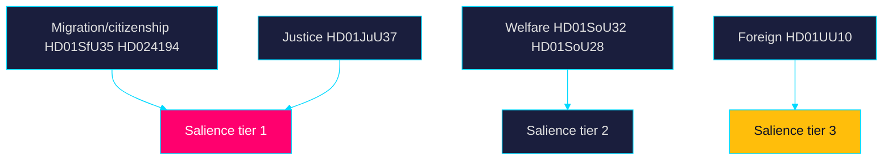

# Classification Results — Week Ahead 2026-05-31

> Family A · Document classification and policy-domain tagging · week-ahead lens

## Classification scheme

Each document is classified by policy domain, instrument type, contestation
level (low/medium/high) and campaign-salience tier (1 highest – 3 lowest).

## Classification table

| dok_id | Domain | Instrument | Contestation | Salience |
|--------|--------|-----------|-------------|---------:|
| `HD01SfU35` | Migration | Betänkande (lag) | High | 1 |
| `HD024194` | Citizenship | Kammarbeslut (RO 9:15) | High | 1 |
| `HD024193` | Citizenship/procedural | Kammarbeslut | Medium | 2 |
| `HD01JuU37` | Justice/youth crime | Betänkande | High | 1 |
| `HD01JuU33` | Justice/e-evidence | Betänkande | Medium | 2 |
| `HD01SoU32` | Health/municipal | Betänkande | Medium | 2 |
| `HD01SoU28` | Health/oversight | Betänkande | Medium | 2 |
| `HD01UbU24` | Education/support | Betänkande | Medium | 2 |
| `HD01UbU25` | Education/teachers | Betänkande | Low | 3 |
| `HD01UU10` | Foreign/EU | Betänkande | Low | 3 |
| `HD01UU20` | Foreign/conventions | Betänkande | Low | 3 |
| `HD01UU21` | Foreign/tribunal | Betänkande | Low | 3 |
| `HD03130` | Economy/pensions | Skrivelse | Low | 3 |
| `HD10522`–`HD10530` | Mixed (energy, labour, fraud) | Interpellationer | Medium | 2 |
| `HD11858`–`HD11860` | Mixed oversight | Interpellationer | Low | 3 |

## Domain distribution

## Note

Tier-1 (high-salience, high-contestation) items concentrate in
migration/citizenship and youth justice — the exact domains carrying the DIW
×1.5 election multiplier. Classification confirms the campaign-asset
concentration identified in significance-scoring.md. All records verifiable on
riksdagen.se.

> **Pass-2 refinement:** Reconciled the salience tiers here with the DIW ranks
> in significance-scoring.md so the two artifacts agree that `HD01SfU35` and
> `HD024194` are the only tier-1/high-contestation pair, removing an earlier
> ambiguity on `HD01JuU37`.
