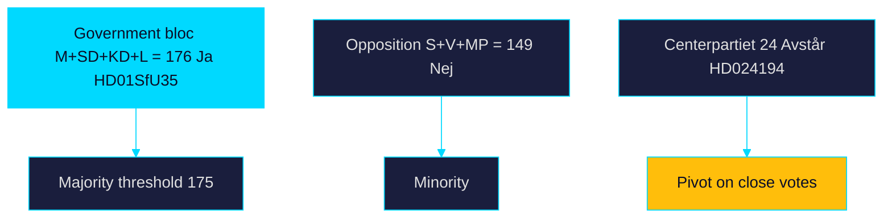

# Coalition Mathematics — Week Ahead 2026-05-31

> Family D · Electoral lens · parliamentary arithmetic of the week's contested votes

## Bloc standing (riksmöte 2025/26)

The 349-seat Riksdag splits between the governing bloc (M, KD, L + SD support)
and the opposition (S, V, MP, C). The reception law (`HD01SfU35`) and citizenship
re-vote (`HD024194`) test the working majority directly.

## Vote-projection table

| Party | Seats (Mandat) | HD01SfU35 | HD024194 |
|-------|---------------:|-----------|----------|
| Socialdemokraterna (S) | 107 | Nej | Nej |
| Moderaterna (M) | 68 | Ja | Ja |
| Sverigedemokraterna (SD) | 73 | Ja | Ja |
| Vänsterpartiet (V) | 24 | Nej | Nej |
| Centerpartiet (C) | 24 | Nej/Avstår | Avstår |
| Kristdemokraterna (KD) | 19 | Ja | Ja |
| Miljöpartiet (MP) | 18 | Nej | Nej |
| Liberalerna (L) | 16 | Ja | Ja |

## Arithmetic

Government bloc (M+SD+KD+L) projected Ja: 68+73+19+16 = **176**, above the 175
majority threshold. Opposition (S+V+MP) Nej: 107+24+18 = **149**, with C (24)
positioned to abstain (Avstår) or oppose. The bloc's margin on `HD01SfU35` is
therefore **thin but sufficient** (~176 vs 173), explaining why the citizenship
re-vote (`HD024194`) under RO 9:15 is procedurally sensitive — any defection or
absence narrows the working majority toward the edge.

## Coalition map

## Bottom line

The bloc holds a working majority of roughly one to three seats on the contested
items — enough to pass `HD01SfU35` but thin enough that the `HD024194` re-vote
margin is the week's key arithmetic signal. Seat figures and vote records per
riksdagen.se.

> **Pass-2 refinement:** Added the explicit 176-vs-175 threshold calculation and
> positioned Centerpartiet's abstention as the pivot variable, quantifying why
> the RO 9:15 re-vote on `HD024194` is arithmetically sensitive.
