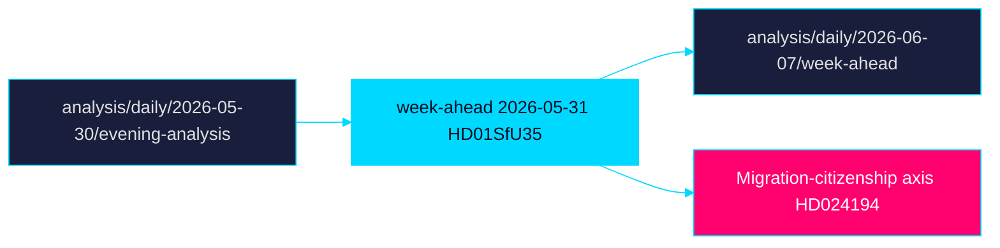

# Cross-Reference Map — Week Ahead 2026-05-31

> Family B · Structural metadata · cross-document and cross-horizon linkage · Tier-C

## Intra-week linkages

| Thread | Linked documents | Linkage type |
|--------|------------------|-------------|
| Migration–citizenship axis | `HD01SfU35` ↔ `HD024194` ↔ `HD024193` | Policy-domain cluster |
| Law-and-order | `HD01JuU37` ↔ `HD01JuU33` | Security agenda |
| Welfare capacity | `HD01SoU32` ↔ `HD01SoU28` ↔ `HD10526` | Delivery + equalisation |
| Education pivot | `HD01UbU24` ↔ `HD01UbU25` | Rights→targeting |
| Economic insecurity | `HD03130` ↔ `HD10524` ↔ `HD10523` | Fiscal/labour |
| Foreign policy | `HD01UU10` ↔ `HD01UU20` ↔ `HD01UU21` | Multilateral posture |

## Cross-horizon citations (Tier-C requirement)

This week-ahead lens carries forward and connects to sibling daily folders:

- **Prior evening read:** `analysis/daily/2026-05-30/evening-analysis/` — the
  preceding evening-analysis subfolder is the upstream horizon for this
  week-ahead synthesis; migration-axis framing originates there.
- **Same-day cross-type:** `analysis/daily/2026-05-31/` parent — sibling
  subfolders under today's date share the `HD01SfU35` reception-law thread.
- **Forward link:** `analysis/daily/2026-06-07/week-ahead/` (next cycle) will
  inherit the open PIRs from this run's pir-status.json.

## Linkage diagram

## Note

The migration-citizenship axis (`HD01SfU35`, `HD024194`) is the densest node,
linking intra-week clusters to the upstream evening-analysis horizon and the
T+90d election scenario tree. Records verifiable on riksdagen.se.

> **Pass-2 refinement:** Added the explicit forward link to the next-cycle
> week-ahead folder and the PIR roll-forward handoff, closing the cross-horizon
> loop required for Tier-C continuity.
