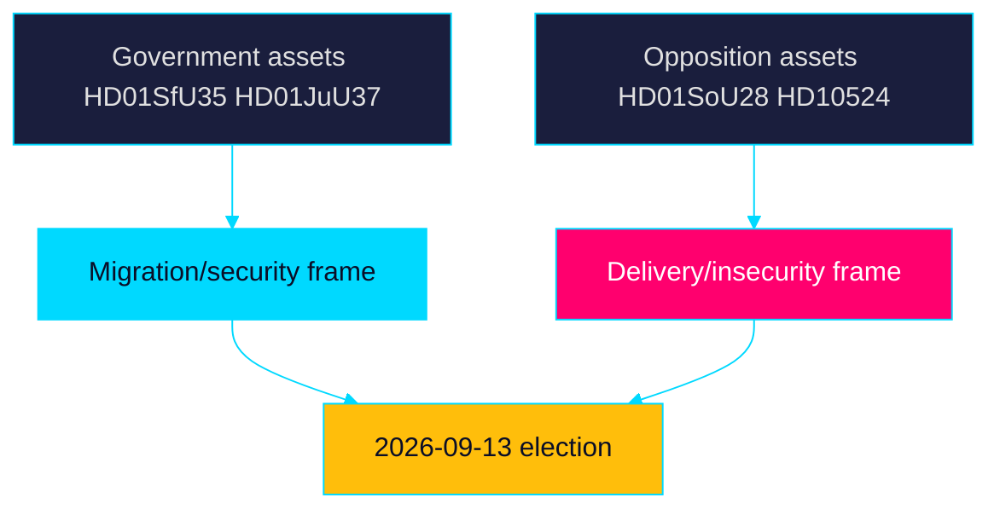

# Election 2026 Analysis — Week Ahead 2026-05-31

> Family D · Electoral lens · 105 days to 2026-09-13 general election

## Pre-recess week as campaign opening

With ~105 days to polling day (2026-09-13), the final pre-recess voting block is
the de facto campaign launch. The reception law (`HD01SfU35`) and citizenship
re-vote (`HD024194`) give the Tidö bloc a closed migration file to campaign on;
the welfare-oversight (`HD01SoU28`) and education (`HD01UbU24`) items seed the
opposition's delivery-and-equity counter-offer.

## Electoral stakes by item

| dok_id | Electoral function | Beneficiary bloc |
|--------|--------------------|------------------|
| `HD01SfU35` | Migration delivery proof | Government + SD |
| `HD024194` | Citizenship-policy signal | Government + SD |
| `HD01JuU37` | Law-and-order credential | Government + SD |
| `HD01SoU28` | Welfare-failure attack line | Opposition (S-V-MP) |
| `HD01SoU32` | Municipal-capacity critique | Opposition + C |
| `HD10524` | Economic-insecurity line | Opposition |

## Forecast linkage

The citizenship re-vote (`HD024194`) margin is the single most useful
data point this week for calibrating the T+90d seat model: it reveals the bloc's
actual working majority. IMF WEO Apr-2026 (~2.1% growth T+1) sets a moderate
economic backdrop that neither bloc can claim decisively.

## Electoral map

## Bottom line

The week tilts the agenda toward the government's strongest terrain (migration,
security) while handing the opposition durable welfare-delivery ammunition. Net
electoral effect is **roughly even [horizon:quarter]**, pending the
`HD024194` margin. Records on riksdagen.se.

> **Pass-2 refinement:** Made the citizenship re-vote (`HD024194`) margin the
> single most decision-relevant data point for the T+90d seat model and tied it
> directly to coalition-mathematics.md.
