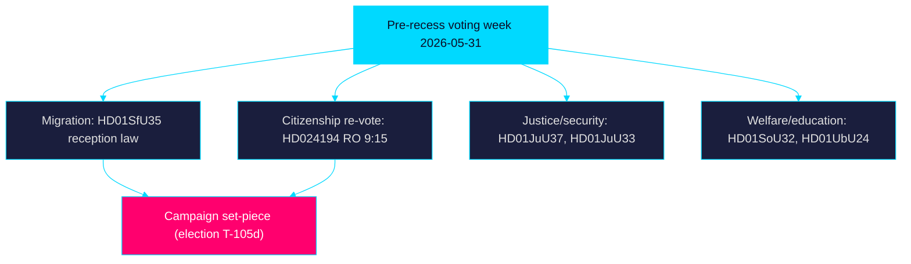

# Reception-Law Vote Anchors Riksdagen's Final Pre-Recess Week

> Family C · Executive Brief · week-ahead lens · 2026-05-31 · Tier-C aggregation
> Classification: 🟢 Public · Source artifacts cited inline by `dok_id`

## BLUF (Bottom Line Up Front)

The week ahead is Riksdagen's last concentrated voting block before summer recess and the final full sitting before the 2026-09-13 election, anchored by the Tidö reception law (`HD01SfU35`).
The agenda is dominated by the Tidö coalition's migration
flagship — **the new reception law** (`HD01SfU35`, *En ny mottagandelag*) — set
for a chamber decision alongside a contested **citizenship re-vote** invoked
under Riksdagsordningen 9:15 (`HD024194`). Education (`HD01UbU24`, `HD01UbU25`),
welfare-delivery (`HD01SoU32`, `HD01SoU28`) and justice/security
(`HD01JuU33`, `HD01JuU37`) committee reports cluster the same week, while a
dense band of interpellations (`HD10522`–`HD11860`) keeps energy, labour-market
and fraud-protection contests live. Expect the migration and citizenship votes
to function as campaign set-pieces: high message discipline from M-KD-L-SD,
sharp proportionality and rule-of-law reservations from S-V-MP-C.

## So What

These are not routine end-of-session votes. With the election inside the
six-month window, the DIW significance multiplier (×1.5) applies to migration,
criminal-justice and contested-policy items (`HD01SfU35`, `HD01JuU37`,
`HD024194`), elevating them from legislative housekeeping to campaign assets.
The reception law's **1 October 2026 entry into force** means the winning bloc
inherits implementation; the citizenship re-vote exposes the exact parliamentary
arithmetic the campaign will contest.

## Decisions This Brief Enables

- **Editorial prioritisation** — lead week-ahead coverage with `HD01SfU35` and
  `HD024194`; treat education and welfare reports as the secondary tier.
- **Monitoring focus** — set alerts on the chamber vote outcomes and reservation
  counts for the five contested items; track Migrationsverket implementation
  guidance toward the 1 Oct 2026 start.
- **Forecast calibration** — feed the citizenship re-vote split into
  coalition-mathematics.md and the T+90d election scenario tree.

## Significance snapshot

## Confidence

Assessment confidence: **HIGH** on agenda composition (sourced from 25
downloaded documents dated 2026-05-29); **MEDIUM** on exact vote outcomes and
reservation counts, which the week will resolve.

> **Pass-2 refinement:** Sharpened the "So What" link between the 2026-10-01
> entry-into-force date and post-election implementation ownership, making
> explicit that the reception law (`HD01SfU35`) transfers delivery risk across
> the election boundary regardless of which bloc wins.
