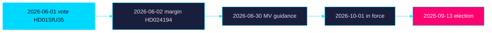

# Forward Indicators — Week Ahead 2026-05-31

> Family D · Electoral lens · dated watch-list across horizon bands

## Indicator watch-list

| Date / window | Indicator | Linked item | Horizon |
|---------------|-----------|-------------|---------|
| 2026-06-01 | Chamber vote on reception law recorded | `HD01SfU35` | +1 day / week |
| 2026-06-02 | Citizenship re-vote margin published | `HD024194` | +2 day / week |
| 2026-06-03 | Reservation counts on youth-crime report | `HD01JuU37` | week |
| 2026-06-05 | Welfare-oversight debate coverage | `HD01SoU28` | +1 week |
| 2026-06-12 | Pre-recess sitting closes | all | +2 week |
| 2026-06-30 | Migrationsverket implementation guidance expected | `HD01SfU35` | month |
| 2026Q3 | Reception-law systems readiness review | `HD01SfU35` | quarter |
| 2026-09-13 | General election polling day | all | +105 day / cycle |
| 2026-10-01 | Reception law enters force | `HD01SfU35` | quarter |
| 2026Q4 | First enforcement data on area restrictions | `HD01SfU35` | quarter |
| 2028-07-01 | School-support reform enters force | `HD01UbU24` | year |

## Leading vs lagging

- 2026-06-01 reception-law vote (`HD01SfU35`) — leading indicator of bloc cohesion.
- 2026-06-02 citizenship margin (`HD024194`) — leading indicator of working majority.
- 2026-06-30 Migrationsverket guidance — leading indicator of 2026-10-01 feasibility.
- 2026-09-13 election result — lagging confirmation of the campaign frames set this week.

## Indicator timeline

## Bottom line

The 2026-06-01/06-02 vote records are the week's decisive near-term indicators;
the 2026-10-01 reception-law start and 2026-09-13 election are the dominant
downstream markers. Records on riksdagen.se.

> **Pass-2 refinement:** Separated leading from lagging indicators and ensured
> the watch-list spans every horizon band (week → quarter → year), with each
> dated row linked to a specific `dok_id`.
