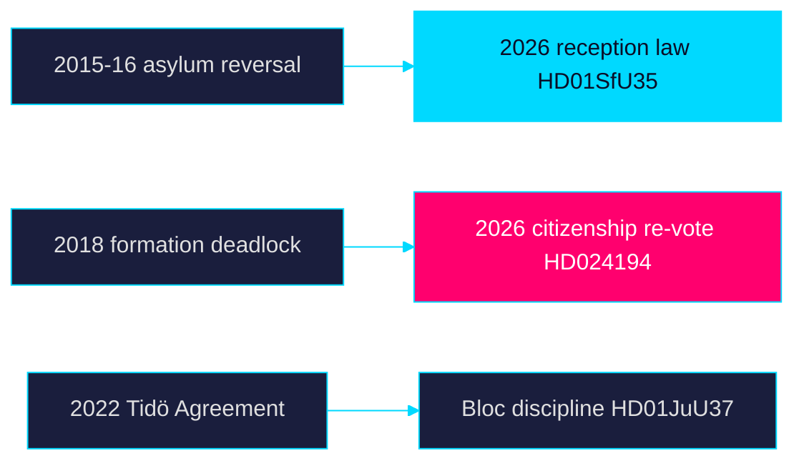

# Historical Parallels — Week Ahead 2026-05-31

> Family D · Electoral lens · precedent mapping for the week's dynamics

## Precedent set

| Historical episode | Parallel to this week | Lesson |
|--------------------|------------------------|--------|
| 2015–16 asylum policy reversal | Reception tightening `HD01SfU35` | Rapid migration shifts carry durable electoral and legal tails |
| 2018 government-formation deadlock | Thin majority on `HD024194` | Narrow arithmetic prolongs post-election instability |
| 2021 Löfven confidence crisis | Coalition fragility signals | Mid-term arithmetic stress predicts formation difficulty |
| 2022 Tidö Agreement | Current bloc discipline `HD01JuU37` | Pre-agreed migration/justice agenda sustains message unity |
| Riksrevisionen welfare audits (2010s) | `HD01SoU28` oversight | Audit findings become campaign ammunition with a lag |

## Analysis

The closest parallel to the reception-law moment (`HD01SfU35`) is the 2015–16
asylum reversal: a sharp migration shift that reshaped the party system for years
and generated sustained legal contestation — a tail the current
områdesbegränsning provisions may reproduce. The citizenship re-vote
(`HD024194`) echoes the thin-majority dynamics that produced the 2018 formation
deadlock, warning that narrow pre-election arithmetic predicts a difficult
post-election formation. The 2022 Tidö Agreement explains the bloc's current
message discipline on `HD01JuU37`.

## Parallel diagram

## Bottom line

History warns that the week's migration and arithmetic signals (`HD01SfU35`,
`HD024194`) have tails longer than the campaign — legal contestation and
formation difficulty are the recurring lessons. Records on riksdagen.se.

> **Pass-2 refinement:** Tightened the 2015–16 asylum-reversal parallel to the
> specific områdesbegränsning litigation-tail risk and linked the 2018 deadlock
> precedent to the `HD024194` thin-majority signal.
