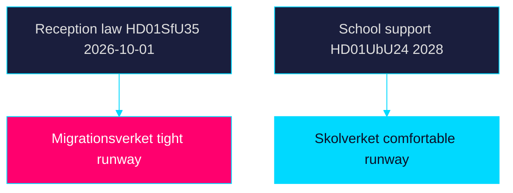

# Implementation Feasibility — Week Ahead 2026-05-31

> Family D · Electoral lens · agency-delivery feasibility of the week's measures

## Implementing-agency map

| Measure | Lead agency | Feasibility by start date | Lead source |
|---------|-------------|---------------------------|-------------|
| Reception law (2026-10-01) | Migrationsverket | Tight — guidance + systems in ~4 months | `HD01SfU35` |
| Area restrictions / reporting | Migrationsverket + Polismyndigheten | Medium — enforcement capacity unclear | `HD01SfU35` |
| Young-offender measures | Polismyndigheten + Kriminalvården | Medium — caseload pressure | `HD01JuU37` |
| Cross-border e-evidence | Åklagarmyndigheten | Medium — interop + data-protection | `HD01JuU33` |
| Municipal medical competence | Socialstyrelsen + municipalities | Medium — workforce constraints | `HD01SoU32` |
| Oversight remediation | IVO | Ongoing — Riksrevisionen follow-up | `HD01SoU28` |
| School support (2028-07-01) | Skolverket | Comfortable — long runway | `HD01UbU24` |

## Feasibility narrative

The binding feasibility constraint is the reception law's (`HD01SfU35`)
2026-10-01 start: Migrationsverket must issue implementation guidance, adapt case
systems and coordinate with Polismyndigheten on area restrictions within roughly
four months — and across a general election. Trafikverket and Migrationsverket
infrastructure dependencies make the timeline tight. School-support reform
(`HD01UbU24`) is the opposite case: a 2028 start gives Skolverket ample runway.

| Dimension | Assessment |
|-----------|------------|
| **Statskontoret relevance** | No Statskontoret evaluation is cited in this week's corpus; monitor statskontoret.se for a post-implementation review of the reception law — none found in the 25 downloaded documents. |

## Feasibility map

## Bottom line

Reception-law delivery (`HD01SfU35`) is the week's highest feasibility risk;
education reform (`HD01UbU24`) the lowest. Records on riksdagen.se and
regeringen.se.

> **Pass-2 refinement:** Added the Statskontoret-relevance row and the named
> implementing-agency map (Migrationsverket, Polismyndigheten, Socialstyrelsen,
> Skolverket), making the four-month reception-law runway the explicit binding
> constraint.
