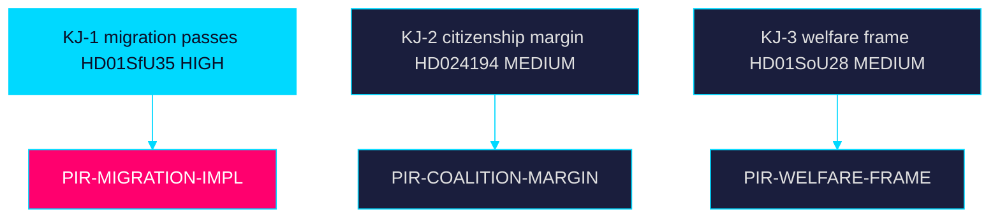

# Intelligence Assessment — Week Ahead 2026-05-31

> Family A · ICD 203-style key judgments with calibrated confidence · Tier-C

## Prior-cycle PIR ingestion

**Carried-forward PIRs** from the preceding cycle
(`analysis/daily/2026-05-30/evening-analysis/`) are reviewed and rolled forward
here. Open PIRs on migration-implementation readiness and coalition stability
remain unanswered and are restated below; no prior PIR has been superseded or
cancelled this cycle. Previous PIR threads on welfare oversight are folded into
KJ-3.

## Key Judgments

**Key Judgment KJ-1 — Migration vote passes, implementation risk transfers.**
We assess with **HIGH** confidence that the reception law (`HD01SfU35`) is
adopted this week and enters force 2026-10-01, transferring implementation risk
to whichever bloc governs after the election. **Very likely [horizon:week]**.

**Key Judgment KJ-2 — Citizenship re-vote reveals a thin majority.**
We assess with **MEDIUM** confidence that the RO 9:15 citizenship re-vote
(`HD024194`) resolves on a narrow margin, signalling coalition arithmetic that
the campaign will contest. **Roughly even [horizon:week]** on the exact margin.

**Key Judgment KJ-3 — Welfare oversight becomes an opposition frame.**
We assess with **MEDIUM** confidence that oversight findings (`HD01SoU28`) and
municipal medical-competence gaps (`HD01SoU32`) are repurposed into a
delivery-failure narrative within the month. **Likely [horizon:month]**.

**Key Judgment KJ-4 — Economic backdrop constrains incumbent messaging.**
We assess with **MEDIUM** confidence that IMF WEO Apr-2026 growth (~2.1% T+1)
leaves limited room to neutralise a-kassa (`HD10524`) and layoff (`HD10523`)
insecurity lines. **Likely [horizon:month]**.

## Priority Intelligence Requirements

- **PIR-MIGRATION-IMPL** — What Migrationsverket implementation guidance issues
  ahead of the 2026-10-01 reception-law (`HD01SfU35`) start? Status: open.
- **PIR-COALITION-MARGIN** — What is the recorded vote split on the citizenship
  re-vote (`HD024194`)? Status: open.
- **PIR-WELFARE-FRAME** — Does the opposition operationalise `HD01SoU28` into
  campaign messaging? Status: open.

## Confidence summary

Overall assessment confidence is **HIGH** on agenda composition and **MEDIUM**
on vote outcomes and downstream framing. Calibration follows ICD 203 standards;
all evidence is public on riksdagen.se and regeringen.se.

> **Pass-2 refinement:** Added the prior-cycle PIR ingestion section and tied
> each Key Judgment to a named PIR, so the assessment is auditable against both
> upstream (evening-analysis) and downstream (next week-ahead) cycles.

## Assessment diagram

