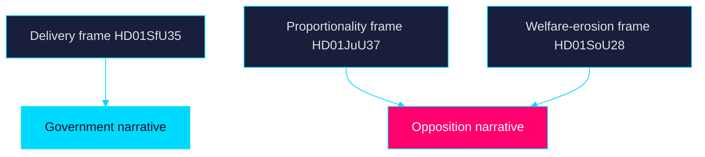

# Media Framing Analysis — Week Ahead 2026-05-31

> Family D · Electoral lens · framing contest over the week's agenda

## Competing master frames

| Frame | Carrier | Anchor items | Core message |
|-------|---------|-------------|--------------|
| "Delivery on migration" | Government + SD | `HD01SfU35`, `HD024194` | Promises kept, order restored |
| "Proportionality / rule of law" | V, MP, C, NGOs | `HD01SfU35`, `HD01JuU37` | Rights eroded, courts will object |
| "Welfare erosion" | S, V | `HD01SoU28`, `HD01SoU32` | Services failing under the bloc |
| "Economic insecurity" | S, LO | `HD10523`, `HD10524` | Jobs and safety net at risk |
| "Responsible internationalism" | Government | `HD01UU10`, `HD01UU20` | Sweden as reliable partner |

## Framing dynamics

The government will frame `HD01SfU35` as promise-kept delivery, compressing the
rights dimension. The opposition splits its framing labour: S leads welfare
erosion (`HD01SoU28`) while V-MP carry proportionality (`HD01SfU35`,
`HD01JuU37`). The citizenship re-vote (`HD024194`) is the most framing-contested
event because its procedural form (RO 9:15) is easily mis-framed as either
"routine" or "crisis." Editorial neutrality requires plain-language process
explanation.

## Framing map

## Bottom line

The week is won by whichever bloc fixes its master frame on the reception law
first; the citizenship re-vote (`HD024194`) is the highest mis-framing risk and
the clearest test of editorial process literacy. Records on riksdagen.se.

> **Pass-2 refinement:** Separated the opposition's framing labour into S-led
> welfare-erosion and V-MP-led proportionality streams, and flagged the RO 9:15
> procedure on `HD024194` as the specific mis-framing surface needing
> plain-language editorial treatment.
