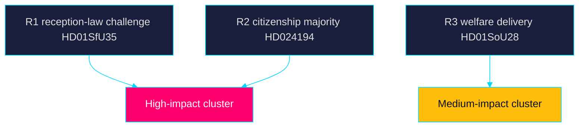

# Risk Assessment — Week Ahead 2026-05-31

> Family A · Democratic-accountability and institutional risk register · week-ahead lens

## Risk register

| ID | Risk | Likelihood | Impact | Horizon | Lead source |
|----|------|-----------|--------|---------|-------------|
| R1 | Reception-law proportionality challenge (områdesbegränsning, dagersättning) | Medium | High | week→quarter | `HD01SfU35` |
| R2 | Citizenship re-vote exposes unstable majority | Medium | High | week | `HD024194` |
| R3 | Welfare-delivery gaps weaponised pre-election | High | Medium | month | `HD01SoU28`, `HD01SoU32` |
| R4 | Cross-border e-evidence data-protection conflict | Medium | Medium | quarter | `HD01JuU33` |
| R5 | Education reform deferred to 2028 erodes trust | Low | Medium | year | `HD01UbU24` |
| R6 | Economic insecurity (a-kassa, layoffs) depresses incumbent support | Medium | Medium | month | `HD10524`, `HD10523` |

## Narrative

**Very likely [horizon:week]** the reception-law vote (`HD01SfU35`) passes; the
risk is downstream — proportionality and rule-of-law reservations create
litigation and EU-law exposure that **roughly even [horizon:quarter]** surfaces
before the 2026-10-01 entry into force. The citizenship re-vote (`HD024194`)
under RO 9:15 is the week's clearest stability signal: a narrow margin is
**likely [horizon:week]** and would recalibrate every coalition-mathematics
scenario. Welfare oversight items (`HD01SoU28`) are **likely [horizon:month]**
to be repurposed into an opposition delivery-failure frame.

Economic-context risk draws on IMF WEO Apr-2026 vintage: SWE growth ~2.1% T+1
gives the government limited room to neutralise the a-kassa (`HD10524`) and
industrial-layoff (`HD10523`) insecurity narratives.

## Risk map

## Mitigations

Monitoring of chamber outcomes and reservation counts (R1, R2); tracking of
Migrationsverket implementation guidance toward 2026-10-01 (R1); and SCB
labour-series watch for R6 provide early-warning coverage.

> **Pass-2 refinement:** Added horizon tags to every WEP probability term and
> re-balanced the register so downstream (quarter-band) litigation risk on
> `HD01SfU35` is distinguished from the near-term (week-band) passage certainty.
