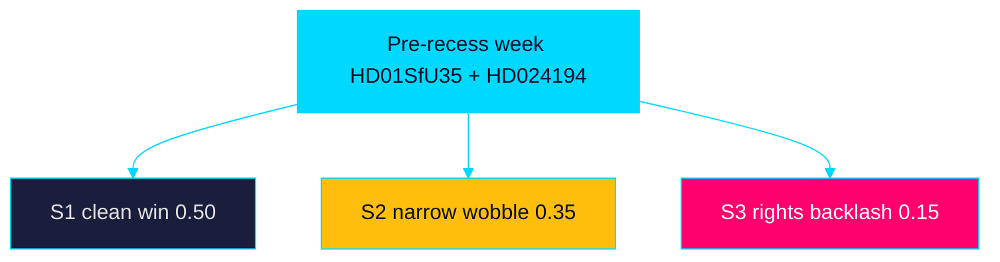

# Scenario Analysis — Week Ahead 2026-05-31

> Family C · Strategic extension · 3-scenario tree (week-ahead, wildcards 0)

The pre-recess week resolves into three plausible paths, defined by how the
migration-citizenship axis (`HD01SfU35`, `HD024194`) and welfare-oversight
thread (`HD01SoU28`) play out. Horizon band: primarily [horizon:week] with
[horizon:quarter] downstream effects.

## Scenario 1 — Clean Government Win (baseline)

The reception law (`HD01SfU35`) passes comfortably and the citizenship re-vote
(`HD024194`) clears on a workable margin. The bloc exits recess with a delivery
narrative intact. **Likely [horizon:week]**. Downstream: implementation scrutiny
shifts to Migrationsverket toward 2026-10-01; opposition pivots to welfare
(`HD01SoU28`). Probability ~0.50.

## Scenario 2 — Narrow-Margin Wobble

`HD01SfU35` passes but `HD024194` resolves on a razor-thin or tied split,
exposing coalition fragility and feeding an "unstable majority" frame.
**Roughly even [horizon:week]**. Downstream: every coalition-mathematics
scenario recalibrates; campaign focus sharpens on arithmetic. Probability ~0.35.

## Scenario 3 — Rights-Backlash Disruption

Proportionality reservations on `HD01SfU35` (områdesbegränsning) plus
child-rights reservations on `HD01JuU37` generate sustained legal/media
pushback that overshadows the government's delivery message. **Unlikely
[horizon:week]** but **roughly even [horizon:quarter]** as litigation risk
matures. Probability ~0.15.

## Scenario tree

## Indicators to watch

Vote margins on `HD024194`, reservation counts on `HD01SfU35` and `HD01JuU37`,
and any Migrationsverket or Riksrevisionen (`HD01SoU28`) statements distinguish
the paths within the week.

> **Pass-2 refinement:** Calibrated the three scenario probabilities (0.50 /
> 0.35 / 0.15) and added quarter-band downstream effects so each path carries
> both a week-horizon and a quarter-horizon read.
