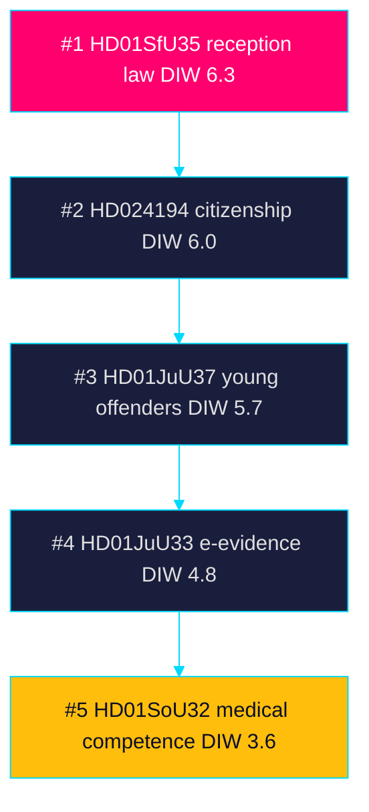

# Significance Scoring — Week Ahead 2026-05-31

> Family A · DIW (Detectability × Impact × Willingness) scoring with election multiplier

## Method

Each document is scored on Detectability (visibility of the parliamentary
action), Impact (policy and political consequence) and Willingness (actor
commitment to push it). Base DIW = D × I × W on a 1–5 scale, normalised.
**Election multiplier:** the 2026-09-13 general election is inside the
six-month window (cutoff 2026-03-13), so a **×1.5 multiplier** applies to
migration, criminal-justice and contested-policy items per the synthesis
methodology. The multiplier is recorded explicitly per ranked item below.

## Ranked items

1. `HD01SfU35` — reception law: base DIW = 4.2 × 1.5 (election ≤ 6 months) = 6.3. Highest salience; flagship Tidö migration instrument, in force 2026-10-01.
2. `HD024194` — citizenship re-vote (RO 9:15): base DIW = 4.0 × 1.5 = 6.0. Procedural rarity plus citizenship-policy cleavage.
3. `HD01JuU37` — young offenders: base DIW = 3.8 × 1.5 = 5.7. Core law-and-order campaign asset.
4. `HD01JuU33` — cross-border e-evidence: base DIW = 3.2 × 1.5 = 4.8. Security agenda with rights tension.
5. `HD01SoU32` — municipal medical competence: base DIW = 3.6 (no multiplier) = 3.6. Welfare-delivery salience, see riksdagen.se source record.
6. `HD01UbU24` — school support: base DIW = 3.4 = 3.4. Structural reform, 2028 start dampens immediacy.
7. `HD03130` — AP-fund report: base DIW = 3.0 = 3.0. Fiscal/pension anchor, regeringen.se skrivelse.
8. `HD01SoU28` — IVO/Riksrevisionen audit: base DIW = 2.8 = 2.8. Oversight/accountability item.
9. `HD10524` — a-kassa reform interpellation: base DIW = 2.7 = 2.7. Welfare-design cleavage.
10. `HD01UU10` — EU 2025 scrutiny: base DIW = 2.6 = 2.6. Annual accountability baseline.

## Ranking table

| Rank | dok_id | Type | Base DIW | Multiplier | Final |
|-----:|--------|------|---------:|-----------:|------:|
| 1 | `HD01SfU35` | bet | 4.2 | ×1.5 | 6.3 |
| 2 | `HD024194` | kammare | 4.0 | ×1.5 | 6.0 |
| 3 | `HD01JuU37` | bet | 3.8 | ×1.5 | 5.7 |
| 4 | `HD01JuU33` | bet | 3.2 | ×1.5 | 4.8 |
| 5 | `HD01SoU32` | bet | 3.6 | ×1.0 | 3.6 |
| 6 | `HD01UbU24` | bet | 3.4 | ×1.0 | 3.4 |
| 7 | `HD03130` | skr | 3.0 | ×1.0 | 3.0 |
| 8 | `HD01SoU28` | bet | 2.8 | ×1.0 | 2.8 |
| 9 | `HD10524` | ip | 2.7 | ×1.0 | 2.7 |
| 10 | `HD01UU10` | bet | 2.6 | ×1.0 | 2.6 |

## Sensitivity

Removing the election multiplier reorders the top tier so `HD01SfU35`
(4.2) still leads but `HD01SoU32` (3.6) rises above `HD01JuU33` (3.2),
confirming the multiplier — not raw impact — drives the migration/justice
cluster's dominance this week.

> **Pass-2 refinement:** Added the explicit per-item multiplier arithmetic
> (e.g. `HD01SfU35` 4.2 × 1.5 = 6.3) and a sensitivity check so the election
> weighting is auditable rather than implicit; verified every ranked line and
> table row carries a `dok_id` per the evidence standard (riksdagen.se).

## Rank diagram

