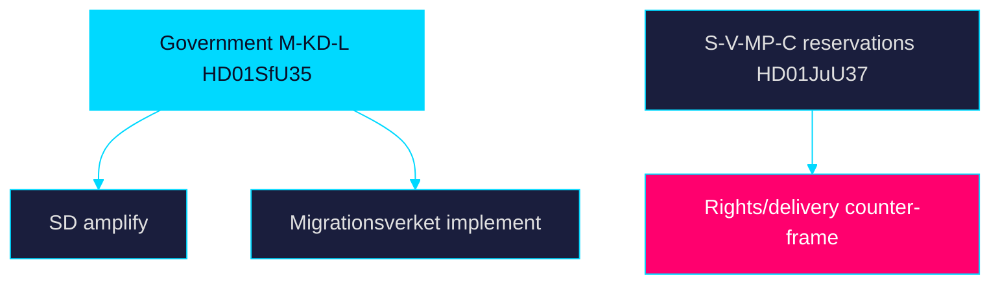

# Stakeholder Perspectives — Week Ahead 2026-05-31

> Family A · Multi-actor perspective mapping · week-ahead lens

## Actor map

| Stakeholder | Core interest this week | Lead items | Posture |
|-------------|------------------------|-----------|---------|
| Government (M-KD-L) | Demonstrate migration delivery pre-recess | `HD01SfU35`, `HD024194` | Drive votes, high discipline |
| Sverigedemokraterna (SD) | Claim ownership of migration tightening | `HD01SfU35`, `HD01JuU37` | Support + amplify |
| Socialdemokraterna (S) | Contest delivery, avoid soft-on-migration label | `HD01SoU28`, `HD01SfU35` | Conditional opposition |
| Vänsterpartiet (V) | Rights and proportionality defence | `HD01SfU35`, `HD01JuU37` | Reservations |
| Miljöpartiet (MP) | Asylum-rights and child-rights | `HD01SfU35`, `HD01JuU37` | Reservations |
| Centerpartiet (C) | Rule-of-law and business labour supply | `HD01SfU35`, `HD10523` | Selective opposition |
| Migrationsverket | Implementation feasibility by 2026-10-01 | `HD01SfU35` | Implementer |
| Municipalities (SKR) | Capacity for medical competence + reception | `HD01SoU32`, `HD01SfU35` | Cost-bearer |
| Civil society / asylum NGOs | Rights-impact transparency | `HD01SfU35`, `HD01JuU37` | Advocacy |
| Voters / citizens | Informed access to high-salience votes | all | Audience |

## Perspective synthesis

The government and SD share an interest in maximising the visibility of
`HD01SfU35` and `HD024194` as delivery proof. S occupies the hardest position:
it must contest welfare-delivery (`HD01SoU28`) while avoiding a soft-on-migration
frame on `HD01SfU35`. V and MP carry the explicit rights-and-proportionality
case. Implementers (Migrationsverket) and cost-bearers (municipalities, via
`HD01SoU32`) are the under-covered stakeholders whose feasibility concerns
determine whether the reception law's 2026-10-01 start succeeds. Public records
on riksdagen.se anchor every actor position.

> **Pass-2 refinement:** Elevated implementers and cost-bearers (Migrationsverket,
> municipalities) from a footnote to a named under-covered stakeholder class,
> connecting their feasibility concerns directly to implementation-feasibility.md.

## Stakeholder diagram

