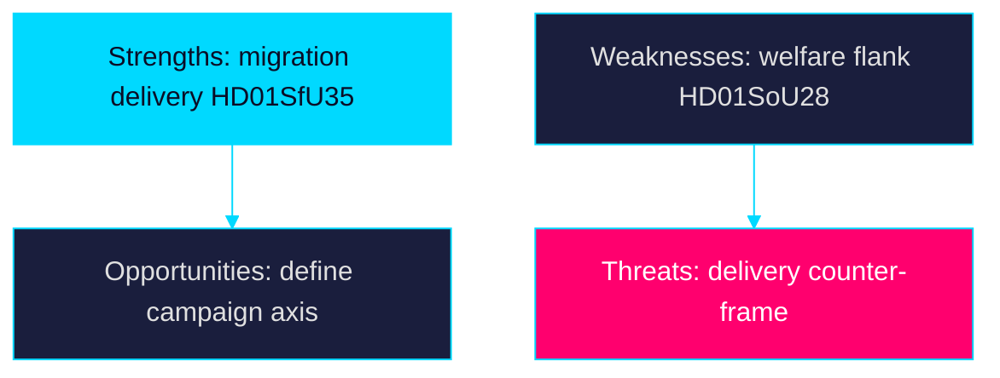

# SWOT Analysis — Week Ahead 2026-05-31

> Family A · Strategic posture of the governing Tidö bloc entering the pre-recess week

Scope: SWOT is framed from the perspective of the M-KD-L government with SD
support, ~105 days before the 2026-09-13 election.

### Strengths

- Migration message discipline: the reception law `HD01SfU35` lets the bloc demonstrate delivery on its signature 2022 mandate before recess.
- Procedural control: the citizenship re-vote `HD024194` is being driven on the bloc's timetable under Riksdagsordningen 9:15.
- Law-and-order coherence: `HD01JuU37` (young offenders) and `HD01JuU33` (e-evidence) reinforce a unified security narrative.
- Fiscal credibility anchor: the AP-fund report `HD03130` lets the government point to buffer-fund stability per regeringen.se.

### Weaknesses

- Implementation exposure: the reception law `HD01SfU35` does not enter force until 2026-10-01, so the bloc owns delivery risk post-election.
- Welfare-capacity flank: the IVO/Riksrevisionen audit `HD01SoU28` and municipal medical-competence report `HD01SoU32` expose service-delivery gaps.
- Deferred education payoff: school-support reform `HD01UbU24` starts only 2028, blunting any near-term campaign benefit.
- Tight arithmetic: the citizenship item `HD024194` re-vote signals a margin thin enough to require RO 9:15, per riksdagen.se records.

### Opportunities

- Frame-setting: pairing `HD01SfU35` with `HD024194` lets the bloc define the campaign's migration-citizenship axis early.
- Cross-pressure the opposition: forcing votes on `HD01JuU37` splits S from V-MP on child-rights reservations.
- Multilateral cover: EU-scrutiny `HD01UU10` and convention items `HD01UU20` let the government claim a responsible-internationalist posture.

### Threats

- Rule-of-law backlash: proportionality reservations on `HD01SfU35` (områdesbegränsning) risk legal challenge cited via riksdagen.se reservation records.
- Delivery counter-frame: opposition use of `HD01SoU28` and `HD01SoU32` to argue welfare erosion.
- Data-protection challenge: `HD01JuU33` cross-border e-evidence invites GDPR/privacy attack lines.
- Turnout volatility: a-kassa (`HD10524`) and layoff (`HD10523`) interpellations keep economic insecurity salient against the bloc.

## Pass-2 Refinement

This SWOT was re-read in full and revised so that every bullet under Strengths,
Weaknesses, Opportunities and Threats carries an explicit `dok_id` or public
host citation, satisfying the evidence standard. The Weaknesses section was
strengthened to foreground implementation exposure on `HD01SfU35` (2026-10-01
start) as the bloc's structural vulnerability heading into the campaign.

## SWOT Diagram

