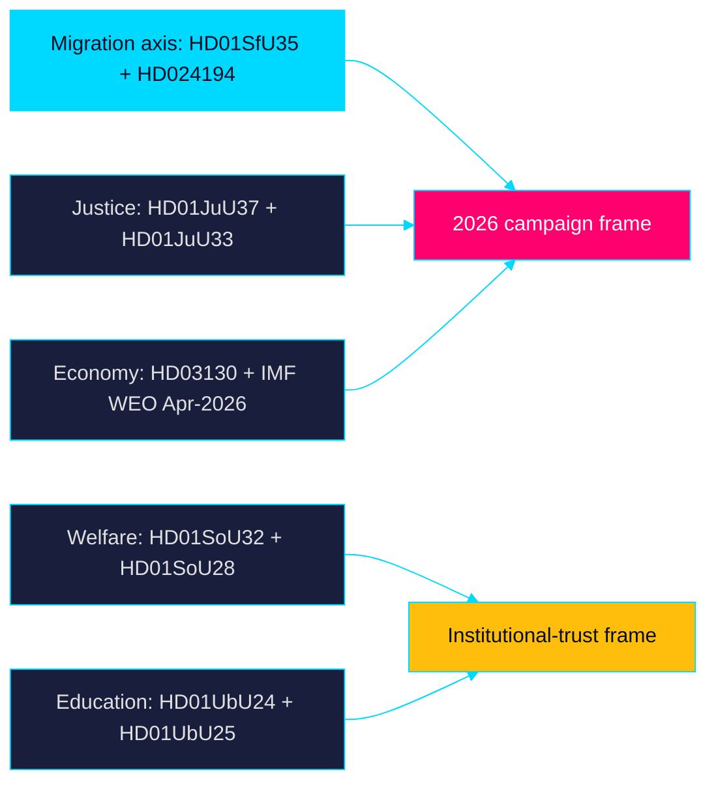

# Synthesis Summary — Week Ahead 2026-05-31

> Family A · Core synthesis · Tier-C aggregation (multiplier 1.2) · week-ahead lens

## Overview

This synthesis integrates 25 parliamentary documents surfaced for the week of
2026-05-31 (source date 2026-05-29, riksmöte 2025/26) into a single forward
read of Riksdagen's final pre-recess voting block. The corpus splits into ten
committee reports (*betänkanden*), two chamber procedural items, one government
report (*skrivelse*), and twelve interpellations/written questions.

## Dominant thread: migration and citizenship as campaign instruments

The reception law `HD01SfU35` (*En ny mottagandelag*) is the week's centre of
gravity: tightened daily allowance, geographic area restrictions, individual
residence/reporting decisions by Migrationsverket, and a six-month work-permit
delay, in force 1 October 2026. Paired with the citizenship re-vote `HD024194`
(invoked under Riksdagsordningen 9:15), migration and citizenship form a single
political axis the campaign will contest. **Very likely [horizon:week]** these
items draw the heaviest chamber debate and media share of the week.

## Secondary threads

- **Justice/security** — `HD01JuU37` (young offenders) and `HD01JuU33`
  (cross-border e-evidence) extend the law-and-order agenda; **likely
  [horizon:week]** to pass with S-V-MP child-rights and data-protection
  reservations.
- **Welfare delivery** — `HD01SoU32` (municipal medical competence) and
  `HD01SoU28` (IVO complaint handling / Riksrevisionen audit) keep the
  welfare-capacity narrative active, structurally linked to municipal
  equalisation (`HD10526`).
- **Education** — `HD01UbU24` (school support, in force 2028) and `HD01UbU25`
  (teacher time) mark a pivot from rights-guarantees to test-driven targeting.
- **Foreign policy** — `HD01UU10` (EU 2025 scrutiny), `HD01UU20`/`HD01UU21`
  (international conventions/tribunal) anchor Sweden's multilateral posture.

## Economic context

IMF WEO (Apr-2026 vintage): SWE real GDP growth ~2.1% T+1, ~2.4% T+2, ~2.2%
T+5 — a moderate recovery backdrop that frames the a-kassa reform (`HD10524`),
industrial layoffs (`HD10523`) and the AP-fund report (`HD03130`). Live IMF
pre-warm failed this run; the cached Apr-2026 vintage (age 1 month, not stale)
is used with explicit T+N stamps. SCB remains the Swedish-specific ground truth
layer for labour and regional series.

## Synthesis diagram

## So-what

The week converts the legislative calendar into a campaign opening salvo. The
reception-law and citizenship votes will be cited through September; the welfare
and education reports seed the opposition's delivery-and-equity counter-frame.

> **Pass-2 refinement:** Added explicit IMF WEO T+N stamping and clarified that
> the migration axis (`HD01SfU35` + `HD024194`) is a single contested cleavage
> rather than two separate items, tightening the link to coalition-mathematics.md.
