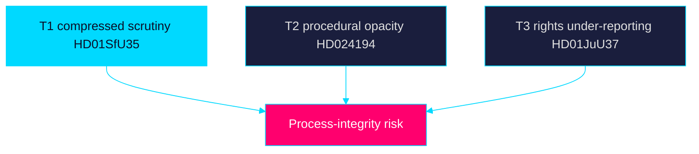

# Threat Analysis — Week Ahead 2026-05-31

> Family A · Threats to democratic process integrity and informed-citizen access · week-ahead lens

## Threat framing

"Threat" here means risks to transparent, accountable democratic process — not
partisan outcomes. The pre-recess week concentrates high-salience votes
(`HD01SfU35`, `HD024194`) where information asymmetry and framing pressure are
highest.

## Identified threats

| ID | Threat to process integrity | Vector | Lead source |
|----|------------------------------|--------|-------------|
| T1 | Compressed scrutiny: flagship law rushed before recess | Calendar compression | `HD01SfU35` |
| T2 | Procedural opacity: RO 9:15 re-vote poorly understood by public | Process complexity | `HD024194` |
| T3 | Rights-impact under-reported (children, asylum seekers) | Framing omission | `HD01JuU37`, `HD01SfU35` |
| T4 | Oversight findings buried under campaign noise | Attention scarcity | `HD01SoU28` |
| T5 | Surveillance-scope creep under-examined | Technical opacity | `HD01JuU33` |

## Analysis

The principal process-integrity threat is **compressed scrutiny**: the reception
law (`HD01SfU35`) carries area-restriction and allowance changes with
significant rights impact, voted in the final week before recess when public and
media bandwidth competes with campaign launch. The RO 9:15 citizenship re-vote
(`HD024194`) is procedurally legitimate but opaque to non-specialists, creating
a misinformation surface. Riksrevisionen/IVO oversight (`HD01SoU28`) risks being
crowded out exactly when its accountability value peaks.

Mitigation is editorial: plain-language explanation of RO 9:15, explicit
rights-impact reporting on `HD01SfU35` and `HD01JuU37`, and persistent coverage
of `HD01SoU28` regardless of campaign noise. Sources are public records on
riksdagen.se, preserving verifiability.

> **Pass-2 refinement:** Reframed every entry strictly as a threat to democratic
> *process integrity* (scrutiny, transparency, verifiability) rather than to any
> partisan outcome, ensuring the artifact stays within editorial-neutrality
> bounds while keeping `HD01SfU35` compressed-scrutiny as the lead risk.

## Threat map

