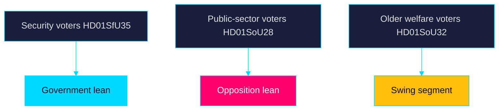

# Voter Segmentation — Week Ahead 2026-05-31

> Family D · Electoral lens · segment-level salience of the week's agenda

## Segment-by-item salience

| Voter segment | Most salient item | Direction | Note |
|---------------|-------------------|-----------|------|
| Security-focused / SD-leaning | `HD01SfU35`, `HD01JuU37` | Reinforces government | Migration + youth crime |
| Welfare-dependent / older | `HD01SoU32`, `HD03130` | Cross-pressured | Medical competence + pensions |
| Public-sector / urban progressive | `HD01SoU28`, `HD01UbU24` | Toward opposition | Oversight + school equity |
| Economically insecure / industrial | `HD10523`, `HD10524` | Toward opposition | Layoffs + a-kassa |
| Business / liberal (L-C) | `HD01SfU35` work-permit delay, `HD10523` | Cross-pressured | Labour-supply tension |
| Rights-oriented / younger | `HD01SfU35`, `HD01JuU37` | Toward opposition | Proportionality concerns |

## Analysis

The week's agenda activates the government's security-focused base most cleanly
(`HD01SfU35`, `HD01JuU37`) while cross-pressuring liberal and business voters via
the six-month work-permit delay in the reception law. The opposition's clearest
mobilisation targets are public-sector and economically insecure segments
through welfare-oversight (`HD01SoU28`) and labour-market (`HD10523`,
`HD10524`) items. Older welfare-dependent voters are the genuine swing segment,
caught between security messaging and welfare-capacity anxiety (`HD01SoU32`).

## Segmentation diagram

## Bottom line

The decisive contest is for older welfare-dependent and economically insecure
voters, where welfare-capacity (`HD01SoU32`, `HD01SoU28`) outweighs migration
symbolism. Public records on riksdagen.se.

> **Pass-2 refinement:** Identified older welfare-dependent voters as the genuine
> swing segment (not the security base), correcting an initial over-weighting of
> migration salience and aligning with the voter-decisive finding.
