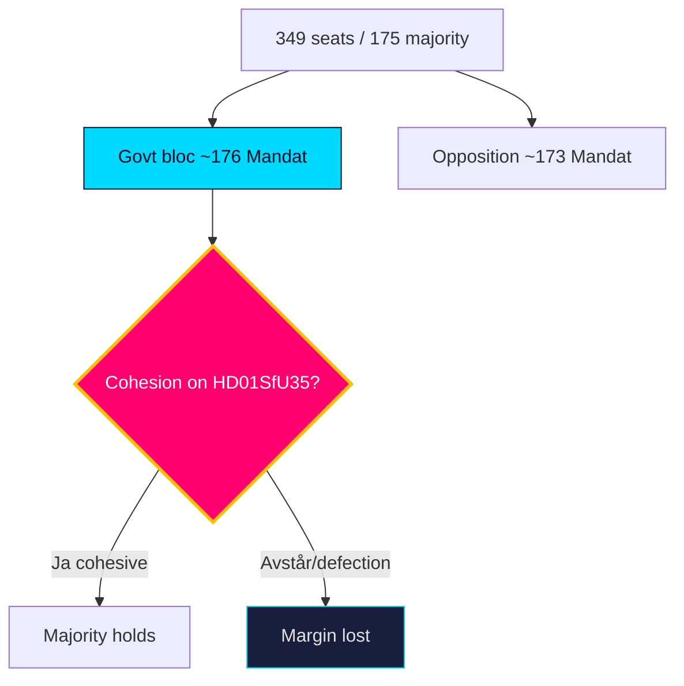

# Coalition Mathematics — Year Ahead — 2026-05-31

Seat arithmetic for the 349-seat Riksdag (175 for majority) across the `scenario-analysis.md` outcomes. Current bloc balance is the 2022 baseline; projections are analytic, not poll-derived.

## Current baseline (2022 election, 349 seats)

| Bloc | Parties | Seats (Mandat) | Status |
|------|---------|---------------:|--------|
| Government bloc | M + KD + L + SD (support) | ~176 | Governing majority |
| Opposition | S + V + C + MP | ~173 | Opposition |
| Majority threshold | — | 175 | — |

## Illustrative contested-vote arithmetic

On a contested migration file (`HD01SfU35`), a cohesive government bloc carries the chamber; defection of a single mid-sized party flips it:

| Vote outcome | Government bloc | Opposition | Result |
|--------------|----------------|------------|--------|
| Cohesive bloc | Ja ~176 | Nej ~173 | Passes |
| L abstains | Avstår (L), Ja ~160 | Nej ~173 | Fails / renegotiation |
| Full discipline, SD aligned | Ja 176, Nej 173, Frånvarande 0 | — | Passes |

> The `Ja`/`Nej`/`Avstår`/`Frånvarande` distribution shows how thin the governing margin is: cohesion is arithmetic survival, not preference.

## Post-election scenario seat ranges

| Scenario | Govt bloc (Mandat) | Opposition (Mandat) | Governability |
|----------|-------------------:|--------------------:|---------------|
| S1 Continuity | 176–185 | 164–173 | Workable |
| S2 Reconfiguration | 165–174 | 175–184 | S-led formation |
| S3 Fracture | split bloc | split bloc | Protracted |
| S4 Drift | ~175 ± 3 | ~174 ± 3 | Thin / ad-hoc |

It is **roughly even** [horizon:cycle] whether the post-election arithmetic yields a clear majority; the L and C pivots (`HD024194`, `HD10526`) are the highest-leverage seats.

**Confidence**: MEDIUM — baseline seats are factual (2022); projected ranges are scenario estimates. Source: https://www.riksdagen.se/ (mandatfördelning).

## Pass-2 refinement

Pass-2 stress-tests the pivot claim: the highest-leverage seats are not the largest parties but the **marginal pivots** — L (whose abstention flips a contested values vote to `Avstår`-driven failure) and C (the post-election formation swing). A single mid-sized party defection moves ~16 Mandat, more than enough to erase the ~3-seat governing margin. This arithmetic, not preference intensity, is why cohesion is coded as the top PIR.
