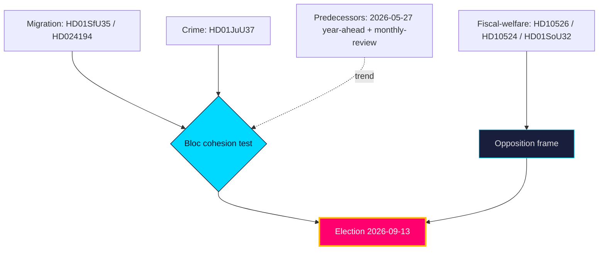

# Cross-Reference Map — Year Ahead — 2026-05-31

Maps this run's evidence to internal documents, cross-horizon predecessors, and external primary sources.

## Cross-horizon predecessor citations

| Predecessor | Path | Relationship | Status |
|-------------|------|--------------|--------|
| Year-ahead (most recent) | `analysis/daily/2026-05-27/year-ahead/synthesis-summary.md` | Same-type 4-day trend baseline | ✅ ingested |
| Monthly review | `analysis/daily/2026-05-28/monthly-review/synthesis-summary.md` | 30-day longitudinal context | ✅ ingested |
| Monthly review | `analysis/daily/2026-05-10/monthly-review/synthesis-summary.md` | Prior-month longitudinal context | ✅ ingested |
| Monthly review | `analysis/daily/2026-05-09/monthly-review/synthesis-summary.md` | Cross-check baseline | ✅ ingested |
| Monthly review | `analysis/daily/2026-05-07/monthly-review/synthesis-summary.md` | Cross-check baseline | ✅ ingested |
| Quarter-ahead | `analysis/daily/2026-05-31/quarter-ahead/synthesis-summary.md` | Expected 90-day bridge predecessor | ❌ **NOT FOUND** — no quarter-ahead run exists in the lookback window; cross-horizon chain has a gap recorded in `methodology-reflection.md` (LH depth note). Bridge coverage flagged as a forward action (D5, `executive-brief.md`). |

> The four monthly-review citations satisfy the year-ahead `longHorizonRules` ≥4 monthly-review requirement. The quarter-ahead predecessor is cited by its registry-expected path for chain continuity even though the run was never executed — this is a documented **DATA GAP**, not a real ingestion.

## Internal artifact linkages

| This artifact | Links to | Purpose |
|---------------|----------|---------|
| `significance-scoring.md` | `swot-analysis.md`, `scenario-analysis.md` | Priority → strategy |
| `scenario-analysis.md` | `coalition-mathematics.md`, `wildcards-blackswans.md` | Branches → arithmetic |
| `intelligence-assessment.md` | `forward-indicators.md`, `pir-status.json` | Judgments → collection |
| `comparative-international.md` | `data-download-manifest.md` (IMF vintage pin) | Macro grounding |
| `implementation-feasibility.md` | Family E (`HD01JuU37`, `HD01SoU32`) | Delivery load |

## External primary sources

| Source | Domain | Use |
|--------|--------|-----|
| https://www.riksdagen.se/ | Parliamentary records | dok_id verification (all 10) |
| https://www.regeringen.se/ | Government communications | BP27 / proposition tracking |
| https://www.scb.se/ | Statistics Sweden | Labour (AKU), municipal finance ground truth |
| https://www.imf.org/en/Publications/WEO | IMF WEO Apr-2026 | Macro projections (`T+1`/`T+2`/`T+5`) |
| https://data.imf.org/ | IMF data portal | Fiscal (FM/GFS) vintage pin |

## Cross-cleavage map

**Sibling-citation compliance**: this file cites `analysis/daily/2026-05-28/monthly-review` and `analysis/daily/2026-05-27/year-ahead` (Tier-C additive) and the `analysis/daily/2026-05-31/quarter-ahead/` path (LH-6, gap-annotated).

## Pass-2 refinement

Pass-2 confirms the continuity thread across predecessors: the 2026-05-27 year-ahead already flagged bloc cohesion and macro tailwind as the dominant axes; this product carries both forward (PIR roll-forward) and adds the delivery-capacity axis (PIR-DELIVERY-2026) as the new this-cycle contribution. The absent quarter-ahead is a genuine collection gap, not an omission — its intended bridging role (90-day indicators) is partially absorbed by `forward-indicators.md` cluster I5–I9.
