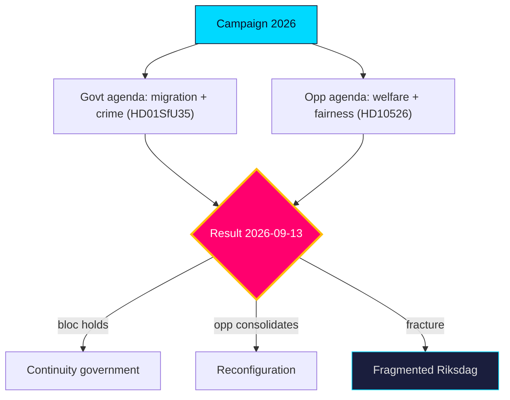

# Election 2026 Analysis — Year Ahead — 2026-05-31

The fixed anchor of the year-ahead horizon: the **Riksdag general election, 13 September 2026** [horizon:election]. This file projects the campaign's structure from the late-May legislative pipeline.

## The strategic setup

The government bloc (M, KD, L governing with SD support under the Tidö framework) enters the campaign owning the migration and crime agenda (`HD01SfU35`, `HD01JuU37`, `HD024194`). The S-led opposition contests on welfare delivery and fiscal fairness (`HD10526`, `HD01SoU32`, `HD10524`). The macro backdrop (IMF WEO Apr-2026: growth ~2.1% `T+1`, debt ~34% GDP `T+1`) is neutral-to-favourable for the incumbent.

## Battleground issues (ranked)

| Issue | Owner | Salience | Key file | Horizon |
|-------|-------|----------|----------|---------|
| Migration & citizenship | Government/SD | Very high | `HD01SfU35`, `HD024194` | [horizon:election] |
| Crime & security | Government | Very high | `HD01JuU37` | [horizon:election] |
| Welfare delivery | Opposition | High | `HD01SoU32` | [horizon:election] |
| Fiscal fairness / equalisation | Opposition | High | `HD10526` | [horizon:election] |
| Labour / a-kassa | Contested | Medium | `HD10524` | [horizon:quarter] |

## Projected dynamics

It is **very likely** [horizon:election] that migration and crime remain the agenda's spine, **likely** [horizon:election] that the opposition's welfare-fairness frame narrows but does not reverse the contest, and **roughly even** [horizon:cycle] whether the result produces a stable governing majority or a fragmented Riksdag requiring protracted formation. The decisive sub-question is government-bloc cohesion (`intelligence-assessment.md` KJ-2).

**Confidence**: MEDIUM-HIGH on issue structure; MEDIUM on outcome (long-horizon electoral uncertainty). Linked: `coalition-mathematics.md`, `voter-segmentation.md`, `scenario-analysis.md`. Source: https://www.riksdagen.se/.

## Pass-2 refinement

Pass-2 tightens the turnout linkage: the migration and crime files the government owns (`HD01SfU35`, `HD01JuU37`) are also the highest-mobilisation issues for SD and the activist left respectively, so issue salience cuts both ways on turnout. The decisive marginal voter is **likely** [horizon:election] the welfare-anxious centrist (cf. `voter-segmentation.md`), which is why the opposition's `HD01SoU32`/`HD10526` fairness frame is the real contest for the median seat.
