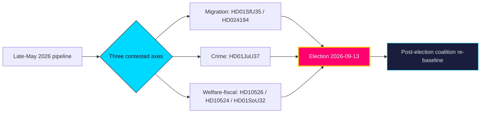

# Sweden's Pre-Election Year Turns on Migration, Crime and the Welfare Bill

**Classification**: 🟢 Public · **Type**: Year-Ahead Intelligence Brief · **Horizon**: 365 days (through 2027-05) · **Run date**: 2026-05-31
**Analytic confidence**: MEDIUM-HIGH · **Tier**: C (comprehensive, 2.0× depth)

## BLUF

The next twelve months of Swedish politics will be governed by one fixed anchor — the **13 September 2026 general election** [horizon:election] — and three contested legislative axes already visible in the late-May 2026 pipeline: migration (`HD01SfU35` new reception law; `HD024194` citizenship transition), criminal justice (`HD01JuU37` young offenders), and the welfare/fiscal settlement (`HD10526` equalisation; `HD10524` a-kassa; `HD01SoU32` municipal care). It is **very likely** [horizon:year] that migration and law-and-order continue to set the campaign agenda and structure government-bloc cohesion, while the equalisation–welfare cluster becomes the principal opposition counter-offensive. Macro conditions are a tailwind: the pinned IMF WEO Apr-2026 vintage projects Swedish GDP growth near 2.1% (`T+1`) and gross debt near 34% of GDP (`T+1`), giving fiscal room that lowers the **likely** [horizon:year] salience of austerity framing. The dominant uncertainty is not *which* issues but *whether* the four-party government bloc holds discipline through a differentiating campaign — a **roughly even** [horizon:cycle] question past the election anchor.

## Decisions

| # | Decision / watch item | Owner | Trigger | Horizon |
|---|----------------------|-------|---------|---------|
| D1 | Track government-bloc cohesion on the migration package (`HD01SfU35`, `HD024194`) as the primary stability signal | Intelligence desk | Next contested chamber vote | `T+1` [horizon:month] |
| D2 | Watch BP27 (autumn Budget Bill) for AP-fund mandate (`HD03130`), welfare grants (`HD01SoU32`) and equalisation response (`HD10526`) | Fiscal analyst | BP27 tabling ~Sep 2026 | [horizon:quarter] |
| D3 | Monitor SCB AKU labour prints against a-kassa salience (`HD10524`); a deterioration shifts the campaign frame | Economic desk | Monthly AKU release | [horizon:quarter] |
| D4 | Re-baseline coalition mathematics the week after 2026-09-13 results | Coverage lead | Election result | [horizon:election] |
| D5 | Maintain quarter-ahead bridge coverage to close the missing 90-day predecessor gap | Editorial | Next quarter-ahead run | [horizon:quarter] |

## Why now

The corpus is dated 2026-05-29 — the closing weeks of the 2025/26 Riksmöte, when committees clear contested betänkanden before summer recess. This is the last full legislative window before the campaign dominates the autumn, making the late-May pipeline an unusually clean read on the issues parties have chosen to carry into the vote.

**Bottom line**: a low-drama macro backdrop frees the campaign to be fought almost entirely on migration, crime and welfare-delivery competence — terrain the government bloc chose and the opposition must contest on fiscal-fairness grounds.

> Evidence base: 10 curated documents (`data-download-manifest.md`); IMF WEO Apr-2026 vintage pin (live fetch degraded — see `mcp-reliability-audit.md`); cross-horizon baselines from `analysis/daily/2026-05-27/year-ahead/` and `analysis/daily/2026-05-28/monthly-review/`.

## Pass-2 refinement

Pass-2 sharpens the decision relevance for a reader/editor: the one number to watch is the **June 2026 pre-recess cohesion read** (indicators I1–I4). A cohesive sweep on `HD01SfU35`/`HD024194` confirms the modal S1 path and the "strong but constrained incumbent" headline; a single `Avstår`/defection signal is the earliest leading indicator that the S3 fracture branch is activating and the headline should pivot to coalition-fragility framing.
