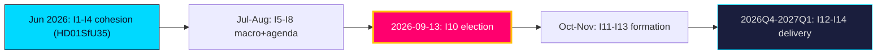

# Forward Indicators — Year Ahead — 2026-05-31

Dated, falsifiable indicators that discriminate the `scenario-analysis.md` branches. Each carries a target date/horizon and a scenario linkage. Calendar API degraded → dates anchored on statutory rhythm ().

## Indicator set

| # | Indicator | Target date | Horizon | Discriminates | Source |
|---|-----------|-------------|---------|---------------|--------|
| I1 | Chamber vote on reception law `HD01SfU35` — bloc cohesion | 2026-06-18 | [horizon:month] | S1 vs S3 | riksdagen.se |
| I2 | Citizenship transition vote `HD024194` reservation pattern | 2026-06-20 | [horizon:month] | S1 vs S3 | riksdagen.se |
| I3 | Young-offenders vote `HD01JuU37` margin | 2026-06-19 | [horizon:month] | S1 | riksdagen.se |
| I4 | Riksmöte summer recess — legislative close-out | 2026-06-26 | [horizon:month] | all | riksdagen.se |
| I5 | SCB AKU labour print (unemployment vs 8.3% `T+1`) | 2026-07-15 | [horizon:quarter] | S2 trigger | scb.se |
| I6 | Q2 2026 GDP flash vs IMF WEO ~2.1% `T+1` | 2026Q2 | [horizon:quarter] | S2 vs S1 | scb.se |
| I7 | Summer migration-salience polling trend | 2026-08-10 | [horizon:quarter] | H1 (devils-advocate) | published polls |
| I8 | Campaign launch — agenda framing lock-in | 2026-08-20 | [horizon:quarter] | S1 vs S2 | regeringen.se |
| I9 | Budget Bill BP27 signals (AP-fund `HD03130`, welfare grants `HD01SoU32`, equalisation `HD10526`) | 2026-09-20 | [horizon:quarter] | S1 vs S2 | regeringen.se |
| I10 | **General election** result & bloc balance | 2026-09-13 | [horizon:election] | all scenarios | riksdagen.se |
| I11 | Government formation duration post-election | 2026-10-15 | [horizon:cycle] | S3 vs S1 | riksdagen.se |
| I12 | Statskontoret myndighetsanalys on crime/care delivery | 2026Q4 | [horizon:year] | R4 / T4 | statskontoret.se |
| I13 | First post-election contested vote — new-bloc cohesion | 2026-11-12 | [horizon:cycle] | S1 vs S4 | riksdagen.se |
| I14 | a-kassa reform trajectory `HD10524` | 2027Q1 | [horizon:year] | S2 | riksdagen.se |

## Reading the board

- **Pre-recess cluster (I1–I4, June 2026)** is the first cohesion read — a clean cohesive sweep pushes toward S1; an abstention/defection toward S3.
- **Summer macro cluster (I5–I6)** is the S2 trigger watch — a labour shock is the highest-leverage synthesis-breaker (PIR-LABOUR-MACRO-2026).
- **Election + formation cluster (I10–I11, I13)** resolves the post-anchor configuration.

**Confidence**: dates are statutory-anchored estimates (calendar API degraded); indicator logic is robust. 14 dated indicators span month → quarter → election → cycle → year.

## Pass-2 refinement

Pass-2 adds discriminating power weighting: not all 14 indicators are equal. I1–I4 (cohesion) and I5–I6 (macro) are **high-discrimination** — each cleanly separates two scenario branches. I7 (polling) and I8 (agenda) are **medium-discrimination** (noisy, reversible). I10 (the election itself) is terminal rather than leading. For early warning, prioritise the June cohesion cluster and the July labour print; they move probability mass fastest.
