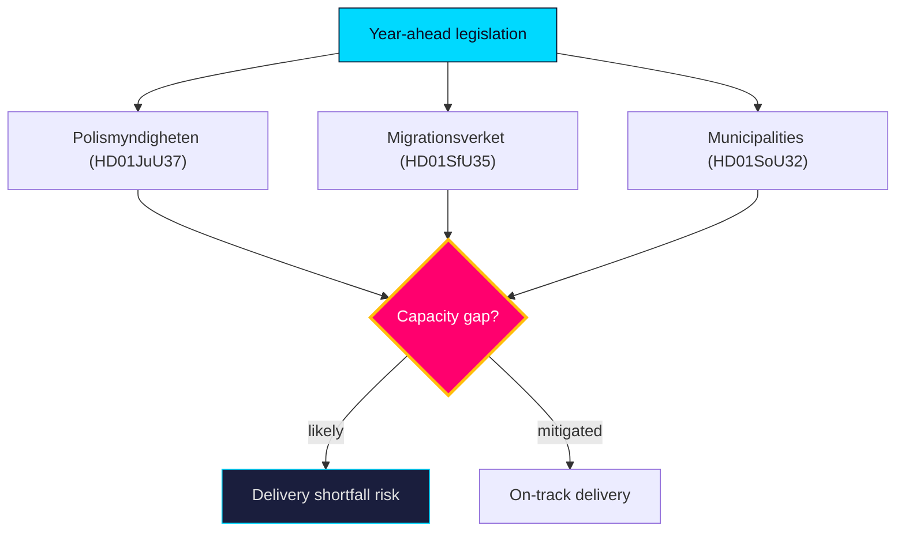

# Implementation Feasibility — Year Ahead — 2026-05-31

Assesses delivery feasibility for the year-ahead legislative package, focusing on agency capacity — the chronic gap between legislation and execution (`risk-assessment.md` R4).

## Agency load map

| File | Lead implementer(s) | Capacity strain | Feasibility |
|------|---------------------|-----------------|-------------|
| `HD01SfU35` reception law | Migrationsverket + 290 municipalities | High (dispersal logistics) | Medium |
| `HD01JuU37` young offenders | Polismyndigheten, Åklagarmyndigheten, social services | High (investigative + social) | Medium-low |
| `HD01SoU32` municipal care | Municipalities + regions, Socialstyrelsen | High (workforce shortage) | Medium-low |
| `HD024194` citizenship transition | Migrationsverket | Medium (caseload backlog) | Medium |
| `HD01UbU25` teaching time | Municipalities (school principals) | Medium (staffing) | Medium |

## Feasibility assessment

The binding constraint is **workforce and agency capacity**, not legislative will. It is **likely** [horizon:year] that crime (`HD01JuU37`) and elder-care (`HD01SoU32`) reforms outrun the police, social-service and care-worker capacity needed to deliver them — producing the visible delivery failures that adversarial narratives exploit (`threat-analysis.md` T4). Migration reception (`HD01SfU35`) is **roughly even** [horizon:year] on feasibility, contingent on municipal cooperation under the equalisation-strained fiscal frame (`HD10526`).

| **Statskontoret relevance** | The Swedish Agency for Public Management (Statskontoret) is the natural evaluator of these implementation gaps; an ex-post myndighetsanalys or förvaltningspolitisk uppföljning of the crime/care reforms is a **likely** [horizon:year] oversight product. Tracking: https://www.statskontoret.se/ |

**Confidence**: MEDIUM-HIGH on the capacity-constraint diagnosis (structural, well-evidenced); MEDIUM on per-file outcomes. Source: https://www.riksdagen.se/, https://www.statskontoret.se/.

## Pass-2 refinement

Pass-2 connects feasibility to the electoral clock: reforms legislated in the June 2026 close-out cannot demonstrate delivery before the 2026-09-13 vote, so the campaign is fought on *promised* rather than *proven* outcomes. This timing gap **likely** [horizon:year] shields the government from delivery-failure attacks pre-election but converts them into a post-election liability — making the Statskontoret myndighetsanalys (I12, 2026Q4) the decisive accountability moment for whichever bloc governs.
