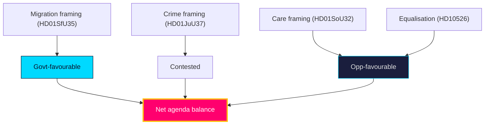

# Media Framing Analysis — Year Ahead — 2026-05-31

How the contested files are **likely** [horizon:year] to be framed across the media ecosystem into the 2026-09-13 campaign.

## Competing frames

| Issue | Government frame | Opposition frame | Key file |
|-------|------------------|------------------|----------|
| Migration | "Order restored / control" | "Cruelty / rule-of-law erosion" | `HD01SfU35` |
| Citizenship | "Earned membership" | "Exclusion / arbitrary transition" | `HD024194` |
| Youth crime | "Protecting communities" | "Criminalising children" | `HD01JuU37` |
| Equalisation | "Fiscal responsibility" | "Abandoning rural Sweden" | `HD10526` |
| Elder care | "Sustainable reform" | "Underfunded promises" | `HD01SoU32` |

## Framing dynamics

The government's frames are **likely** [horizon:year] to dominate the security/migration coverage it owns (`HD01SfU35`, `HD01JuU37`), while the opposition's competence frames gain traction on welfare (`HD01SoU32`). Civil-liberties reservations (V, MP) supply the strongest counter-narrative on youth crime, making `HD01JuU37` the most **roughly even** [horizon:year] framing contest. Disinformation risk (T1, `threat-analysis.md`) concentrates on the migration frame.

## Frame-resonance read

- **High government resonance**: crime/security (issue ownership + valence).
- **Contested**: youth crime (civil-liberties counter), migration (humanitarian counter).
- **High opposition resonance**: elder care, equalisation (competence + fairness).

**Confidence**: MEDIUM — framing direction grounded in issue ownership; resonance pending campaign dynamics. Source: https://www.riksdagen.se/ (committee reservations).

## Pass-2 refinement

Pass-2 adds the agenda-control read: whichever bloc sets the dominant frame for the final campaign fortnight wins the salience battle. The government's structural advantage is that security/migration is **always available** to escalate, whereas the opposition's welfare frame depends on a slow-burn competence narrative that is harder to spike. A late security incident (wildcard W2) would therefore asymmetrically hand agenda control to the incumbent — the single largest framing risk for the opposition.
