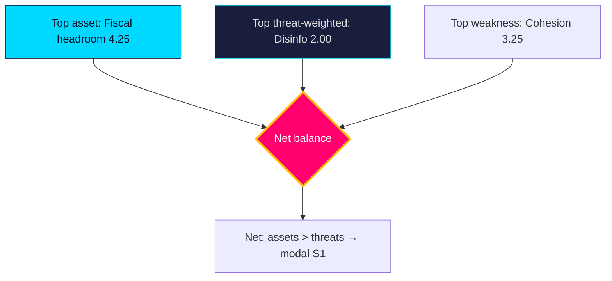

# Quantitative SWOT — Year Ahead — 2026-05-31

Numeric scoring of the `swot-analysis.md` factors. Each factor is rated on **Impact** (1–5) and **Likelihood** (0.0–1.0); weighted score = Impact × Likelihood. Higher = more decision-relevant.

## Strengths

| Factor | Impact | Likelihood | Weighted | Evidence |
|--------|-------:|-----------:|---------:|----------|
| Fiscal headroom (debt ~34% GDP `T+1`) | 5 | 0.85 | 4.25 | IMF WEO Apr-2026 |
| Governing majority (~176 seats) | 5 | 0.70 | 3.50 | `coalition-mathematics.md` |
| Issue ownership on security | 4 | 0.80 | 3.20 | `HD01JuU37`, `HD01SfU35` |

## Weaknesses

| Factor | Impact | Likelihood | Weighted | Evidence |
|--------|-------:|-----------:|---------:|----------|
| Thin seat margin / cohesion fragility | 5 | 0.65 | 3.25 | `HD01SfU35` |
| Delivery/agency capacity gap | 4 | 0.75 | 3.00 | `implementation-feasibility.md` |
| Intra-bloc values friction | 4 | 0.60 | 2.40 | `HD024194` |

## Opportunities

| Factor | Impact | Likelihood | Weighted | Evidence |
|--------|-------:|-----------:|---------:|----------|
| Pre-election welfare signalling | 4 | 0.80 | 3.20 | `HD01SoU32`, `HD10526` |
| Macro tailwind (growth ~2.1% `T+1`) | 4 | 0.70 | 2.80 | IMF WEO Apr-2026 |
| EU digital-justice leadership | 3 | 0.65 | 1.95 | `HD01JuU33`, `HD01UU10` |

## Threats

| Factor | Impact | Likelihood | Weighted | Evidence |
|--------|-------:|-----------:|---------:|----------|
| Labour/macro shock (unemp >9%) | 5 | 0.30 | 1.50 | `HD10524`, W1 |
| Disinformation/foreign interference | 4 | 0.50 | 2.00 | `threat-analysis.md` T1 |
| Coalition rupture pre-election | 5 | 0.25 | 1.25 | W3 |

## Ranked decision priorities (by weighted score)

1. Fiscal headroom (4.25) — the dominant strategic asset.
2. Governing majority (3.50) — necessary but fragile.
3. Seat-margin fragility / welfare signalling (3.25 / 3.20) — twin pivots.
4. Issue ownership (3.20).

**Aggregate read**: Strengths (10.95) outweigh Threats (4.75); Weaknesses (8.65) exceed Opportunities (7.95), confirming the synthesis that the government's position is strong but cohesion-constrained. **Confidence**: MEDIUM — scores are analytic, not poll-calibrated.

## Pass-2 refinement

Pass-2 adds a sensitivity check: the synthesis is robust to plausible re-scoring of any single factor, but **not** to a joint shock. If W1 (labour shock) lands, "macro tailwind" (2.80) collapses toward 0 *and* "labour shock threat" likelihood jumps from 0.30 to ~0.70 (weighted ~3.50), simultaneously removing a top asset and elevating a top threat — a ~6-point swing that would invert the assets-vs-threats margin and flip the modal scenario from S1 to S2. The quantitative frame thus localises the single point of failure precisely where the qualitative analysis placed it.
