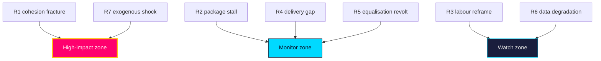

# Risk Assessment — Year Ahead — 2026-05-31

**Frame**: democratic-accountability and governance-stability risks over 365 days [horizon:year]. Likelihood uses WEP terms with horizon tags; impact 1–5.

## Risk register

| ID | Risk | Likelihood | Impact | Horizon | Evidence |
|----|------|-----------|-------:|---------|----------|
| R1 | Government-bloc cohesion fractures under campaign differentiation pressure | roughly even [horizon:cycle] | 5 | post-election | `HD01SfU35`, `HD024194` |
| R2 | Migration package stalls / reservation rebellion before recess | unlikely [horizon:month] | 4 | `T+1` | `HD01SfU35` |
| R3 | Labour-market deterioration reframes campaign onto economy | unlikely [horizon:year] | 3 | [horizon:quarter] | `HD10524` / SCB AKU |
| R4 | Implementation capacity gap (police/courts) undercuts crime-policy delivery | likely [horizon:year] | 3 | [horizon:year] | `HD01JuU37` |
| R5 | Equalisation grievance hardens into rural electoral revolt | roughly even [horizon:year] | 3 | [horizon:election] | `HD10526` |
| R6 | Calendar/data-source degradation impairs forward monitoring | likely [horizon:quarter] | 2 | [horizon:quarter] | `data-download-manifest.md` |
| R7 | Exogenous security/economic shock disrupts agenda | unlikely [horizon:year] | 5 | [horizon:year] | `wildcards-blackswans.md` |

## Narrative

The headline risk is **R1**: a four-party bloc that governs by agenda-discipline faces rising incentives to differentiate as the 2026-09-13 vote nears, making cohesion a **roughly even** [horizon:cycle] proposition past the election. Near-term legislative risk (**R2**) is **unlikely** [horizon:month] — committees have invested too much to fail the migration files before recess. Macro risk (**R3**) is **unlikely** [horizon:year] given the IMF WEO Apr-2026 tailwind (growth ~2.1% `T+1`), but a labour softening would be the one development that reframes the campaign off the government's chosen terrain. Delivery risk (**R4**) is **likely** [horizon:year] and chronic: legislation outruns agency capacity (`implementation-feasibility.md`).

**Treatment**: prioritise cohesion-signal monitoring (R1) and delivery tracking (R4); treat R3/R7 as low-probability high-consequence triggers in `forward-indicators.md`.

## Pass-2 refinement

Pass-2 adds the risk-interaction read: R1 (cohesion failure) and R4 (delivery gap) are not independent — a delivery failure on the crime/care reforms feeds the opposition's competence frame, which raises intra-bloc recrimination and *increases* cohesion risk. This positive-feedback loop is the most dangerous compound path and is **roughly even** [horizon:year] to activate at low intensity; it justifies treating cohesion and delivery as a single coupled risk system rather than two separate lines.
