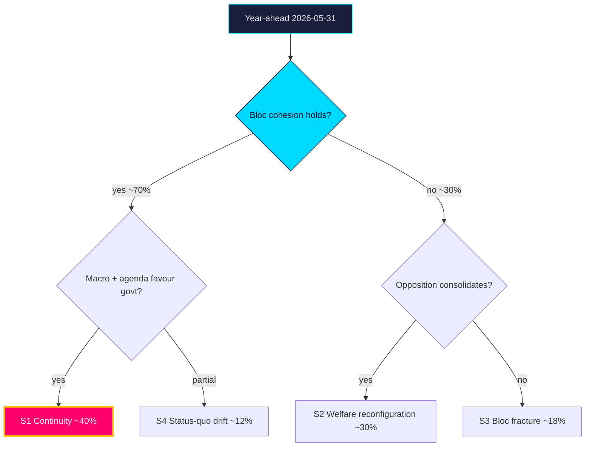

# Scenario Analysis — Year Ahead — 2026-05-31

Four base scenarios over the 365-day horizon, anchored on the 2026-09-13 election [horizon:election], plus five wildcards in `wildcards-blackswans.md`. Probabilities are WEP-tagged with horizons and sum to ~1.0 across the base set.

## Scenario 1 — Continuity Coalition (base case)

**Probability: likely [horizon:cycle] (~40%)**

The government bloc holds cohesion through the campaign, migration/crime delivery (`HD01SfU35`, `HD01JuU37`) consolidates its base, the macro tailwind (IMF WEO Apr-2026, growth ~2.1% `T+1`) neutralises economic attack, and the bloc returns with a workable majority. Citizenship/reception files pass; opposition fiscal-fairness offensive (`HD10526`) underperforms. Most consistent with current evidence.

## Scenario 2 — Welfare Backlash Reconfiguration

**Probability: roughly even [horizon:cycle] (~30%)**

The opposition's equalisation + welfare-delivery frame (`HD10526`, `HD01SoU32`, `HD10524`) gains traction, especially if a labour softening (SCB AKU) lands mid-campaign. S-led bloc grows; C tilts left on equalisation. Produces a closer result and a harder post-election coalition math (`coalition-mathematics.md`).

## Scenario 3 — Bloc Fracture

**Probability: unlikely [horizon:cycle] (~18%)**

Campaign differentiation pressure splits the government bloc — L breaks from SD-driven citizenship maximalism (`HD024194`), or KD/M diverge on equalisation. Cohesion failure (the R1 risk) yields a fragmented Riksdag and protracted government formation.

## Scenario 4 — Status-Quo Drift

**Probability: unlikely [horizon:cycle] (~12%)**

No bloc shifts decisively; the result mirrors 2022 within margins; governance continues with thin majorities and recurring ad-hoc deals. Legislative output slows post-election as both blocs lack mandate depth.

## Probability tree

## Indicators that discriminate scenarios
- **Toward S1**: cohesive bloc votes on `HD01SfU35`/`HD024194`; stable AKU prints.
- **Toward S2**: equalisation motion (`HD10526`) gains cross-bloc traction; labour deterioration.
- **Toward S3**: public L–SD friction on citizenship; reservation rebellions.
- **Toward S4**: flat polling, no decisive movement.

See `forward-indicators.md` for the dated trigger set and `intelligence-assessment.md` for the linked key judgments.

**Confidence**: MEDIUM — long-horizon electoral scenarios carry irreducible uncertainty; probabilities are analytic estimates, not forecasts.

## Pass-2 refinement

Pass-2 makes the scenario-probability logic explicit: S1 is modal because it requires only the *continuation* of present conditions (incumbency, macro tailwind, bloc cohesion), whereas S2/S3 each require a specific *break* (macro shock / cohesion rupture). Base-rate reasoning therefore weights S1 highest, but the combined probability mass of "some break occurs" (S2+S3+wildcards) is non-trivial — which is why the synthesis headline is "strong but constrained" rather than "safe".
