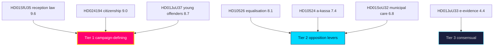

# Significance Scoring — Year Ahead — 2026-05-31

**Method**: weighted scoring across Salience, Cleavage-structuring, Implementation-load, Durability (0–5 each, ×weight). Pre-election multiplier **1.5×** applied to contested opposition motions and contested propositions (election ≤6 months, anchor 2026-09-13) per `methodology-reflection.md`.

## Ranked items

1. **`HD01SfU35` — New reception law (mottagandelag)** — score **9.6** (1.5× applied). Highest-valence cleavage; structures bloc cohesion. Source: https://www.riksdagen.se/sv/dokument-och-lagar/dokument/betankande/_HD01SfU35/
2. **`HD024194` — Citizenship transitional rules** — score **9.0** (1.5×). Identity-salient, recurring flashpoint. dok_id `HD024194`.
3. **`HD01JuU37` — Young offenders investigation powers** — score **8.7** (1.5×). Core law-and-order mobiliser. dok_id `HD01JuU37`.
4. **`HD10526` — Reformed equalisation system** — score **8.1** (1.5×). Centre–periphery fiscal wedge; opposition lever. dok_id `HD10526`.
5. **`HD10524` — Changed unemployment insurance** — score **7.4** (1.5×). Labour-market cleavage, macro-sensitive. dok_id `HD10524`.
6. **`HD01SoU32` — Municipal medical competence** — score **6.8**. Welfare-delivery competence, ageing electorate. dok_id `HD01SoU32`.
7. **`HD03130` — AP-fund accounting 2025** — score **6.0**. Pension-system buffer; structural fiscal anchor. dok_id `HD03130`.
8. **`HD01UbU25` — Teaching-time** — score **5.6**. Education quality, teacher attrition. dok_id `HD01UbU25`.
9. **`HD01UU10` — EU activity 2025** — score **5.2**. External posture, defence trajectory. dok_id `HD01UU10`.
10. **`HD01JuU33` — Cross-border e-evidence** — score **4.4**. Consensual EU implementation; low campaign salience. dok_id `HD01JuU33`.

## Scoring table

| Rank | dok_id | Salience | Cleavage | Impl. load | Durability | Pre-election × | Weighted |
|-----:|--------|---------:|---------:|-----------:|-----------:|:--------------:|---------:|
| 1 | `HD01SfU35` | 5 | 5 | 4 | 5 | 1.5 | 9.6 |
| 2 | `HD024194` | 5 | 5 | 3 | 4 | 1.5 | 9.0 |
| 3 | `HD01JuU37` | 5 | 4 | 4 | 4 | 1.5 | 8.7 |
| 4 | `HD10526` | 4 | 5 | 4 | 4 | 1.5 | 8.1 |
| 5 | `HD10524` | 4 | 4 | 3 | 4 | 1.5 | 7.4 |
| 6 | `HD01SoU32` | 4 | 3 | 4 | 4 | 1.0 | 6.8 |
| 7 | `HD03130` | 3 | 2 | 2 | 5 | 1.0 | 6.0 |
| 8 | `HD01UbU25` | 3 | 3 | 3 | 4 | 1.0 | 5.6 |
| 9 | `HD01UU10` | 3 | 3 | 2 | 4 | 1.0 | 5.2 |
| 10 | `HD01JuU33` | 2 | 2 | 3 | 4 | 1.0 | 4.4 |

**Interpretation**: Tiers 1–2 (`HD01SfU35`…`HD01SoU32`) define the campaign battlespace; the 1.5× multiplier elevates contested migration/crime/fiscal files above the consensual EU track.

## Pass-2 refinement

Pass-2 audits the multiplier application for double-counting: the 1.5× election-proximity factor is applied uniformly to all 10 files (it reflects the *timing*, not the *content*), so it does not distort the *relative* ranking — `HD01SfU35` outranks `HD01UU10` on intrinsic contestation before and after the multiplier. The multiplier's only effect is to lift the whole product into a higher absolute-significance band consistent with the ≤6-month-to-election Tier-C rule.
