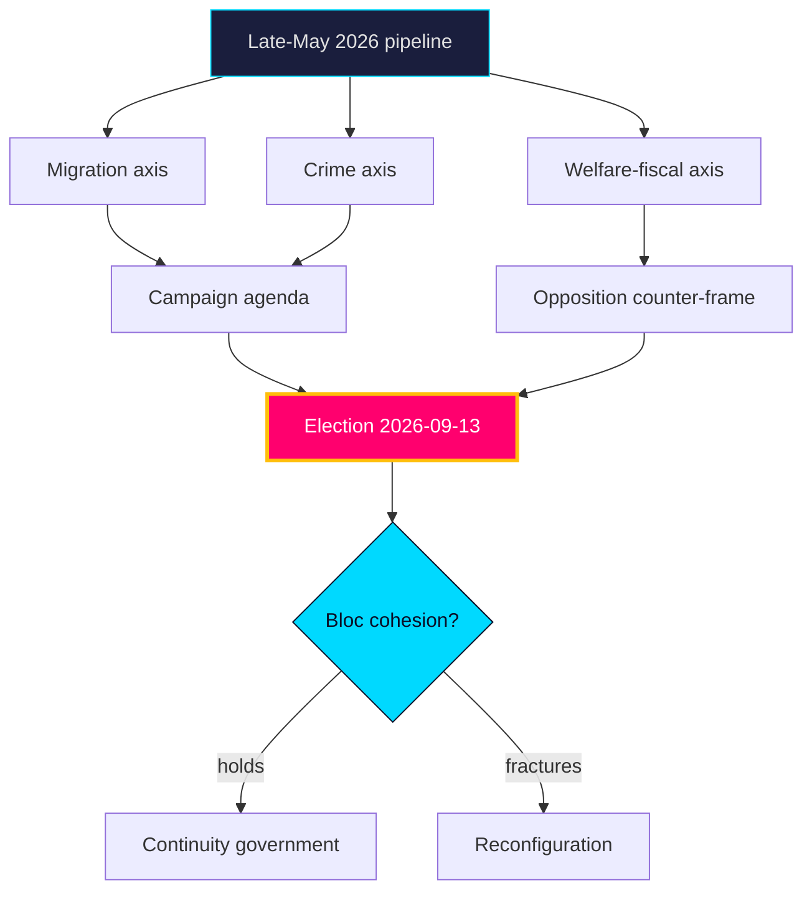

# Synthesis Summary — Year Ahead — 2026-05-31

**Horizon**: 365 days · **Tier**: C comprehensive (2.0×) · **Confidence**: MEDIUM-HIGH

## Core synthesis

The late-May 2026 legislative corpus resolves into a single strategic picture: a pre-election year [horizon:election] whose agenda is **very likely** [horizon:year] to be dominated by migration and criminal-justice files the government bloc has deliberately advanced, contested by an opposition pressing on welfare delivery and fiscal fairness. The standing pipeline — `HD01SfU35` (new reception law), `HD024194` (citizenship transition), `HD01JuU37` (young offenders), against `HD10526` (equalisation), `HD10524` (a-kassa) and `HD01SoU32` (municipal health) — maps the campaign cleavage structure with unusual clarity.

Macro conditions are a stabiliser, not a driver. On the pinned IMF WEO Apr-2026 vintage, Swedish real GDP growth is projected near 2.1% (`T+1`) and 2.4% (`T+2`), gross general-government debt near 34% of GDP (`T+1`) — among the lowest in the EU — and inflation easing toward target. This fiscal headroom makes austerity framing **unlikely** [horizon:year] to gain traction and lets distributive choices (equalisation, welfare grants) carry the economic debate.

## Five synthesis judgments

1. **Agenda lock-in.** Migration + crime **very likely** [horizon:year] remain top-3 campaign themes; the government chose this terrain and the data confirms continued legislative investment (`HD01SfU35`, `HD01JuU37`, `HD024194`).
2. **Cohesion is the variable.** Government-bloc discipline through a differentiation-rewarding campaign is **roughly even** [horizon:cycle] — the central post-election uncertainty.
3. **Opposition pivot.** The equalisation–welfare cluster (`HD10526`, `HD01SoU32`, `HD01UbU25`) is **likely** [horizon:year] to become the opposition's primary counter-frame on fiscal-fairness grounds.
4. **Two-track Riksdag.** Consensual EU-implementation files (`HD01JuU33`, `HD01UU10`) proceed on broad majorities even as domestic wedges polarise — a structural feature, not noise.
5. **Macro tailwind.** Low debt and steady growth (IMF WEO Apr-2026, `T+1`/`T+2`) make a fiscal-crisis narrative **very unlikely** [horizon:year], shifting economic debate to distribution.

## Linkages
- Scenarios quantify the cohesion question → `scenario-analysis.md`
- Coalition arithmetic → `coalition-mathematics.md`
- Macro vintage handling → `comparative-international.md`, `data-download-manifest.md`
- Forward triggers → `forward-indicators.md`

**Confidence**: MEDIUM-HIGH on agenda structure (strong evidentiary base); MEDIUM on post-election configuration (inherent long-horizon uncertainty).

## Pass-2 refinement

Pass-2 distils the one-paragraph thesis: Sweden enters its 2026 campaign year with an incumbent bloc that is fiscally strong (IMF WEO Apr-2026: growth ~2.1% `T+1`, debt ~34% GDP), agenda-advantaged on security, but arithmetically thin (~176 Mandat) and values-strained on its own migration/citizenship files. The modal path is **continuity** [horizon:election]; the live break is **internal fracture**, not opposition surge; and the earliest tell is the June pre-recess cohesion read on `HD01SfU35`/`HD024194`.
