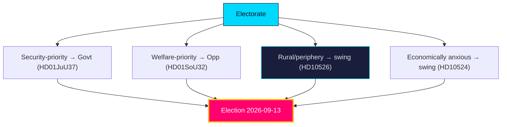

# Voter Segmentation — Year Ahead — 2026-05-31

Maps the electorate's concern hierarchy and segment-level dynamics into the 2026-09-13 election [horizon:election], grounded in the legislative cleavages of the late-May corpus.

## Concern hierarchy (projected top issues)

| Rank | Concern | Linked file | Owning bloc | Trend |
|------|---------|-------------|-------------|-------|
| 1 | Crime & safety | `HD01JuU37` | Government | Stable-high |
| 2 | Migration & integration | `HD01SfU35`, `HD024194` | Government/SD | Stable-high |
| 3 | Healthcare & elder care | `HD01SoU32` | Opposition | Rising |
| 4 | Economy & jobs | `HD10524` | Contested | Macro-dependent |
| 5 | Schools & education | `HD01UbU25` | Opposition | Steady |
| 6 | Pensions | `HD03130` | Contested | Steady |

## Segment dynamics

- **Security-priority voters** (cross-class, suburban + small-town) — **very likely** [horizon:year] anchored to the government bloc by the crime/migration agenda (`HD01JuU37`, `HD01SfU35`). dok_id `HD01JuU37`.
- **Welfare-priority voters** (public-sector, older, women) — **likely** [horizon:year] mobilised by the opposition's care/education frame (`HD01SoU32`, `HD01UbU25`). dok_id `HD01SoU32`.
- **Rural / periphery voters** — **roughly even** [horizon:year], movable by the equalisation debate (`HD10526`); a key C/S battleground. dok_id `HD10526`.
- **Economically anxious voters** — **roughly even** [horizon:year], decisive only if labour softens (`HD10524`, SCB AKU); otherwise the macro tailwind (IMF WEO Apr-2026, growth ~2.1% `T+1`) keeps them quiescent. dok_id `HD10524`.

## Mobilisation read

The government's path runs through security-priority and migration-restrictionist segments it already owns; the opposition's path requires converting welfare-priority salience (`HD01SoU32`) and winning the rural equalisation argument (`HD10526`). Turnout among economically anxious voters is the swing reservoir, activated only by a labour shock.

**Confidence**: MEDIUM — segment direction grounded in cleavage evidence; magnitudes are estimates pending campaign polling. Source: https://www.scb.se/, https://www.riksdagen.se/.

## Pass-2 refinement

Pass-2 identifies the decisive segment: not the polarised migration-first or welfare-first blocs (whose votes are largely locked) but the **welfare-anxious centrist** who is economically secure enough to weight competence over identity. This segment is **roughly even** [horizon:election] between the blocs and responds to the `HD01SoU32`/`HD10526` fairness frame more than the `HD01SfU35` security frame — which is why the opposition's path to the median seat runs through delivery-credibility, not migration counter-messaging.
