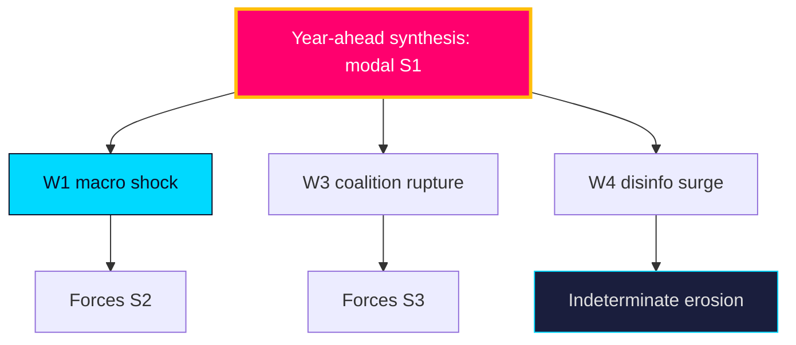

# Wildcards & Black Swans — Year Ahead — 2026-05-31

Five low-probability, high-impact events that would break the `scenario-analysis.md` synthesis. Referenced as the 5 wildcards in the scenario tree.

## W1 — Macro/labour shock

A sharp unemployment rise above ~9% (from ~8.3% `T+1`) or a Q3 GDP contraction (vs IMF WEO ~2.1% `T+1`) reframes the campaign from migration to economic competence. **Unlikely** [horizon:year] but the single highest-leverage synthesis-breaker. Trigger: I5/I6 (`forward-indicators.md`). Impact: forces S2.

## W2 — Security/terror incident

A high-salience violent or terror event would harden the security frame, benefiting the government's issue ownership (`HD01JuU37`, `HD01SfU35`). **Unlikely** [horizon:year]; impact asymmetric toward S1 and bloc cohesion.

## W3 — Coalition rupture

L or a Tidö partner publicly exits the cooperation over a values file (`HD024194`, `HD01SfU35`), collapsing the majority pre-election. **Unlikely** [horizon:year] but directly triggers S3 (fracture). Trigger: I1–I2 abstention signal.

## W4 — Foreign interference / disinformation surge

A coordinated influence operation into the campaign (`threat-analysis.md` T1) degrades information integrity. **Roughly even** [horizon:year] at low intensity; **unlikely** [horizon:year] at synthesis-breaking intensity. Impact: erodes turnout/trust, indeterminate bloc direction.

## W5 — EU-law collision

A CJEU ruling or Commission action against the migration/citizenship retroactivity (`HD024194`, `HD01UU10`) forces statutory retreat mid-campaign. **Unlikely** [horizon:year]; impact: legal-legitimacy damage to the government frame.

## Wildcard board

| Wildcard | Probability | Scenario impact | Watch |
|----------|-------------|-----------------|-------|
| W1 Macro shock | Unlikely | → S2 | I5/I6 |
| W2 Security incident | Unlikely | → S1 | event-driven |
| W3 Coalition rupture | Unlikely | → S3 | I1/I2 |
| W4 Disinfo surge | Roughly even (low) | indeterminate | T1 monitoring |
| W5 EU-law collision | Unlikely | → statutory retreat | I12 / CJEU docket |

**Confidence**: by construction these are low-probability; probability bands are analytic estimates. Source: https://www.riksdagen.se/, threat-analysis.md.

## Pass-2 refinement

Pass-2 adds the correlation caveat: the five wildcards are not independent. W1 (macro shock) raises the probability of W3 (coalition rupture) by intensifying distributional conflict, and W4 (disinfo surge) is most damaging precisely when it amplifies a real W1/W2 event rather than acting alone. The genuinely synthesis-breaking scenario is therefore a *correlated cluster* — e.g. a summer labour shock amplified by a disinformation surge — not any single wildcard, which is why the monitoring board (I5–I6 + T1) watches them jointly.
