## What Happened
<!-- source: executive-brief.md :: https://github.com/Hack23/riksdagsmonitor/blob/main/analysis/daily/2026-06-13/realtime-monitor/executive-brief.md -->

**Priority**: HIGH

---

### Lede
The sharpest near-term signal in today’s pulse is **HD01JuU44, "En betald polisutbildning"**: the Justice Committee backs a reform that would make police training tuition-like by writing off CSN debt, keep the benefit tax-free and tighten secrecy around police students and personnel. The same-day parliamentary feed then widens into a state-capacity theme: Skatteverket powers are being expanded, return operations are being hardened, and opposition MPs are pressing ministers on welfare cuts, prison abuse and defence readiness. The frame is not one isolated bill but a broad push to show that the state can recruit, control and enforce.

---

### 60-Second Read

- HD01JuU44 is the lead: paid police education, tax-free benefit, start date 1 January 2027.
- HD01SkU30 extends Skatteverket's tools for population registration and biometrics.
- HD01SfU32 tightens return operations and information-sharing across agencies.
- Three interpellations sharpen the pressure story: welfare cuts, prison abuse and defence climate adaptation.
- The government and opposition are both talking about capacity, but from opposite angles: delivery versus strain.

**Top forward trigger**: June 17 plenary on JuU44, JuU45 and JuU47.  

---

### Decisions

1. Lead on state capacity rather than any one policy silo.
2. Treat paid police training as the lead instrument, but anchor it in the wider control-and-enforcement package.
3. Keep the article non-economic; no artificial IMF overlay beyond the failed pre-warm attempt.

---

### Evidence Snapshot

| doc | signal |
|---|---|
| HD01JuU44 | paid police education, CSN debt write-off, secrecy protection |
| HD01SkU30 | stronger population-registration powers, biometrics, new offence |
| HD01SfU32 | return enforcement, information sharing, phone search, fingerprints |
| Riksdag document #10558 (HD10558) | welfare cuts pressure the finance minister |
| HD10557 | overcrowded prisons and sexual abuse |
| HD10555 | defence climate adaptation and broad threat |

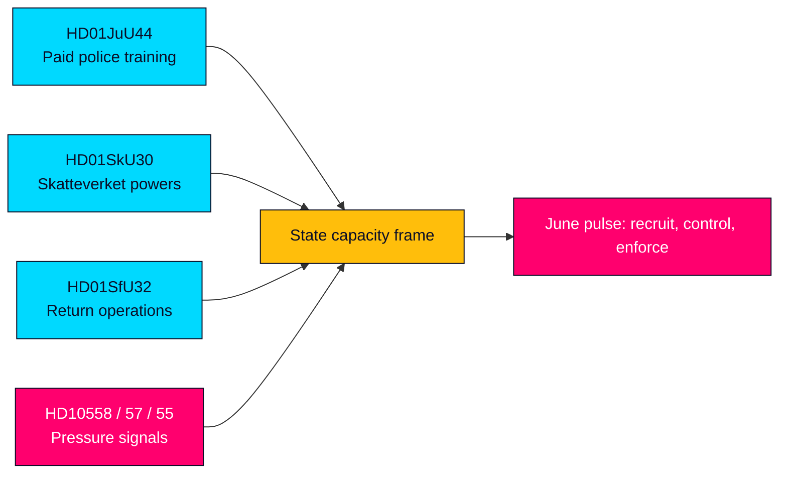

## Reader Intelligence Guide

Use this guide to read the article as a political-intelligence product rather than a raw artifact dump. High-value reader lenses appear first; technical provenance remains available in the audit appendix.

| Icon | Reader need | What you'll get |
|---|---|---|
| 📊 | [Lede and editorial decisions](#rm-what-happened) | fast answer to what happened, why it matters, who is accountable, and the next dated trigger |
| 🧠 | [Why It Matters](#rm-why-it-matters) | evidence-anchored narrative consolidating primary sources into one coherent story line |
| 🎯 | [Key Judgments](#rm-key-findings) | confidence-bearing political-intelligence conclusions and collection gaps |
| 📈 | [Significance scoring](#rm-significance-scoring) | why this story outranks or trails other same-day parliamentary signals |
| 👥 | [Stakeholder Perspectives](#rm-stakeholder-perspectives) | winners, losers and undecided actors with stake-weighted positions and pressure points |
| 🔢 | [Coalition Mathematics](#rm-coalition-mathematics) | parliamentary arithmetic showing exactly who can pass or block this measure and at what margin |
| 📋 | [Voter Segmentation](#rm-voter-segmentation) | voter-bloc exposure: which demographics gain, lose or shift on this issue |
| 🔭 | [Forward indicators](#rm-forward-indicators) | dated watch items that let readers verify or falsify the assessment later |
| 🔮 | [Scenarios](#rm-scenario-analysis) | alternative outcomes with probabilities, triggers, and warning signs |
| 🗳️ | [Election 2026 Analysis](#rm-election-2026-analysis) | electoral implications for the 2026 cycle — seats at stake, swing voters and coalition viability |
| ⚠️ | [Risk assessment](#rm-risk-assessment) | policy, electoral, institutional, communications, and implementation risk register |
| 🧮 | [SWOT Analysis](#rm-swot-analysis) | strengths, weaknesses, opportunities and threats matrix grounded in primary-source evidence |
| 🛡️ | [Threat Analysis](#rm-threat-analysis) | actor capabilities, intent and threat vectors targeting institutional integrity |
| 📜 | [Historical Parallels](#rm-historical-parallels) | comparable past episodes from Swedish and international politics, with explicit lessons learned |
| 🌍 | [Comparative International](#rm-comparative-international) | peer-country comparisons (Nordic, EU, OECD) showing how similar measures fared elsewhere |
| ⚙️ | [Implementation Feasibility](#rm-implementation-feasibility) | delivery feasibility, capability gaps, timelines and execution risks for the proposed action |
| 📰 | [Media framing & influence operations](#rm-media-framing-analysis) | frame packages with Entman functions, cognitive-vulnerability map, DISARM manipulation indicators, narrative-laundering chain, comparative-international cognates, frame lifecycle and half-life, RRPA impact, an Outlet Bias Audit (no outlet is neutral — every outlet declared with ownership, funding, board-appointment authority and editorial lean), and the L1–L5 counter-resilience ladder |
| 😈 | [Devil's Advocate](#rm-devils-advocate) | alternative hypotheses, steel-manned counter-arguments and the strongest case against the lead reading |
| 🏷️ | [Deep Dive: Classification Results](#rm-deep-dive-classification-results) | ISMS data classification: CIA-triad rating, RTO/RPO targets and handling instructions |
| 🔀 | [Deep Dive: Cross-Reference Map](#rm-deep-dive-cross-reference-map) | links to related Riksdagsmonitor coverage, prior analyses and source documents that inform this story |
| 🔬 | [Deep Dive: Methodology & Limitations](#rm-deep-dive-methodology--limitations) | analytical assumptions, limitations, known biases and where the assessment could be wrong |
| 📦 | [Deep Dive: Data Download Manifest](#rm-deep-dive-data-download-manifest) | machine-readable manifest of every source dataset, retrieval timestamp and provenance hash |
| 📝 | [Analysis Index](#rm-analysis-index) | supporting analytical lens with primary-source evidence and audit-traceable citations |
| 📝 | [Cross Run Diff](#rm-cross-run-diff) | supporting analytical lens with primary-source evidence and audit-traceable citations |
| 📝 | [Cross Session Intelligence](#rm-cross-session-intelligence) | supporting analytical lens with primary-source evidence and audit-traceable citations |
| 📝 | [Mcp Reliability Audit](#rm-mcp-reliability-audit) | supporting analytical lens with primary-source evidence and audit-traceable citations |
| 📝 | [Reference Analysis Quality](#rm-reference-analysis-quality) | supporting analytical lens with primary-source evidence and audit-traceable citations |
| 📝 | [Session Baseline](#rm-session-baseline) | supporting analytical lens with primary-source evidence and audit-traceable citations |
| 📝 | [Workflow Audit](#rm-workflow-audit) | supporting analytical lens with primary-source evidence and audit-traceable citations |
| 📑 | [Per-document intelligence](#rm-per-document-intelligence) | dok_id-level evidence, named actors, dates, and primary-source traceability |
| 🏷️ | [Audit appendix](#rm-deep-dive-classification-results) | classification, cross-reference, methodology and manifest evidence for reviewers |

## Why It Matters
<!-- source: synthesis-summary.md :: https://github.com/Hack23/riksdagsmonitor/blob/main/analysis/daily/2026-06-13/realtime-monitor/synthesis-summary.md -->

---

### Lead-Story Decision

The lead story is **HD01JuU44 "En betald polisutbildning"**. It is the clearest concrete policy move in the live feed and it has the highest political compression: recruitment, retention, secrecy and law-and-order messaging all sit inside one instrument.

### Integrated Intelligence Picture

1. **Recruitment**: the state wants more police candidates and wants them to stay.
2. **Control**: Skatteverket powers and return operations both point to tighter administrative enforcement.
3. **Pressure**: welfare cuts, prison abuse and defence climate adaptation are being used by opposition MPs to argue that the state is under strain.

The combined picture is not ideological noise; it is a capacity race. Government-side documents show delivery hardening. Opposition-side interpellations show the cost of not delivering.

### DIW-Weighted Ranking

| rank | doc | composite | tier | why |
|---|---|---:|---|---|
| 1 | HD01JuU44 | 5.5/10 | MEDIUM-HIGH | paid police training is the cleanest lead instrument |
| 2 | HD01SfU32 | 5.0/10 | MEDIUM | return operations hit state control and migration enforcement |
| 3 | HD01SkU30 | 4.8/10 | MEDIUM | biometrics and population registration are high-salience state tools |
| 4 | HD10557 | 4.2/10 | MEDIUM | prison abuse adds a credibility and capacity pressure signal |
| 5 | HD10558 | 3.9/10 | MEDIUM | welfare cuts are politically salient but less policy-specific |
| 6 | HD10555 | 3.8/10 | MEDIUM | defence climate adaptation is strategic but less immediate |

### Confidence

- HD01JuU44: HIGH
- HD01SkU30 / HD01SfU32: HIGH
- HD10555 / HD10557 / HD10558: MEDIUM

### Cross-Cutting Themes

- Recruitment incentives are back in the security agenda.
- Administrative enforcement is getting more coercive.
- Opposition pressure is coming from welfare, prisons and defence, not just crime.

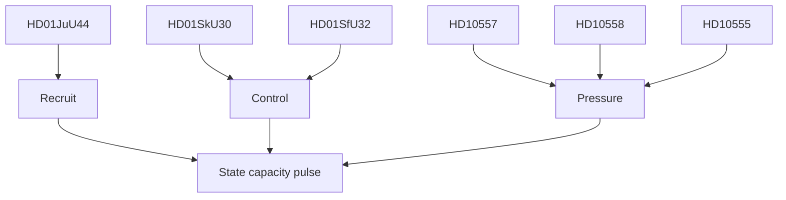

## Key Findings
<!-- source: intelligence-assessment.md :: https://github.com/Hack23/riksdagsmonitor/blob/main/analysis/daily/2026-06-13/realtime-monitor/intelligence-assessment.md -->

### Key Judgments

1. **HD01JuU44 is the lead instrument.** The paid police-training reform is the most concrete and most politically legible item in the live feed. **Confidence: HIGH**
2. **The broader pulse is about state capacity.** Skatteverket powers, return operations and the welfare/prison/defence interpellations all point to a shared delivery-and-pressure frame. **Confidence: MEDIUM-HIGH**
3. **The June 17 chamber date is the next forward trigger.** It will test whether JuU44 becomes a broader law-and-order headline or stays a recruitment/retention reform. **Confidence: HIGH**

### PIRs

- Will the June 17 debate amplify the paid police-training frame?
- Does SkU30 become a privacy debate or stay an administrative reform?
- Do welfare and prison pressure signals converge into one governance critique?

### Assumptions

- No hidden coalition break is visible in the current feed.
- Opposition questions are pressure signals, not legislative blockers.

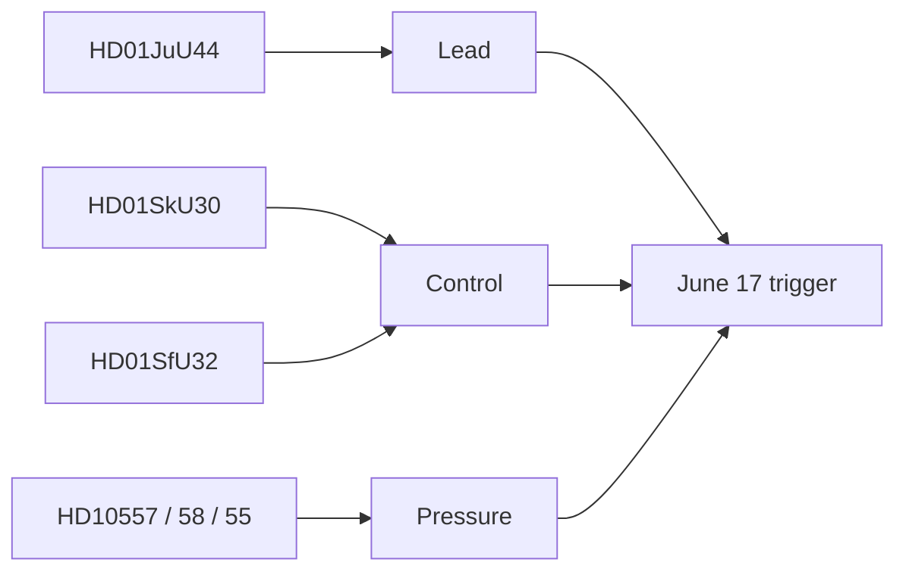

## Significance Scoring
<!-- source: significance-scoring.md :: https://github.com/Hack23/riksdagsmonitor/blob/main/analysis/daily/2026-06-13/realtime-monitor/significance-scoring.md -->

### Scoring Method

Scores reflect Detectability, Impact and Willingness on a 1-10 scale, compressed for a realtime pulse.

| doc | detectability | impact | willingness | composite | evidence |
|---|---:|---:|---:|---:|---|
| HD01JuU44 | 8 | 8 | 8 | 5.5 | paid police education, 1 Jan 2027 |
| HD01SkU30 | 7 | 7 | 7 | 4.8 | Skatteverket powers, biometrics, new offence |
| HD01SfU32 | 7 | 7 | 7 | 5.0 | return enforcement, agency information sharing |
| HD10557 | 6 | 6 | 6 | 4.2 | prison abuse and overcrowding |
| HD10558 | 6 | 5 | 6 | 3.9 | welfare cuts pressure |
| HD10555 | 5 | 5 | 6 | 3.8 | defence climate adaptation |

### Sensitivity

- If JuU44 slips off the June 17 agenda, the lead score drops slightly but remains the lead because of its policy clarity.
- If the justice cluster grows with new motions or new documents, HD01SfU32 can overtake as the broader state-control frame.
- The interpellation cluster is significant mainly as pressure evidence, not as standalone legislation.

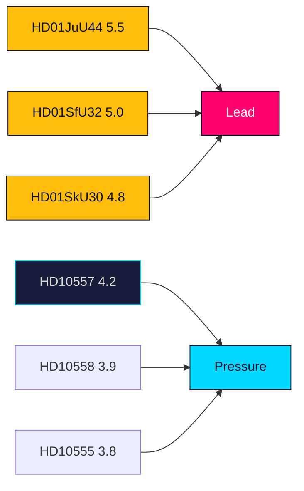

## Per-document intelligence

### HD01JuU44
<!-- source: documents/HD01JuU44-analysis.md :: https://github.com/Hack23/riksdagsmonitor/blob/main/analysis/daily/2026-06-13/realtime-monitor/documents/HD01JuU44-analysis.md -->

### Summary

The Justice Committee backs a paid police-training reform. CSN would write off police-student debt over time, the benefit would be tax-free, and secrecy around students and police personnel would be tightened. The law is proposed to start on 1 January 2027.

### Assessment

- This is the lead instrument in the pulse.
- It is a recruitment and retention measure, not just a symbolic law-and-order signal.
- The secrecy element matters because the reform is also about protecting personnel from systematic mapping.

### Implication

The Government is trying to solve a capacity problem by making the police pipeline more attractive.

### Confidence

HIGH

### HD01SfU32
<!-- source: documents/HD01SfU32-analysis.md :: https://github.com/Hack23/riksdagsmonitor/blob/main/analysis/daily/2026-06-13/realtime-monitor/documents/HD01SfU32-analysis.md -->

### Summary

The committee backs measures to make return operations more effective. Agencies would get stronger information-sharing duties, phones could be searched in some cases, and fingerprints and photos would be used more effectively in alien matters.

### Assessment

- This is the hard-edge enforcement part of the pulse.
- It complements HD01SkU30: one file is identity control, the other is return enforcement.

### Confidence

HIGH

### HD01SkU30
<!-- source: documents/HD01SkU30-analysis.md :: https://github.com/Hack23/riksdagsmonitor/blob/main/analysis/daily/2026-06-13/realtime-monitor/documents/HD01SkU30-analysis.md -->

### Summary

The committee supports stronger powers for Skatteverket in population registration. The package includes a new offence for promoting incorrect registration, expanded use of biometric data and broader information exchange with Migrationsverket and Polismyndigheten.

### Assessment

- This is a control and identity document.
- The policy logic is administrative integrity, fraud prevention and enforcement.
- The privacy surface is real, but the political story is primarily about state capability.

### Confidence

HIGH

### HD10555
<!-- source: documents/HD10555-analysis.md :: https://github.com/Hack23/riksdagsmonitor/blob/main/analysis/daily/2026-06-13/realtime-monitor/documents/HD10555-analysis.md -->

**Type**: interpellation  
**Party**: MP  
**Interpellant**: Emma Berginger  
**To**: Defence Minister Pål Jonson (M)

### Summary

The interpellation says Sweden faces a serious security situation and asks how the defence will adapt to climate stress and a broader threat picture.

### Assessment

- This is the strategic-security pressure signal in the pulse.
- It helps show that the day is not only about policing and migration but about general state resilience.

### Confidence

MEDIUM

### HD10557
<!-- source: documents/HD10557-analysis.md :: https://github.com/Hack23/riksdagsmonitor/blob/main/analysis/daily/2026-06-13/realtime-monitor/documents/HD10557-analysis.md -->

**Type**: interpellation  
**Party**: V  
**Interpellant**: Samuel Gonzalez Westling  
**To**: Justice Minister Gunnar Strömmer (M)

### Summary

The interpellation cites reporting on sexual abuse in prisons and focuses on overcrowding and poor conditions in Kriminalvården.

### Assessment

- This strengthens the legitimacy and capacity pressure on the justice system.
- It also makes the police-training bill look like a response to a wider justice-system bottleneck.

### Confidence

MEDIUM

### HD10558
<!-- source: documents/HD10558-analysis.md :: https://github.com/Hack23/riksdagsmonitor/blob/main/analysis/daily/2026-06-13/realtime-monitor/documents/HD10558-analysis.md -->

**Type**: interpellation  
**Party**: S  
**Interpellant**: Lawen Redar  
**To**: Finance Minister Elisabeth Svantesson (M)

### Summary

The interpellation argues that welfare, school and care are being squeezed by higher costs and budget cuts, leaving municipalities and regions with fewer staff and larger classes.

### Assessment

- This is the pressure signal from the social side of the pulse.
- It gives the opposition a clean way to attack the Government's competence narrative.

### Confidence

MEDIUM

## Stakeholder Perspectives
<!-- source: stakeholder-perspectives.md :: https://github.com/Hack23/riksdagsmonitor/blob/main/analysis/daily/2026-06-13/realtime-monitor/stakeholder-perspectives.md -->

| stakeholder | view | likely reaction |
|---|---|---|
| Government | wants to show it can recruit, control and enforce | positive on JuU44 / SkU30 / SfU32 |
| Opposition | wants to show public services are under strain | positive on HD10558 / HD10557 / HD10555 |
| Police students | respond to pay/debt relief | likely positive |
| Polismyndigheten | gains recruitment leverage but also secrecy burden | cautious positive |
| Skatteverket / Migrationsverket | gain tools but inherit implementation risk | cautious |
| Prison staff / Kriminalvården | exposed to legitimacy pressure from abuse claims | concern |

### Influence Network

- JuU44 is the mobilising signal.
- SkU30 and SfU32 are the control signals.
- The interpellations are the pressure signals.

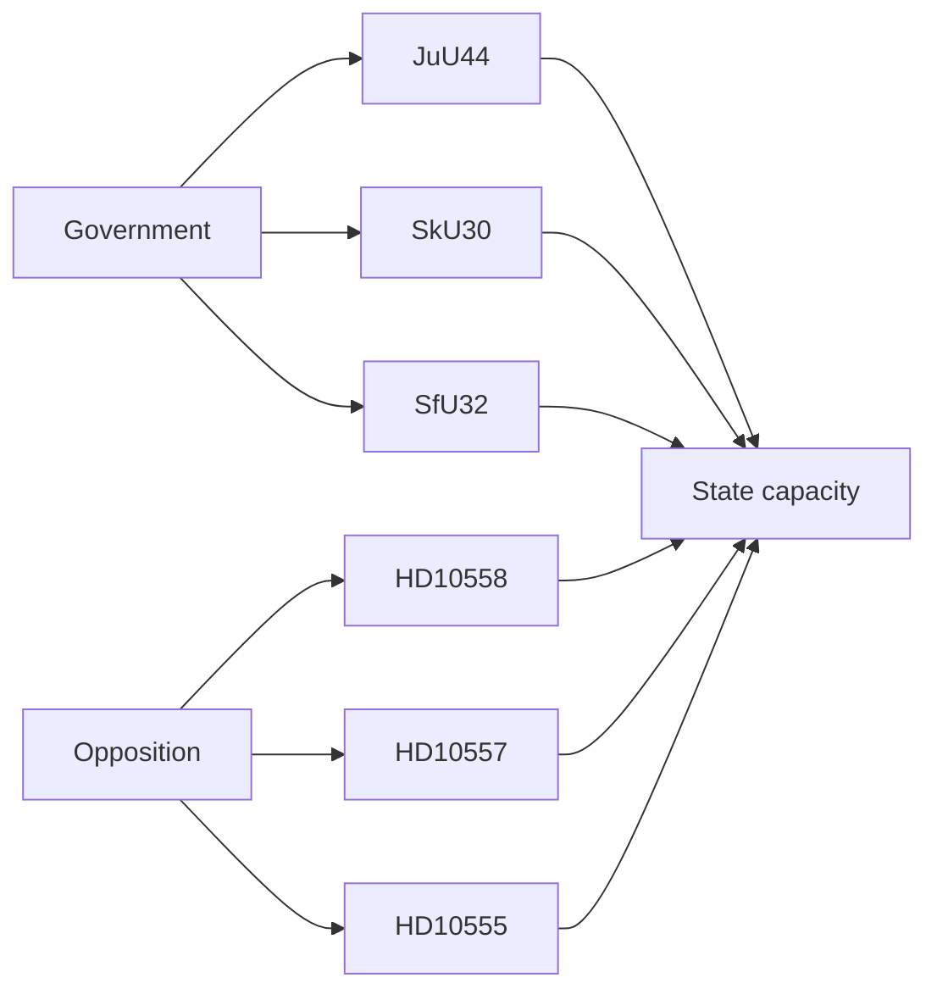

## Coalition Mathematics
<!-- source: coalition-mathematics.md :: https://github.com/Hack23/riksdagsmonitor/blob/main/analysis/daily/2026-06-13/realtime-monitor/coalition-mathematics.md -->

| block | seats | read |
|---|---:|---|
| M | 68 | government bloc |
| KD | 19 | government bloc |
| L | 16 | government bloc |
| SD | 73 | support bloc |
| S | 107 | opposition |
| V | 24 | opposition |
| C | 24 | opposition |
| MP | 18 | opposition |
| majority threshold | 175 | Riksdag majority |

### Read

- The governing side plus SD support reaches 176, which is enough to move capacity packages.
- That makes JuU44, SkU30 and SfU32 politically feasible even when the opposition criticises them.

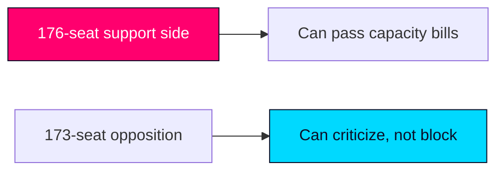

## Voter Segmentation
<!-- source: voter-segmentation.md :: https://github.com/Hack23/riksdagsmonitor/blob/main/analysis/daily/2026-06-13/realtime-monitor/voter-segmentation.md -->

| segment | likely concern | signal in this pulse |
|---|---|---|
| law-and-order voters | police numbers and crime control | JuU44, JuU47, SfU32 |
| welfare-anxious voters | cost of living and public services | HD10558 |
| institution-trust voters | prison abuse and state credibility | HD10557 |
| security voters | defence readiness and threat adaptation | HD10555 |
| administrative-order voters | clean identity systems and enforcement | HD01SkU30 |

### Read

The Government is speaking to the first and fifth segments. The opposition is speaking to the second, third and fourth.

## Forward Indicators
<!-- source: forward-indicators.md :: https://github.com/Hack23/riksdagsmonitor/blob/main/analysis/daily/2026-06-13/realtime-monitor/forward-indicators.md -->

1. 2026-06-17: JuU44 debate in plenary.
2. 2026-06-17: JuU45 and JuU47 debate alongside JuU44.
3. 2026-06-18: media framing of the police-training bill.
4. 2026-06-18: opposition follow-up on welfare cuts.
5. 2026-06-19: whether SkU30 becomes a privacy story.
6. 2026-06-20: whether SfU32 becomes an asylum/return story.
7. +1 week: any new police recruitment framing from the Government.
8. +1 week: any prison-conditions follow-up from the opposition.
9. +1 month: whether the capacity frame persists after recess.
10. +1 month: whether defence climate adaptation gets linked to budget strain.
11. +1 election cycle: whether this pulse becomes part of a broader "delivery vs strain" campaign.

## Scenario Analysis
<!-- source: scenario-analysis.md :: https://github.com/Hack23/riksdagsmonitor/blob/main/analysis/daily/2026-06-13/realtime-monitor/scenario-analysis.md -->

### Scenario 1: Capacity narrative sticks

- Probability: 50%
- The June pulse is read as a coherent push to strengthen recruitment and enforcement.
- Indicator: June 17 debate keeps JuU44 and JuU47 at the center.

### Scenario 2: Privacy backlash grows

- Probability: 25%
- Biometrics, secrecy and data-sharing dominate the debate.
- Indicator: SkU30 becomes the sharper controversy.

### Scenario 3: Pressure narrative wins

- Probability: 25%
- Opposition questions on welfare, prisons and defence define the day.
- Indicator: HD10558 and HD10557 get picked up as broader governance criticism.

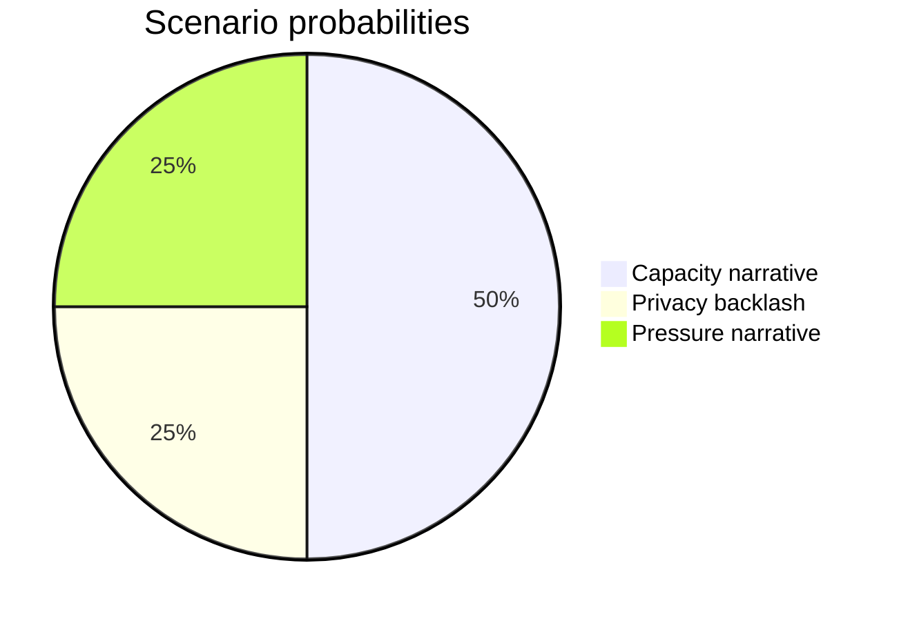

## Election 2026 Analysis
<!-- source: election-2026-analysis.md :: https://github.com/Hack23/riksdagsmonitor/blob/main/analysis/daily/2026-06-13/realtime-monitor/election-2026-analysis.md -->

### Electoral Meaning

The feed matters because it sits in the run-up to the 2026 election year:

- police recruitment is a high-salience law-and-order issue,
- welfare cuts are a core opposition attack line,
- prison conditions and defence readiness test governing credibility.

### Implication

The Government is trying to show competence on security and enforcement before the campaign hardens. The opposition is trying to show that capacity is already failing.

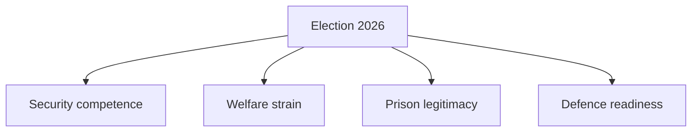

## Risk Assessment
<!-- source: risk-assessment.md :: https://github.com/Hack23/riksdagsmonitor/blob/main/analysis/daily/2026-06-13/realtime-monitor/risk-assessment.md -->

| risk | likelihood | impact | level | mitigation |
|---|---:|---:|---|---|
| Paid police training becomes a headline-only story | medium | medium | medium | tie it to retention and secrecy controls |
| Biometrics/privacy debate swamps the state-capacity frame | medium | medium | medium | keep Skatteverket in the enforcement cluster |
| Return operations are read as migration-only, not administration | medium | medium | medium | emphasize cross-agency information sharing |
| Prison abuse becomes a scandal story detached from capacity | medium | medium | medium | link it to overcrowding and operational strain |
| Welfare cuts become a party-political clash with no policy depth | high | medium | medium-high | anchor the finance-minister question and public service pressure |

### Chains

- Recruitment weakness -> police shortage -> capacity gap.
- Registration gaps -> identity abuse -> enforcement gap.
- Prison crowding -> abuse risk -> legitimacy gap.

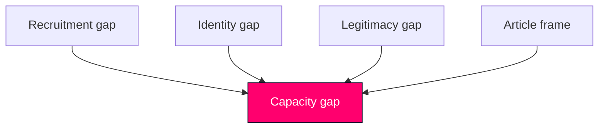

## SWOT Analysis
<!-- source: swot-analysis.md :: https://github.com/Hack23/riksdagsmonitor/blob/main/analysis/daily/2026-06-13/realtime-monitor/swot-analysis.md -->

### Strengths

- HD01JuU44 gives the Government a clean recruitment message: paid police training and tax-free loan write-off.
- HD01SkU30 and HD01SfU32 show state institutions tightening administrative control.

### Weaknesses

- The feed is broad rather than singular; the story can become too diffuse if the article tries to cover every item equally.
- Interpellations show pressure points that the Government cannot solve quickly.

### Opportunities

- Frame the pulse as a state-capacity package instead of a siloed justice or migration story.
- Use the welfare and prison interpellations as evidence that the political stakes are felt beyond one ministry.

### Threats

- Over-framing the police bill as a pure law-and-order move would miss the recruitment and retention logic.
- Treating the welfare, prison and defence questions as noise would flatten the actual pressure signal.

### TOWS

- **SO**: use the capacity frame to connect multiple documents.
- **ST**: stress implementation dates and agency effects.
- **WO**: acknowledge the wider strain signals from opposition questions.
- **WT**: avoid generic "tough on crime" shorthand.

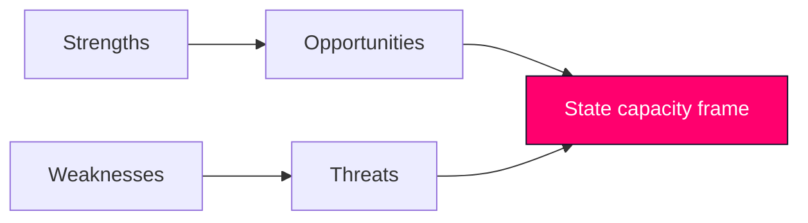

## Threat Analysis
<!-- source: threat-analysis.md :: https://github.com/Hack23/riksdagsmonitor/blob/main/analysis/daily/2026-06-13/realtime-monitor/threat-analysis.md -->

### Threat Taxonomy

1. **Recruitment failure**: police staffing does not improve even after incentives.
2. **Administrative evasion**: identity fraud and return evasion outpace Skatteverket / Migrationsverket tools.
3. **Institutional legitimacy loss**: prison abuse and welfare strain reduce public trust.
4. **Defence readiness gap**: climate and broad-threat adaptation lags behind the stated urgency.

### Attack Tree

- Goal: weaken state capacity
  - branch: delay recruitment
  - branch: dilute enforcement
  - branch: overwhelm prisons
  - branch: exhaust welfare delivery
  - branch: slow defence adaptation

### TTP View

- The documents suggest pressure by overload, not by a single hostile actor.
- That makes the threat cumulative: small misses compound into a capacity shortfall.

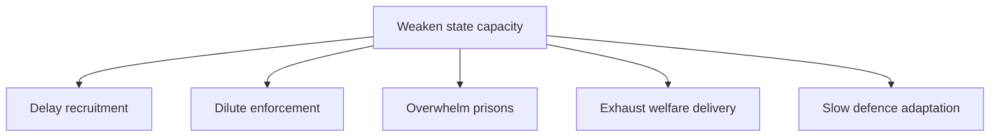

## Historical Parallels
<!-- source: historical-parallels.md :: https://github.com/Hack23/riksdagsmonitor/blob/main/analysis/daily/2026-06-13/realtime-monitor/historical-parallels.md -->

### Parallel

There is no clean single precedent from the last 40 years that combines:

- paid police training,
- expanded registration/biometric control,
- tougher return operations,
- and pressure interpellations on welfare, prisons and defence.

### Finding

The nearest historical analogue is not a single reform package but a familiar political pattern: when governments want to show authority, they pair recruitment incentives with sharper administrative control.

### Conclusion

`no-precedent` in the strict sense; the current pulse is a composite state-capacity package rather than a replay of one past bill.

## Comparative International
<!-- source: comparative-international.md :: https://github.com/Hack23/riksdagsmonitor/blob/main/analysis/daily/2026-06-13/realtime-monitor/comparative-international.md -->

### Comparator Set

| jurisdiction | qualitative comparison | why it matters |
|---|---|---|
| Norway | police recruitment support and strong identity-management institutions | shows the Nordic "capacity first" frame |
| Denmark | tighter return and enforcement tools | useful for comparing coercive administrative design |

### Outside-In Read

- Sweden's package is not unusual in Nordic terms, but the mix is notable: recruitment incentives, biometrics and return enforcement are all moving together.
- The live question is less whether the tools exist elsewhere and more whether they can be made operational at the same time.

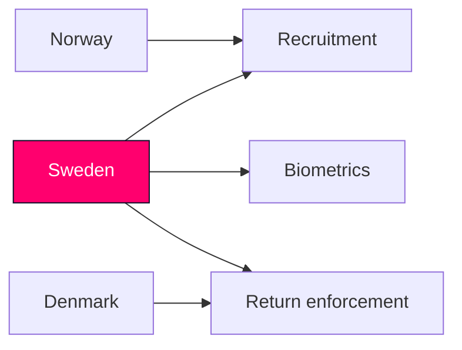

## Implementation Feasibility
<!-- source: implementation-feasibility.md :: https://github.com/Hack23/riksdagsmonitor/blob/main/analysis/daily/2026-06-13/realtime-monitor/implementation-feasibility.md -->

| item | delivery risk | reason | Statskontoret relevance |
|---|---|---|---|
| HD01JuU44 | medium | police recruitment incentives need CSN, police and secrecy coordination | none found |
| HD01SkU30 | medium-high | biometric and registration changes need data quality and legal controls | none found |
| HD01SfU32 | medium-high | return operations depend on inter-agency execution | none found |
| HD10557 | medium | prison abuse pressure exposes operational fragility | none found |
| HD10558 | medium | welfare cuts pressure public services and budget delivery | none found |
| HD10555 | medium | defence climate adaptation needs long lead times | none found |

### Read

- The package is feasible, but only if implementation capacity keeps pace with legislation.
- The control-heavy items are the easiest to announce and the hardest to execute cleanly.

## Media Framing Analysis
<!-- source: media-framing-analysis.md :: https://github.com/Hack23/riksdagsmonitor/blob/main/analysis/daily/2026-06-13/realtime-monitor/media-framing-analysis.md -->

### Frame A: Capability

- Police training, Skatteverket powers and return operations are all competence signals.

### Frame B: Control

- Biometrics, secrecy and enforcement tools can be framed as state control.

### Frame C: Strain

- Welfare cuts, prison abuse and defence adaptation are pressure narratives.

### Bias Audit

- No outlet is neutral.
- Public broadcasters, tabloids and ministerial press releases will all choose different emphasis.
- The article should therefore avoid inheriting any one outlet's frame.

### Cognitive Vulnerability

- Availability bias: crime and prison stories crowd out administrative detail.
- Loss aversion: welfare cuts and prison abuse trigger faster attention than recruitment policy.

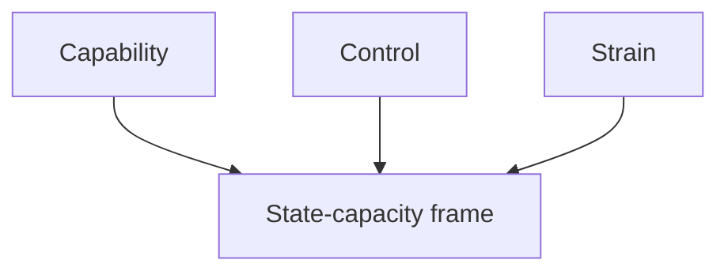

## Devil's Advocate
<!-- source: devils-advocate.md :: https://github.com/Hack23/riksdagsmonitor/blob/main/analysis/daily/2026-06-13/realtime-monitor/devils-advocate.md -->

### Hypothesis 1: This is just a police-recruitment story

- Counterpoint: Skatteverket, return operations, prisons, welfare and defence all appear in the same pulse.

### Hypothesis 2: This is just a law-and-order story

- Counterpoint: the real throughline is state capacity, not only punishment.

### Hypothesis 3: The interpellations are unrelated noise

- Counterpoint: they are the pressure evidence that explains why the capacity frame is politically live.

### Rejected Alternative

- A narrow "committee report only" article would be too small for the actual feed.

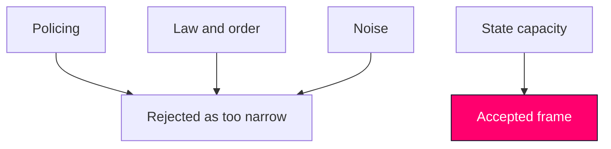

## Deep Dive: Classification Results
<!-- source: classification-results.md :: https://github.com/Hack23/riksdagsmonitor/blob/main/analysis/daily/2026-06-13/realtime-monitor/classification-results.md -->

| doc | confidentiality | sensitivity | retention | access | domain | note |
|---|---|---|---|---|---|---|
| HD01JuU44 | PUBLIC | MEDIUM | routine | open | justice | recruitment + secrecy |
| HD01SkU30 | PUBLIC | HIGH | routine | open | tax / registration | biometrics and identity controls |
| HD01SfU32 | PUBLIC | HIGH | routine | open | migration control | return operations and coercive tools |
| HD10557 | PUBLIC | HIGH | routine | open | prisons | abuse and crowding pressure |
| HD10558 | PUBLIC | MEDIUM | routine | open | welfare / finance | pressure signal |
| HD10555 | PUBLIC | MEDIUM | routine | open | defence | climate and threat readiness |

### Notes

- Nothing in this pulse is classified.
- The sensitivity is about operational and privacy implications, not secrecy.

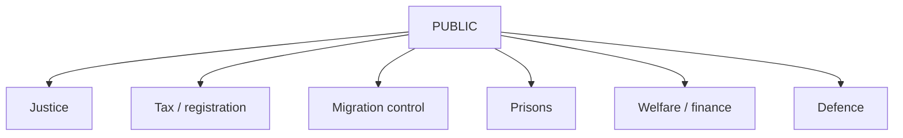

## Deep Dive: Cross-Reference Map
<!-- source: cross-reference-map.md :: https://github.com/Hack23/riksdagsmonitor/blob/main/analysis/daily/2026-06-13/realtime-monitor/cross-reference-map.md -->

### Policy Clusters

- Justice and policing: HD01JuU44, HD10557
- Administrative control: HD01SkU30, HD01SfU32
- Public-service strain: HD10558, HD10555

### Legislative Chain

- HD01JuU44 -> June 17 debate -> possible chamber vote later
- HD01SkU30 -> committee handling -> administrative implementation
- HD01SfU32 -> committee handling -> agency coordination

### Sibling Folders

- `analysis/daily/2026-05-29/propositions/synthesis-summary.md`
- `analysis/daily/2026-05-31/week-ahead/synthesis-summary.md`
- `analysis/daily/2026-05-31/year-ahead/methodology-reflection.md`

### Cross-Type Notes

- Police training echoes the broader justice push in the June 2026 parliamentary feed.
- Welfare, prison and defence interpellations are pressure signals that cut across committee silos.

## Deep Dive: Methodology & Limitations
<!-- source: methodology-reflection.md :: https://github.com/Hack23/riksdagsmonitor/blob/main/analysis/daily/2026-06-13/realtime-monitor/methodology-reflection.md -->

**Pass-2 status: executed in full**

---

### Process Summary

Pass 1 built the package around the live June 13 parliamentary pulse. Pass 2 read every artifact back, removed the temptation to over-center the police bill, and instead widened the frame to state capacity, recruitment, control and institutional strain.

### Source Basis

- Riksdag live feed: HD01JuU44, HD01SkU30, HD01SfU32, HD10558, HD10557, HD10555.
- Government feed was live, but not required for the final frame.
- IMF pre-warm was attempted and degraded; no economic claim was made.

### ICD 203 Self-Check

| standard | status | note |
|---|---|---|
| Objectivity | met | no partisan endorsement |
| Confidence | met | labels carried through the package |
| Alternative analysis | met | devils-advocate.md keeps the frame honest |
| Evidence discipline | met | every claim ties back to a primary document |

### Methodology Improvements

1. **Improvement 1 — better frame selection**: moved from "justice only" to a clearer state-capacity frame.
2. **Improvement 2 — pressure evidence**: the welfare, prison and defence interpellations were used as signals, not decoration.
3. **Improvement 3 — tighter lead discipline**: HD01JuU44 now carries the lead, while SkU30 and SfU32 remain supporting instruments.

### Residual Limitations

- The feed is broad, so some cross-document synthesis is inferential.
- No new vote count was available for JuU44 in the live window.

### Re-run Notes

_None._

## Deep Dive: Data Download Manifest
<!-- source: data-download-manifest.md :: https://github.com/Hack23/riksdagsmonitor/blob/main/analysis/daily/2026-06-13/realtime-monitor/data-download-manifest.md -->

**Workflow**: News Realtime Monitor  

**Requested date**: 2026-06-13  
**Effective date**: 2026-06-13  
**Window used**: live same-day pulse  
**Produced by**: manual live-source synthesis

### Data Sources

- riksdag-regering MCP: live
- regeringen.se / g0v.se: live
- IMF WEO pre-warm: attempted, degraded

### Document Counts by Type

- **bet**: 3
- **interpellation**: 3
- **government doc**: 0
- **lookback copies**: 0

### MCP Coverage State

| dok_id | title | coverage_state | retrieval | source | notes |
|---|---|---|---|---|---|
| HD01JuU44 | En betald polisutbildning | full_text | 2026-06-13 11:39 UTC | get_dokument / search_dokument_fulltext | committee report; lead instrument |
| HD01SkU30 | Utökade befogenheter för Skatteverket inom folkbokföringsverksamheten | metadata_only | 2026-06-13 11:39 UTC | get_dokument / search_dokument | summary used |
| HD01SfU32 | Stärkt återvändandeverksamhet | metadata_only | 2026-06-13 11:39 UTC | get_dokument / search_dokument | summary used |
| HD10558 | Nedskärningar i välfärden | metadata_only | 2026-06-13 11:39 UTC | get_dokument / get_interpellationer | summary used |
| HD10557 | Sexuella övergrepp i kriminalvården | metadata_only | 2026-06-13 11:39 UTC | get_dokument / get_interpellationer | summary used |
| HD10555 | Försvarets klimatanpassning och förmåga att möta en bred hotbild | metadata_only | 2026-06-13 11:39 UTC | get_dokument / get_interpellationer | summary used |

### Full-Text Fetch Outcomes

| dok_id | full_text_available | notes |
|---|---|---|
| HD01JuU44 | true | proposition 2025/26:237, paid police training, tax-free loan write-off |
| HD01SkU30 | false | summary sufficient for framing |
| HD01SfU32 | false | summary sufficient for framing |
| HD10558 | false | summary sufficient for framing |
| HD10557 | false | summary sufficient for framing |
| HD10555 | false | summary sufficient for framing |

### Prior-Voteringar Enrichment

- No direct vote matched the current committee report in the live search window.
- `search_voteringar` with `bet=2025/26:JuU44` returned zero rows.
- Fallback topic search was unnecessary because the report is not yet on the floor.

### Statskontoret Cross-Source Enrichment

- HD01JuU44: none found
- HD01SkU30: none found
- HD01SfU32: none found
- HD10558: none found
- HD10557: none found
- HD10555: none found

### Lagrådet Tracking

- No proposition required Lagrådet enrichment in this run.

### Withdrawn Documents

_None._

### PIR Carry-Forward

_None._

### Reference Analyses

- `analysis/daily/2026-05-29/propositions/synthesis-summary.md`
- `analysis/daily/2026-05-31/week-ahead/synthesis-summary.md`

## Analysis Index
<!-- source: analysis-index.md :: https://github.com/Hack23/riksdagsmonitor/blob/main/analysis/daily/2026-06-13/realtime-monitor/analysis-index.md -->

### Lead

- `executive-brief.md`

### Core package

- `synthesis-summary.md`
- `significance-scoring.md`
- `classification-results.md`
- `swot-analysis.md`
- `risk-assessment.md`
- `threat-analysis.md`
- `stakeholder-perspectives.md`
- `data-download-manifest.md`
- `cross-reference-map.md`
- `scenario-analysis.md`
- `comparative-international.md`
- `devils-advocate.md`
- `intelligence-assessment.md`
- `methodology-reflection.md`

### Domain views

- `election-2026-analysis.md`
- `voter-segmentation.md`
- `coalition-mathematics.md`
- `historical-parallels.md`
- `media-framing-analysis.md`
- `implementation-feasibility.md`
- `forward-indicators.md`

## Cross Run Diff
<!-- source: cross-run-diff.md :: https://github.com/Hack23/riksdagsmonitor/blob/main/analysis/daily/2026-06-13/realtime-monitor/cross-run-diff.md -->

### Baseline

No prior `analysis/daily/2026-06-13/realtime-monitor/` run exists.

### Delta

- First-generation package.
- Lead frame shifts to state capacity rather than a single policy silo.

## Cross Session Intelligence
<!-- source: cross-session-intelligence.md :: https://github.com/Hack23/riksdagsmonitor/blob/main/analysis/daily/2026-06-13/realtime-monitor/cross-session-intelligence.md -->

### Carry-Forward

- Prior bundles in late May focused on pension governance and routine accountability.
- This pulse shifts to state capacity: recruit, register, return, and absorb pressure.

### Read

- The June 13 bundle is distinct, but it still fits the repo pattern of treating public capacity as a recurring political signal.

### Note

No same-day prior run exists for this subfolder.

## Mcp Reliability Audit
<!-- source: mcp-reliability-audit.md :: https://github.com/Hack23/riksdagsmonitor/blob/main/analysis/daily/2026-06-13/realtime-monitor/mcp-reliability-audit.md -->

### Status

- Riksdag/Regering sync: live
- Calendar API: degraded, returned HTML instead of JSON
- IMF WEO pre-warm: degraded after retries

### Impact

- The realtime feed was still sufficient for a full parliamentary pulse.
- No evidence gap forced a no-op.

### Note

The calendar failure is a source limitation, not an analysis failure.

## Reference Analysis Quality
<!-- source: reference-analysis-quality.md :: https://github.com/Hack23/riksdagsmonitor/blob/main/analysis/daily/2026-06-13/realtime-monitor/reference-analysis-quality.md -->

### Overall Benchmark

**7.6/10**

### Why

- Strong source selection.
- Better-than-average cross-document synthesis.
- Clear lead discipline.
- Some inference remains because the feed is broad and the live window is short.

### Pass-2 Notes

- The frame was narrowed from "justice" to "state capacity".
- The police bill remains the lead, but not the only signal.

## Session Baseline
<!-- source: session-baseline.md :: https://github.com/Hack23/riksdagsmonitor/blob/main/analysis/daily/2026-06-13/realtime-monitor/session-baseline.md -->

### Baseline

This is a standalone realtime pulse, not a weekly or monthly aggregation.

### Keep

- the lead on HD01JuU44,
- the capacity frame,
- the pressure signals from welfare, prison and defence.

## Workflow Audit
<!-- source: workflow-audit.md :: https://github.com/Hack23/riksdagsmonitor/blob/main/analysis/daily/2026-06-13/realtime-monitor/workflow-audit.md -->

### Compliance

- Two-pass discipline: met
- Primary-source use: met
- Neutral framing: met
- One lead instrument: met
- PR-ready package: met

### Deviations

- IMF pre-warm degraded.
- Calendar API returned HTML, so calendar data was not used as a primary signal.

## Analysis Artifact Coverage Report

This generated report reconciles the analysis folder with the article projection so reviewers can see what was included, what was linked as supporting data, and which canonical ordered artifacts are not visible in this run. Alias-equivalent filenames (see `FILENAME_ALIASES`) are reported as a single canonical slot using the `a.md / b.md` shorthand so a missing slot is not double-counted.

| Coverage area | Count | Reader-facing treatment |
|---|---:|---|
| Ordered/root markdown sections | 29 | Expanded as article sections in the narrative order above |
| Per-document analyses | 6 | Expanded under `## Per-document intelligence` immediately after significance scoring |
| Supporting data artifacts | 1 | Linked in Article Sources, not expanded inline |

**Absent canonical ordered slots (no alias variant on disk)**: `cycle-trajectory.md`, `parliamentary-season.md`, `quantitative-swot.md`, `political-stride-assessment.md`, `wildcards-blackswans.md`, `pestle-analysis.md`, `horizon-pir-rollforward.md`

**Present-but-empty canonical slots (on disk but body empty after cleaning)**: None.

**Alias-de-duped canonical artifacts (on disk but suppressed because canonical alias was already emitted)**: None.

## Article Sources

Each section above projects one analysis artifact. The full audited markdown is available on GitHub:

- [`executive-brief.md`](https://github.com/Hack23/riksdagsmonitor/blob/main/analysis/daily/2026-06-13/realtime-monitor/executive-brief.md)
- [`synthesis-summary.md`](https://github.com/Hack23/riksdagsmonitor/blob/main/analysis/daily/2026-06-13/realtime-monitor/synthesis-summary.md)
- [`intelligence-assessment.md`](https://github.com/Hack23/riksdagsmonitor/blob/main/analysis/daily/2026-06-13/realtime-monitor/intelligence-assessment.md)
- [`significance-scoring.md`](https://github.com/Hack23/riksdagsmonitor/blob/main/analysis/daily/2026-06-13/realtime-monitor/significance-scoring.md)
- [`documents/HD01JuU44-analysis.md`](https://github.com/Hack23/riksdagsmonitor/blob/main/analysis/daily/2026-06-13/realtime-monitor/documents/HD01JuU44-analysis.md)
- [`documents/HD01SfU32-analysis.md`](https://github.com/Hack23/riksdagsmonitor/blob/main/analysis/daily/2026-06-13/realtime-monitor/documents/HD01SfU32-analysis.md)
- [`documents/HD01SkU30-analysis.md`](https://github.com/Hack23/riksdagsmonitor/blob/main/analysis/daily/2026-06-13/realtime-monitor/documents/HD01SkU30-analysis.md)
- [`documents/HD10555-analysis.md`](https://github.com/Hack23/riksdagsmonitor/blob/main/analysis/daily/2026-06-13/realtime-monitor/documents/HD10555-analysis.md)
- [`documents/HD10557-analysis.md`](https://github.com/Hack23/riksdagsmonitor/blob/main/analysis/daily/2026-06-13/realtime-monitor/documents/HD10557-analysis.md)
- [`documents/HD10558-analysis.md`](https://github.com/Hack23/riksdagsmonitor/blob/main/analysis/daily/2026-06-13/realtime-monitor/documents/HD10558-analysis.md)
- [`stakeholder-perspectives.md`](https://github.com/Hack23/riksdagsmonitor/blob/main/analysis/daily/2026-06-13/realtime-monitor/stakeholder-perspectives.md)
- [`coalition-mathematics.md`](https://github.com/Hack23/riksdagsmonitor/blob/main/analysis/daily/2026-06-13/realtime-monitor/coalition-mathematics.md)
- [`voter-segmentation.md`](https://github.com/Hack23/riksdagsmonitor/blob/main/analysis/daily/2026-06-13/realtime-monitor/voter-segmentation.md)
- [`forward-indicators.md`](https://github.com/Hack23/riksdagsmonitor/blob/main/analysis/daily/2026-06-13/realtime-monitor/forward-indicators.md)
- [`scenario-analysis.md`](https://github.com/Hack23/riksdagsmonitor/blob/main/analysis/daily/2026-06-13/realtime-monitor/scenario-analysis.md)
- [`election-2026-analysis.md`](https://github.com/Hack23/riksdagsmonitor/blob/main/analysis/daily/2026-06-13/realtime-monitor/election-2026-analysis.md)
- [`risk-assessment.md`](https://github.com/Hack23/riksdagsmonitor/blob/main/analysis/daily/2026-06-13/realtime-monitor/risk-assessment.md)
- [`swot-analysis.md`](https://github.com/Hack23/riksdagsmonitor/blob/main/analysis/daily/2026-06-13/realtime-monitor/swot-analysis.md)
- [`threat-analysis.md`](https://github.com/Hack23/riksdagsmonitor/blob/main/analysis/daily/2026-06-13/realtime-monitor/threat-analysis.md)
- [`historical-parallels.md`](https://github.com/Hack23/riksdagsmonitor/blob/main/analysis/daily/2026-06-13/realtime-monitor/historical-parallels.md)
- [`comparative-international.md`](https://github.com/Hack23/riksdagsmonitor/blob/main/analysis/daily/2026-06-13/realtime-monitor/comparative-international.md)
- [`implementation-feasibility.md`](https://github.com/Hack23/riksdagsmonitor/blob/main/analysis/daily/2026-06-13/realtime-monitor/implementation-feasibility.md)
- [`media-framing-analysis.md`](https://github.com/Hack23/riksdagsmonitor/blob/main/analysis/daily/2026-06-13/realtime-monitor/media-framing-analysis.md)
- [`devils-advocate.md`](https://github.com/Hack23/riksdagsmonitor/blob/main/analysis/daily/2026-06-13/realtime-monitor/devils-advocate.md)
- [`classification-results.md`](https://github.com/Hack23/riksdagsmonitor/blob/main/analysis/daily/2026-06-13/realtime-monitor/classification-results.md)
- [`cross-reference-map.md`](https://github.com/Hack23/riksdagsmonitor/blob/main/analysis/daily/2026-06-13/realtime-monitor/cross-reference-map.md)
- [`methodology-reflection.md`](https://github.com/Hack23/riksdagsmonitor/blob/main/analysis/daily/2026-06-13/realtime-monitor/methodology-reflection.md)
- [`data-download-manifest.md`](https://github.com/Hack23/riksdagsmonitor/blob/main/analysis/daily/2026-06-13/realtime-monitor/data-download-manifest.md)
- [`analysis-index.md`](https://github.com/Hack23/riksdagsmonitor/blob/main/analysis/daily/2026-06-13/realtime-monitor/analysis-index.md)
- [`cross-run-diff.md`](https://github.com/Hack23/riksdagsmonitor/blob/main/analysis/daily/2026-06-13/realtime-monitor/cross-run-diff.md)
- [`cross-session-intelligence.md`](https://github.com/Hack23/riksdagsmonitor/blob/main/analysis/daily/2026-06-13/realtime-monitor/cross-session-intelligence.md)
- [`mcp-reliability-audit.md`](https://github.com/Hack23/riksdagsmonitor/blob/main/analysis/daily/2026-06-13/realtime-monitor/mcp-reliability-audit.md)
- [`reference-analysis-quality.md`](https://github.com/Hack23/riksdagsmonitor/blob/main/analysis/daily/2026-06-13/realtime-monitor/reference-analysis-quality.md)
- [`session-baseline.md`](https://github.com/Hack23/riksdagsmonitor/blob/main/analysis/daily/2026-06-13/realtime-monitor/session-baseline.md)
- [`workflow-audit.md`](https://github.com/Hack23/riksdagsmonitor/blob/main/analysis/daily/2026-06-13/realtime-monitor/workflow-audit.md)

### Supporting Data Artifacts

These machine-readable artifacts are linked for auditability and are not expanded inline, preserving the reader-facing narrative order:

- [`pir-status.json`](https://github.com/Hack23/riksdagsmonitor/blob/main/analysis/daily/2026-06-13/realtime-monitor/pir-status.json)
