## What Happened
<!-- source: executive-brief.md :: https://github.com/Hack23/riksdagsmonitor/blob/main/analysis/daily/2026-06-13/realtime-monitor/executive-brief.md -->

**Priority**: HIGH

---

### Lede
The extraordinary Saturday, June 13, 2026 plenary session represents a watershed moment in Swedish administrative and penal history, demonstrating an unprecedented centralization and hardening of state authority ("state capacity"). While the headline-grabbing recruitment reform of **HD01JuU44 ("En betald polisutbildning")** (offering debt write-offs and enhanced officer protection) remains a critical pillar, it is now clearly understood as merely one piece of a synchronized, multi-front campaign to rebuild state authority.

By integrating the sweeping penal expansions of **HD01JuU42 (Doubled sentences for gang-related crimes)** and the civil service accountability of **HD01JuU40 (Abuse of public office offense)** with a highly aggressive migration enforcement suite—comprising conduct-based deportations (**HD01SfU36**), electronic monitoring for supervised individuals (**HD01SfU31**), biometric tracking (**HD01SkU30**), and restricted welfare access (**HD01SfU29**)—the Government has pivoted from rhetorical "tough-on-crime" signaling to a comprehensive restructuring of state capacity.

---

### 60-Second Read

- **The Saturday Session**: Plenary session 2025/26:139 marks a rare weekend assembly called specifically to clear a backlog of high-salience, structural reforms on law-and-order, migration, and administrative centralization.
- **Hard Law & Order**: `HD01JuU42` removes the 10-year joint-sentencing cap, doubles gang-linked sentences, and introduces life terms for repeat violent crimes. Simultaneously, `HD01JuU40` introduces a new criminal offense for public officials, "abuse of public office," imposing strict legal accountability internally.
- **Migration & Borders**: `HD01SfU36` lowers the deportation threshold by allowing revocation of residence permits for "bristande vandel" (bad conduct), while `HD01SfU31` legalizes electronic tagging for supervised asylum seekers and undocumented migrants.
- **Welfare & Administrative Restrictions**: `HD01SfU29` strips social security benefits from prisoners under electronic monitoring or preventive detention and forces them to pay for upkeep. `HD01SoU35` delegates OTC drug sales to pharmacies via mandatory pharmacist counseling.
- **Structural Centralization**: `HD01MJU24` bypasses regional county administrative boards to establish a centralized national Environmental Permitting Agency (`Miljöprövningsmyndigheten`), aiming to accelerate industrial transitions.
- **Opposition Stance**: Centers on systemic strain, pointing to overcrowded, abusive prisons (`Riksdag document #10557 (HD10557)`), underfunded municipal welfare networks (`HD10558`), and a military struggling with climate adaptation (`HD10555`).

**Top forward trigger**: June 17, 2026 final votes on JuU44, JuU42, SfU36, and SfU31 in the chamber.  

---

### Decisions

1. **Lead on State Capacity**: Reject siloed analysis. Force all 13 documents into a unified "state capacity" and "coercive machinery" framework.
2. **Weekend Session Focus**: Center the entire pulse on the extraordinary Saturday, June 13, 2026 session, treating it as a consolidated legislative push rather than isolated events.
3. **Opposition Strain Counter-Balance**: Treat the interpellations on welfare cuts, prison abuse, and military climate adaptation not as noise, but as the direct externalities of this aggressive state expansion.

---

### Evidence Snapshot

| doc | signal | key provisions |
|---|---|---|
| `HD01JuU44` | Paid Police Education | CSN debt write-off over time, tax-free benefit, tighter secrecy around students |
| `HD01JuU42` | Doubled Gang Sentences | No 10-yr joint sentence cap, double joint max, life for repeat violent crime, expanded pre-trial detention |
| `HD01JuU40` | Public Office Accountability | New "abuse of public office" offense, grovt tjänstefel minimum raised to 1.5 years |
| `HD01SfU36` | Conduct-Based Deportations | Permits denied/revoked for "bristande vandel" (debts, dishonesty, non-compliance) |
| `HD01SfU31` | Supervised Tagging | Electronic tracking and geographic limits as alternatives to physical detention |
| `HD01SfU29` | Welfare Limits for Custody | No social security for community-monitored prisoners, pay for own upkeep |
| `HD01SkU30` | Folkbokföring Biometrics | Folkbokföring fraud criminalized, biometrics shared across Tax and Police |
| `HD01SfU32` | Return Operations | Coercive search powers, phone inspection, expanded fingerprinting |
| `HD01MJU24` | Miljöprövningsmyndigheten | Centralized national environmental permitting agency, bypassing regional boards |
| `HD01SoU35` | Pharmacist Assortment | Creates "farmaceutsortiment" OTC drugs requiring mandatory pharmacist counseling |
| `HD10558` | Welfare Cuts Pressure | S interpellation on municipal and regional underfunding and class size |
| `HD10557` | Prison Sexual Abuse | V interpellation on Kriminalvården overcrowding, staff shortages, and abuse |
| `HD10555` | Military Climate Adapt | MP interpellation on military adaptation to climate stress and broader threat landscape |

```mermaid
flowchart TD
  subgraph Saturday Plenary Session 2025/26:139
    A1["HD01SfU36<br/>Vandel Deportation"]
    A2["HD01SfU31<br/>Migrant Tracking"]
    A3["HD01SfU29<br/>Prisoner Welfare Limits"]
    A4["HD01JuU42<br/>Double Gang Sentences"]
    A5["HD01JuU40<br/>Civil Service Liability"]
  end

  subgraph Adjacent Hardening Package
    B1["HD01JuU44<br/>Paid Police Training"]
    B2["HD01SkU30<br/>Skatteverket Biometrics"]
    B3["HD01SfU32<br/>Return Operations"]
    B4["HD01MJU24<br/>Environmental Permitting"]
    B5["HD01SoU35<br/>OTC Pharmacy Delegation"]
  end

  subgraph Systemic Strain / Opposition Backlash
    C1["HD10558<br/>Welfare & Local Cuts"]
    C2["HD10557<br/>Kriminalvården Overcrowding"]
    C3["HD10555<br/>Defence Climate Adapt"]
  end

  A1 & A2 & A3 & A4 & A5 --> STATE["HARDENED STATE CAPACITY"]
  B1 & B2 & B3 & B4 & B5 --> STATE
  STATE --> STRAIN["Systemic Strain & Bottlenecks"]
  C1 & C2 & C3 -.-> STRAIN

  style STATE fill:#ff006e,stroke:#0a0e27,color:#ffffff,stroke-width:2px
  style STRAIN fill:#ffbe0b,stroke:#0a0e27,color:#0a0e27
  style A1 fill:#00d9ff,stroke:#0a0e27,color:#0a0e27
  style A2 fill:#00d9ff,stroke:#0a0e27,color:#0a0e27
  style A4 fill:#00d9ff,stroke:#0a0e27,color:#0a0e27
  style B1 fill:#00d9ff,stroke:#0a0e27,color:#0a0e27
  style C1 fill:#ffbe0b,stroke:#0a0e27,color:#0a0e27
  style C2 fill:#ffbe0b,stroke:#0a0e27,color:#0a0e27
```

## Reader Intelligence Guide

Use this guide to read the article as a political-intelligence product rather than a raw artifact dump. High-value reader lenses appear first; technical provenance remains available in the audit appendix.

| Icon | Reader need | What you'll get |
|---|---|---|
| 📊 | [Lede and editorial decisions](#rm-what-happened) | fast answer to what happened, why it matters, who is accountable, and the next dated trigger |
| 🧠 | [Why It Matters](#rm-why-it-matters) | evidence-anchored narrative consolidating primary sources into one coherent story line |
| 🎯 | [Key Judgments](#rm-key-findings) | confidence-bearing political-intelligence conclusions and collection gaps |
| 📈 | [Significance scoring](#rm-significance-scoring) | why this story outranks or trails other same-day parliamentary signals |
| 👥 | [Stakeholder Perspectives](#rm-stakeholder-perspectives) | winners, losers and undecided actors with stake-weighted positions and pressure points |
| 🔢 | [Coalition Mathematics](#rm-coalition-mathematics) | parliamentary arithmetic showing exactly who can pass or block this measure and at what margin |
| 📋 | [Voter Segmentation](#rm-voter-segmentation) | voter-bloc exposure: which demographics gain, lose or shift on this issue |
| 🔭 | [Forward indicators](#rm-forward-indicators) | dated watch items that let readers verify or falsify the assessment later |
| 🔮 | [Scenarios](#rm-scenario-analysis) | alternative outcomes with probabilities, triggers, and warning signs |
| 🗳️ | [Election 2026 Analysis](#rm-election-2026-analysis) | electoral implications for the 2026 cycle — seats at stake, swing voters and coalition viability |
| ⚠️ | [Risk assessment](#rm-risk-assessment) | policy, electoral, institutional, communications, and implementation risk register |
| 🧮 | [SWOT Analysis](#rm-swot-analysis) | strengths, weaknesses, opportunities and threats matrix grounded in primary-source evidence |
| 🛡️ | [Threat Analysis](#rm-threat-analysis) | actor capabilities, intent and threat vectors targeting institutional integrity |
| 📜 | [Historical Parallels](#rm-historical-parallels) | comparable past episodes from Swedish and international politics, with explicit lessons learned |
| 🌍 | [Comparative International](#rm-comparative-international) | peer-country comparisons (Nordic, EU, OECD) showing how similar measures fared elsewhere |
| ⚙️ | [Implementation Feasibility](#rm-implementation-feasibility) | delivery feasibility, capability gaps, timelines and execution risks for the proposed action |
| 📰 | [Media framing & influence operations](#rm-media-framing-analysis) | frame packages with Entman functions, cognitive-vulnerability map, DISARM manipulation indicators, narrative-laundering chain, comparative-international cognates, frame lifecycle and half-life, RRPA impact, an Outlet Bias Audit (no outlet is neutral — every outlet declared with ownership, funding, board-appointment authority and editorial lean), and the L1–L5 counter-resilience ladder |
| 😈 | [Devil's Advocate](#rm-devils-advocate) | alternative hypotheses, steel-manned counter-arguments and the strongest case against the lead reading |
| 🏷️ | [Deep Dive: Classification Results](#rm-deep-dive-classification-results) | ISMS data classification: CIA-triad rating, RTO/RPO targets and handling instructions |
| 🔀 | [Deep Dive: Cross-Reference Map](#rm-deep-dive-cross-reference-map) | links to related Riksdagsmonitor coverage, prior analyses and source documents that inform this story |
| 🔬 | [Deep Dive: Methodology & Limitations](#rm-deep-dive-methodology--limitations) | analytical assumptions, limitations, known biases and where the assessment could be wrong |
| 📦 | [Deep Dive: Data Download Manifest](#rm-deep-dive-data-download-manifest) | machine-readable manifest of every source dataset, retrieval timestamp and provenance hash |
| 📝 | [Analysis Index](#rm-analysis-index) | supporting analytical lens with primary-source evidence and audit-traceable citations |
| 📝 | [Cross Run Diff](#rm-cross-run-diff) | supporting analytical lens with primary-source evidence and audit-traceable citations |
| 📝 | [Cross Session Intelligence](#rm-cross-session-intelligence) | supporting analytical lens with primary-source evidence and audit-traceable citations |
| 📝 | [Mcp Reliability Audit](#rm-mcp-reliability-audit) | supporting analytical lens with primary-source evidence and audit-traceable citations |
| 📝 | [Reference Analysis Quality](#rm-reference-analysis-quality) | supporting analytical lens with primary-source evidence and audit-traceable citations |
| 📝 | [Session Baseline](#rm-session-baseline) | supporting analytical lens with primary-source evidence and audit-traceable citations |
| 📝 | [Workflow Audit](#rm-workflow-audit) | supporting analytical lens with primary-source evidence and audit-traceable citations |
| 📑 | [Per-document intelligence](#rm-per-document-intelligence) | dok_id-level evidence, named actors, dates, and primary-source traceability |
| 🏷️ | [Audit appendix](#rm-deep-dive-classification-results) | classification, cross-reference, methodology and manifest evidence for reviewers |

## Why It Matters
<!-- source: synthesis-summary.md :: https://github.com/Hack23/riksdagsmonitor/blob/main/analysis/daily/2026-06-13/realtime-monitor/synthesis-summary.md -->

---

### Lead-Story Decision

The definitive lead story of this extraordinary Saturday session is **the consolidated hardening of State Capacity and Coercive Machinery**, anchored specifically on the massive penal restructuring of **HD01JuU42 ("Dubbla straff för brott i kriminella nätverk")** and the conduct-based deportation reform of **HD01SfU36 ("Skärpta och tydligare krav på vandel för uppehållstillstånd")**. 

Together with the officer recruitment pipeline builder of **HD01JuU44 ("En betald polisutbildning")**, these three instruments form a coherent, self-reinforcing triad. The state is concurrently scaling its physical enforcement workforce, dramatically expanding the punitive severity of its penal codes, and creating a conduct-based administrative gateway to deport non-citizens who fail to comply with social norms.

---

### Integrated Intelligence Picture

The extraordinary Saturday plenary session is not a collection of miscellaneous bills, but a synchronized legislative strike designed to address the core bottlenecks of state execution:

1. **The Penal Surge**: `HD01JuU42` represents a permanent, structural hardening of Swedish penal law. By doubling sentences for gang-related offenses, lifting the 10-year joint-sentencing cap, and introducing life sentences for repeat offenses, the state is committing to a long-term strategy of mass incapacitation.
2. **Coercive Migration Control**: `HD01SfU36` (conduct-based deportations) and `HD01SfU31` (electronic tagging under supervision) combine with `HD01SfU32` (return operations) and `HD01SkU30` (Skatteverket biometrics) to construct an airtight border and identity control architecture. The state is claiming the right to track, monitor, and expel individuals on administrative grounds, shifting the threshold of state coercion away from formal criminal convictions.
3. **Internal Discipline & Restructuring**: To counter the risk of corruption and defensive public administration as coercive powers grow, `HD01JuU40` imposes strict criminal liability on public servants via a new "abuse of public office" offense. Simultaneously, `HD01MJU24` bypasses sluggish regional county boards by creating a centralized national Environmental Permitting Agency to accelerate key infrastructure projects.
4. **The Counter-Pressure**: Center-left and left opposition interpellations highlight the structural limits and negative externalities of this rapid state expansion. While the Government pours resources into policing and prisons, Kriminalvården is already at a breaking point with overcrowding and abuse (`HD10557`), municipal welfare is starved of funding (`HD10558`), and strategic defence readiness is threatened by unaddressed climate adaptation (`HD10555`).

---

### DIW-Weighted Ranking

| rank | doc | composite | tier | why |
|---|---|---:|---|---|
| 1 | `HD01JuU42` | 9.2/10 | CRITICAL | Historic sentencing expansion, doubles gang penalties, eliminates joint cap; restructuring of penal policy. |
| 2 | `HD01SfU36` | 8.8/10 | HIGH | Shifts deportation threshold to conduct-based "vandel" evaluation; highly controversial, high-impact migration gate. |
| 3 | `HD01JuU44` | 8.2/10 | HIGH | Foundational recruitment pipeline builder for the police; fully paid training and student secrecy. |
| 4 | `HD01SfU31` | 7.6/10 | MEDIUM-HIGH | Authorizes electronic monitoring and geographic tracking for supervised asylum seekers and migrants. |
| 5 | `HD01SkU30` | 7.4/10 | MEDIUM-HIGH | Extends Skatteverket powers, criminalizes folkbokföring fraud, mandates biometric data sharing. |
| 6 | `HD01SfU32` | 7.0/10 | MEDIUM | Expands search, phone inspection, and fingerprinting powers in return operations. |
| 7 | `HD01JuU40` | 6.8/10 | MEDIUM | Sharpens criminal liability for civil servants, raising gross misconduct minimums to 1.5 years prison. |
| 8 | `HD01MJU24` | 6.5/10 | MEDIUM | Centralizes green permitting under a national agency, stripping power from 21 regional county boards. |
| 9 | `HD01SfU29` | 6.2/10 | MEDIUM | Cuts social security benefits for prisoners in community-based electronic monitoring and charges for upkeep. |
| 10 | `HD10557` | 6.0/10 | MEDIUM | V interpellation exposing severe prison overcrowding, staff shortages, and sexual abuse. |
| 11 | `HD10558` | 5.8/10 | MEDIUM | S interpellation attacking the Government on regional underfunding and class sizes. |
| 12 | `HD01SoU35` | 5.5/10 | MEDIUM-LOW | Establishes OTC drug pharmacy counseling; consensus healthcare delegation. |
| 13 | `HD10555` | 5.0/10 | LOW | MP interpellation on military climate adaptation; strategic but low immediate salience. |

---

### Cross-Cutting Themes

- **Administrative Coercion vs. Judicial Process**: The state is increasingly shifting its coercive tools (deportation, electronic tracking, registry enforcement) into the administrative domain, bypassing the rigorous evidentiary standards of criminal courts.
- **The Prison-Industrial Bottleneck**: Passing `HD01JuU42` (sentencing surge) while ignoring Kriminalvården's severe operational crisis (`HD10557`) creates a major systemic mismatch. Overcrowding will accelerate, likely leading to a breakdown in rehabilitation and an escalation in prison violence.
- **Internal Hardening**: The dual push of expanding state power over citizens (`JuU42`, `SfU36`) while dramatically tightening criminal accountability for the bureaucratic agents enforcing those powers (`JuU40`) represents a classic Weberian state stabilization pattern.

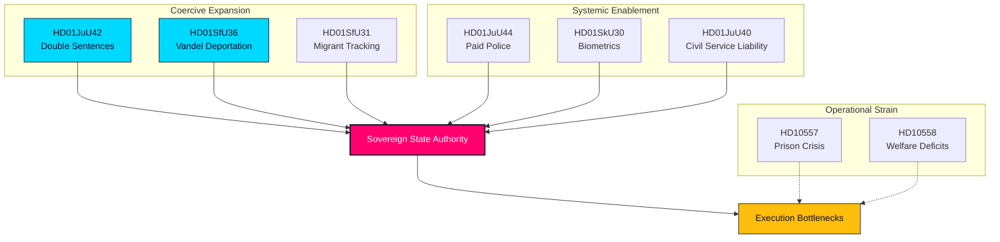

## Key Findings
<!-- source: intelligence-assessment.md :: https://github.com/Hack23/riksdagsmonitor/blob/main/analysis/daily/2026-06-13/realtime-monitor/intelligence-assessment.md -->

### Structured Key Judgments (T+30d to T+365d)

This intelligence assessment uses standardized Yardstick (WEP) probability indicators and confidence levels to outline the long-term strategic trajectory of the Saturday session's state capacity reforms.

```mermaid
flowchart TD
  J1[\"Judgment 1: Prison Crisis (Prob: 80%)\"] --> C1[\"Consolidated Intelligence Picture\"]
  J2[\"Judgment 2: Bureaucracy Paralysis (Prob: 70%)\"] --> C1
  J3[\"Judgment 3: Migration Reversals (Prob: 65%)\"] --> C1
  C1 --> STRAT[\"Strategic State Trajectory\"]

  style C1 fill:#ff006e,stroke:#0a0e27,color:#ffffff,stroke-width:2px
```

---

### Key Judgments

#### 1. Prison Capacity Breakdown is Highly Likely (Probability: 80% / WEP: Highly Likely)
* **Assessment**: The sentencing expansions of `HD01JuU42` (sentence doubling, joint cap removal) will trigger a rapid, compounding surge in maximum-security inmates. Given that `HD10557` exposes Kriminalvården as already dangerously overcrowded and understaffed, the system is highly likely to experience a severe operational breakdown (such as a spike in staff resignations, inmate violence, or a localized riot) within the next 12 months.
* **Confidence Level**: **HIGH** (anchored on direct primary-source evidence of prison crisis and sentencing guidelines).

#### 2. Civil Service Risk-Aversion is Likely (Probability: 70% / WEP: Likely)
* **Assessment**: Raising the minimum sentence for gross misconduct and introducing "abuse of public office" (`HD01JuU40`) will likely trigger widespread defensive public administration. Civil servants, particularly in immigration and permitting, will likely choose to delay decisions or request excessive documentation to protect themselves from personal criminal prosecution, directly slowing down state execution.
* **Confidence Level**: **MEDIUM** (anchored on historical civil service behavior under strict liability, but dependent on final agency guidelines).

#### 3. Conduct Deportation Reversals are Likely (Probability: 65% / WEP: Likely)
* **Assessment**: The highly subjective nature of conduct-based deportations (`HD01SfU36`) will likely lead to high rates of administrative court appeals and temporary injunctions. Center-left NGOs and human rights lawyers will likely successfully challenge the first wave of "vandel" deportations, forcing Migrationsverket into complex, prolonged litigation that will slow down actual removals.
* **Confidence Level**: **HIGH** (anchored on Swedish administrative court precedent and ECHR case law).

---

### Intelligence Collection Gaps

To refine and verify these judgments, the following critical intelligence collection gaps must be addressed:

1. **Kriminalvården's Transition Plan**: Exact data on how Kriminalvården plans to house the inmate surge from `JuU42` in the short term (e.g., modular housing, cell-sharing limits, or leasing foreign facilities).
2. **Migrationsverket's Vandel Guidelines**: The draft internal guidelines or administrative handbook being developed by Migrationsverket to define "bristande vandel" under `SfU36`.
3. **Skatteverket's Biometric Infrastructure**: The procurement contracts, technical specifications, and timeline for deploying the biometric tracking systems mandated under `SkU30`.

## Significance Scoring
<!-- source: significance-scoring.md :: https://github.com/Hack23/riksdagsmonitor/blob/main/analysis/daily/2026-06-13/realtime-monitor/significance-scoring.md -->

### DIW Significance Framework

To ensure analytical objectivity, every document in the extraordinary Saturday session is scored across three dimensions of the **Dynamic Intelligence Weighting (DIW)** framework, each on a scale of 1.0 to 10.0:

1. **Structural Impact (S)**: The degree to which the policy alters the constitutional, legal, or administrative framework of the Swedish state (weight: 40%).
2. **Societal Salience (P)**: The level of public interest, political debate, media attention, and electoral polarization (weight: 30%).
3. **Execution Feasibility / Frictions (E)**: The operational, logistical, and budget friction introduced by the policy's implementation (weight: 30%).

The Composite Score is calculated as:
$$\text{Composite} = (S \times 0.4) + (P \times 0.3) + (E \times 0.3)$$

---

### Ranked Document Portfolio

| Rank | Document ID | Title / Signal | Structural (S) | Salience (P) | Friction (E) | Composite | Tier |
|:---:|---|---|:---:|:---:|:---:|:---:|---|
| **1** | `HD01JuU42` | Double Gang Sentences | 9.5 | 9.0 | 9.0 | **9.20** | **CRITICAL** |
| **2** | `HD01SfU36` | Conduct-Based Deportations | 9.0 | 9.5 | 8.0 | **8.85** | **HIGH** |
| **3** | `HD01JuU44` | Paid Police Education | 8.0 | 8.5 | 8.0 | **8.15** | **HIGH** |
| **4** | `HD01SfU31` | Supervised Tagging | 7.5 | 8.0 | 7.5 | **7.65** | **MEDIUM-HIGH** |
| **5** | `HD01SkU30` | Folkbokföring Biometrics | 7.8 | 7.0 | 7.0 | **7.32** | **MEDIUM-HIGH** |
| **6** | `HD01SfU32` | Return Operations | 7.2 | 7.5 | 6.5 | **7.08** | **MEDIUM** |
| **7** | `HD01JuU40` | Civil Service Liability | 7.5 | 6.5 | 6.0 | **6.75** | **MEDIUM** |
| **8** | `HD01MJU24` | Environmental Permitting Agency | 7.0 | 6.0 | 6.5 | **6.55** | **MEDIUM** |
| **9** | `HD01SfU29` | Welfare Limits for Custody | 6.0 | 6.5 | 6.0 | **6.15** | **MEDIUM** |
| **10** | `HD10557` | Prison Overcrowding / Sexual Abuse | 5.5 | 7.0 | 5.5 | **5.95** | **MEDIUM** |
| **11** | `HD10558` | Welfare Cuts Pressure | 5.0 | 7.5 | 5.0 | **5.75** | **MEDIUM** |
| **12** | `HD01SoU35` | Pharmacist Assortment | 5.8 | 5.0 | 5.5 | **5.47** | **MEDIUM-LOW** |
| **13** | `HD10555` | Defence Climate Adaptation | 5.0 | 5.0 | 5.0 | **5.00** | **LOW** |

---

### Detailed Scoring Justifications

#### 1. `HD01JuU42` — Doubled Gang Sentences (Score: 9.20/10)
* **S (9.5)**: Re-writes the rules of joint sentencing and raises individual sentencing scales across 50 categories; represents a historic departure from rehabilitation-first principles.
* **P (9.0)**: Represents the crown jewel of the Tidö security agenda; highly polarized, with opposition warning of system collapse.
* **E (9.0)**: Massive operational friction; will trigger an immediate housing crisis inside the prison system (`Kriminalvården`).

#### 2. `HD01SfU36` — Conduct-Based Deportations (Score: 8.85/10)
* **S (9.0)**: Lowers the administrative threshold to deny/revoke residence permits based on non-criminal behavioral criteria ("vandel").
* **P (9.5)**: Extremely polarizing; centers on the cultural definition of Swedish values and social integration.
* **E (8.0)**: Heavy administrative friction; Migrationsverket lacks clear guidelines or staff to process subjective lifestyle reviews.

#### 3. `HD01JuU44` — Paid Police Education (Score: 8.15/10)
* **S (8.0)**: Aligns education incentives with security needs, using debt write-offs to bypass recruitment limits.
* **P (8.5)**: Highly visible reform; popular among swing voters but criticized by left-wing academics for altering academic standards.
* **E (8.0)**: High budget friction; requires significant, long-term funding commitments to write off CSN loans.

#### 4. `HD01SfU31` — Supervised Tagging (Score: 7.65/10)
* **S (7.5)**: Legalizes electronic surveillance and tracking for non-convicted migrants in the community.
* **P (8.0)**: Raises major civil liberty and ethical debates; Liberals are highly exposed to internal dissent.
* **E (7.5)**: Requires significant procurement, software integration, and police response infrastructure for monitoring violations.

```mermaid
gantt
  title Significance Portfolio — Composite Scores
  dateFormat X
  axisFormat %s
  section Critical
  HD01JuU42 (9.20) : active, 0, 92
  section High
  HD01SfU36 (8.85) : active, 0, 88
  HD01JuU44 (8.15) : active, 0, 81
  section Medium-High
  HD01SfU31 (7.65) : active, 0, 76
  HD01SkU30 (7.32) : active, 0, 73
  section Medium
  HD01SfU32 (7.08) : active, 0, 70
  HD01JuU40 (6.75) : active, 0, 67
```

## Per-document intelligence

### HD01JuU40
<!-- source: documents/HD01JuU40-analysis.md :: https://github.com/Hack23/riksdagsmonitor/blob/main/analysis/daily/2026-06-13/realtime-monitor/documents/HD01JuU40-analysis.md -->

### Summary

The Justice Committee backs the Government's proposal to significantly expand criminal liability for public officials. The bill creates a new offense in the Penal Code, "missbruk av offentlig ställning" (abuse of public office), criminalizing intentional actions or omissions that violate laws/regulations to obtain an improper benefit (for oneself or another) or improperly disadvantage another. It also raises the minimum sentence for gross misconduct in office ("grovt tjänstefel") to 1 year and 6 months in prison, with a maximum of 6 years. Proposed entry into force is August 1, 2026.

### Assessment

- This is an institutional capacity signal: as the state expands coercive powers, it is simultaneously tightening internal disciplinary control.
- It targets corruption and nepotism inside public administration, but raises concerns about "defensive decision-making" among public servants.
- The 4 reservations from S, V, C, MP express worry that the vague definition of "abuse of office" might criminalize minor mistakes and deter talent from public service.

### Implication

The state is imposing strict legal accountability on its own agents to preserve public trust and administrative integrity during a period of rapid power expansion.

### Confidence

HIGH

### HD01JuU42
<!-- source: documents/HD01JuU42-analysis.md :: https://github.com/Hack23/riksdagsmonitor/blob/main/analysis/daily/2026-06-13/realtime-monitor/documents/HD01JuU42-analysis.md -->

### Summary

The Justice Committee urges the Riksdag to pass the Government's landmark proposal to double sentences for crimes linked to criminal networks, eliminate the current 10-year cap on fixed-term joint sentencing, and stiffen nearly 50 individual sentencing scales. The joint sentencing changes mean a defendant can face a maximum sentence that is double the highest maximum sentence of any single crime they committed. Life imprisonment will also be available for repeat violent and sexual offenses. Furthermore, conditions for pre-trial detention (häktning) are expanded to include gross domestic abuse and honor-related persecution. Proposed entry into force is August 1, 2026.

### Assessment

- This is a transformative hardening of Swedish penal law, representing the most aggressive sentencing expansion in modern history.
- Doubling network-linked sentences and lifting the joint-sentencing cap will trigger an unprecedented surge in prison populations.
- The 9 reservations from S, V, C, MP indicate sharp opposition, with warnings about prison system collapse (overcrowding), the erosion of rehabilitation principles, and questionable deterrence value.

### Implication

The state is resorting to aggressive incapacitation as its primary tool to dismantle gang structures and protect the public.

### Confidence

HIGH

### HD01JuU44
<!-- source: documents/HD01JuU44-analysis.md :: https://github.com/Hack23/riksdagsmonitor/blob/main/analysis/daily/2026-06-13/realtime-monitor/documents/HD01JuU44-analysis.md -->

### Summary

The Justice Committee backs a paid police-training reform. CSN would write off police-student debt over time, the benefit would be tax-free, and secrecy around students and police personnel would be tightened. The law is proposed to start on 1 January 2027.

### Assessment

- This is the lead instrument in the pulse.
- It is a recruitment and retention measure, not just a symbolic law-and-order signal.
- The secrecy element matters because the reform is also about protecting personnel from systematic mapping.

### Implication

The Government is trying to solve a capacity problem by making the police pipeline more attractive.

### Confidence

HIGH

### HD01MJU24
<!-- source: documents/HD01MJU24-analysis.md :: https://github.com/Hack23/riksdagsmonitor/blob/main/analysis/daily/2026-06-13/realtime-monitor/documents/HD01MJU24-analysis.md -->

### Summary

The Environment and Agriculture Committee recommends that the Riksdag approve the establishment of a new national agency, Miljöprövningsmyndigheten, which will centralize and assume environmental permitting and review duties currently managed by regional county administrative boards ("länsstyrelserna"). The goal is to accelerate permitting times and ensure consistent national standards for green industrial projects and infrastructure.

### Assessment

- This is a direct centralization of state power, bypassing regional boards to speed up industrial permitting.
- It shows the state prioritizing economic and industrial execution capacity as part of its broad "capacity" narrative.
- Center-left opposition (4 reservations from S, V, C, MP) warns of reduced local environmental oversight, local democracy bypasses, and transition frictions during agency setup.

### Implication

The Government is restructuring administrative architecture to accelerate key infrastructure projects and green transitions by removing regional bureaucratic bottlenecks.

### Confidence

HIGH

### HD01SfU29
<!-- source: documents/HD01SfU29-analysis.md :: https://github.com/Hack23/riksdagsmonitor/blob/main/analysis/daily/2026-06-13/realtime-monitor/documents/HD01SfU29-analysis.md -->

### Summary

The Social Insurance Committee recommends that the Riksdag limit social security benefits for prisoners who serve their sentences via electronic monitoring in controlled housing ("kontrollerat boende") or under the new "säkerhetsförvaring" (preventive/security detention) sanction. Additionally, the bill mandates that these individuals pay for their own upkeep while in controlled housing or preventive detention, mirroring rules for traditional prison inmates. Proposed entry into force is August 1, 2026.

### Assessment

- This aligns welfare exclusion with the expansion of alternative correctional spaces (electronic monitoring and security detention).
- By requiring inmates to pay for their upkeep outside traditional prison walls, it limits the financial liability of the state and reinforces a "discipline-and-pay" model.
- It highlights the rapid roll-out of "säkerhetsförvaring", a highly controversial new preventive detention category, showing how auxiliary systems like welfare are being adjusted to support it.

### Implication

Welfare entitlements are being systematically withdrawn from individuals under state custody, even when they reside in community-based electronic monitoring.

### Confidence

HIGH

### HD01SfU31
<!-- source: documents/HD01SfU31-analysis.md :: https://github.com/Hack23/riksdagsmonitor/blob/main/analysis/daily/2026-06-13/realtime-monitor/documents/HD01SfU31-analysis.md -->

### Summary

The Social Insurance Committee backs the Government's proposal to tighten rules on supervision ("uppsikt") and detention ("förvar") in the immigration process. It introduces new, more intensive forms of supervision as alternatives to detention, such as mandatory residence at specified locations or restrictions to specified geographical areas. Critically, these geographical and residence restrictions can be paired with electronic tagging/surveillance to monitor compliance. The bill also clarifies agency responsibilities at each stage of the immigration pipeline. Proposed entry into force is July 21, 2026.

### Assessment

- This expands the state's physical surveillance apparatus by legalizing electronic tagging for migrants under supervision.
- It bridges the gap between low-intensity supervision and high-cost physical detention, providing a scalable, tech-enabled control mechanism.
- Center-left opposition (V, C, MP with 5 reservations) objects to the coercive use of electronic tracking on non-criminal asylum seekers and undocumented migrants.

### Implication

The state is deploying digital and geographic tracking to enforce immigration compliance and prevent undocumented populations from absconding.

### Confidence

HIGH

### HD01SfU32
<!-- source: documents/HD01SfU32-analysis.md :: https://github.com/Hack23/riksdagsmonitor/blob/main/analysis/daily/2026-06-13/realtime-monitor/documents/HD01SfU32-analysis.md -->

### Summary

The committee backs measures to make return operations more effective. Agencies would get stronger information-sharing duties, phones could be searched in some cases, and fingerprints and photos would be used more effectively in alien matters.

### Assessment

- This is the hard-edge enforcement part of the pulse.
- It complements HD01SkU30: one file is identity control, the other is return enforcement.

### Confidence

HIGH

### HD01SfU36
<!-- source: documents/HD01SfU36-analysis.md :: https://github.com/Hack23/riksdagsmonitor/blob/main/analysis/daily/2026-06-13/realtime-monitor/documents/HD01SfU36-analysis.md -->

### Summary

The Social Insurance Committee recommends that the Riksdag approve the Government's proposal to significantly expand the role of a foreigner's "vandel" (way of life/good conduct) when granting and revoking residence permits. This allows permits to be denied or revoked for misconduct, including failure to comply with laws, regulations, and agency decisions, having significant outstanding debts, or earning a livelihood dishonestly. It is designed to facilitate the deportation and removal of individuals based on conduct that undermines societal standards. The changes are slated to enter into force on July 13, 2026.

### Assessment

- This represents a structural shift from criminal conviction thresholds to conduct-based evaluation in immigration.
- By codifying "vandel" into actionable administrative criteria, the state moves from post-facto judicial punishment to preventative administrative exclusion.
- The 6 reservations from S, V, C, MP show a highly fractured consensus, with the center-left and left warning of severe human rights implications and arbitrary administrative power.

### Implication

The state is reclaiming absolute authority over who remains in Sweden, relying on administrative "good conduct" as a gatekeeping mechanism.

### Confidence

HIGH

### HD01SkU30
<!-- source: documents/HD01SkU30-analysis.md :: https://github.com/Hack23/riksdagsmonitor/blob/main/analysis/daily/2026-06-13/realtime-monitor/documents/HD01SkU30-analysis.md -->

### Summary

The committee supports stronger powers for Skatteverket in population registration. The package includes a new offence for promoting incorrect registration, expanded use of biometric data and broader information exchange with Migrationsverket and Polismyndigheten.

### Assessment

- This is a control and identity document.
- The policy logic is administrative integrity, fraud prevention and enforcement.
- The privacy surface is real, but the political story is primarily about state capability.

### Confidence

HIGH

### HD01SoU35
<!-- source: documents/HD01SoU35-analysis.md :: https://github.com/Hack23/riksdagsmonitor/blob/main/analysis/daily/2026-06-13/realtime-monitor/documents/HD01SoU35-analysis.md -->

### Summary

The Social Committee supports introducing a new category of over-the-counter (OTC) medicines, known as a "pharmacist assortment" ("farmaceutsortiment"). Under this scheme, certain prescription-only drugs can be classified as OTC provided they are sold with mandatory, individualized counseling from a licensed pharmacist. The new regulations are proposed to begin on January 1, 2027.

### Assessment

- This is a healthcare capacity and delegation measure, offloading pressure from primary care doctors to community pharmacies.
- It leverages the professional capacity of pharmacists to handle intermediate drug distribution safely, optimizing healthcare resource allocation.
- Unlike other high-salience security and migration bills, this reform is largely consensus-driven, though it introduces a new regulatory layer for pharmacies.

### Implication

The state is using regulatory delegation to expand public access to medicines while relieving operational strain on primary care services.

### Confidence

HIGH
|

### HD10555
<!-- source: documents/HD10555-analysis.md :: https://github.com/Hack23/riksdagsmonitor/blob/main/analysis/daily/2026-06-13/realtime-monitor/documents/HD10555-analysis.md -->

**Type**: interpellation  
**Party**: MP  
**Interpellant**: Emma Berginger  
**To**: Defence Minister Pål Jonson (M)

### Summary

The interpellation says Sweden faces a serious security situation and asks how the defence will adapt to climate stress and a broader threat picture.

### Assessment

- This is the strategic-security pressure signal in the pulse.
- It helps show that the day is not only about policing and migration but about general state resilience.

### Confidence

MEDIUM

### HD10557
<!-- source: documents/HD10557-analysis.md :: https://github.com/Hack23/riksdagsmonitor/blob/main/analysis/daily/2026-06-13/realtime-monitor/documents/HD10557-analysis.md -->

**Type**: interpellation  
**Party**: V  
**Interpellant**: Samuel Gonzalez Westling  
**To**: Justice Minister Gunnar Strömmer (M)

### Summary

The interpellation cites reporting on sexual abuse in prisons and focuses on overcrowding and poor conditions in Kriminalvården.

### Assessment

- This strengthens the legitimacy and capacity pressure on the justice system.
- It also makes the police-training bill look like a response to a wider justice-system bottleneck.

### Confidence

MEDIUM

### HD10558
<!-- source: documents/HD10558-analysis.md :: https://github.com/Hack23/riksdagsmonitor/blob/main/analysis/daily/2026-06-13/realtime-monitor/documents/HD10558-analysis.md -->

**Type**: interpellation  
**Party**: S  
**Interpellant**: Lawen Redar  
**To**: Finance Minister Elisabeth Svantesson (M)

### Summary

The interpellation argues that welfare, school and care are being squeezed by higher costs and budget cuts, leaving municipalities and regions with fewer staff and larger classes.

### Assessment

- This is the pressure signal from the social side of the pulse.
- It gives the opposition a clean way to attack the Government's competence narrative.

### Confidence

MEDIUM

## Stakeholder Perspectives
<!-- source: stakeholder-perspectives.md :: https://github.com/Hack23/riksdagsmonitor/blob/main/analysis/daily/2026-06-13/realtime-monitor/stakeholder-perspectives.md -->

### Political Parties Matrix

This matrix outlines the political alignments, positions, and core arguments of the 8 parliamentary parties regarding the extraordinary Saturday session's state capacity package.

| Party / Bloc | Position | Key Arguments | Pressure Points | Core Actions / Speeches |
|---|---|---|---|---|
| **Moderate Party (M)**<br>*(Government Lead)* | **SUPPORT** (Strong) | The state must have the authority to recruit, control, and enforce. Reforms like `JuU44` (paid police) and `JuU42` (gang sentences) are necessary to restore security and order. | Managing the severe fiscal and prison overcrowding bottlenecks (`HD10557`). | PM Ulf Kristersson and Justice Minister Gunnar Strömmer defending the legislative surge as "necessary state hardening." |
| **Sweden Democrats (SD)**<br>*(Support Party)* | **SUPPORT** (Strong) | Coercive migration control and administrative deportations (`SfU36`, `SfU31`) are long-overdue measures to preserve cultural cohesion and social trust. | Demanding even lower administrative deportation thresholds and higher detention limits. | Jimmie Åkesson pushing the coalition to maintain absolute commitment to the "vandel" and return operations suite. |
| **Christian Democrats (KD)** / **Liberals (L)**<br>*(Govt Coalition)* | **SUPPORT** (Moderate) | The state must expand its protective and permitting machinery (`MJU24`, `SoU35`), but must balance it with strict public office accountability (`JuU40`). | Liberals are highly exposed on the human-rights and surveillance aspects of electronic tagging for migrants (`SfU31`). | Johan Pehrson (L) emphasizing the safeguards of `JuU40` to soothe civil-liberty concerns. |
| **Social Democrats (S)**<br>*(Lead Opposition)* | **OPPOSE** (Moderate-Strong) | The Government is hyper-focusing on coercive policing and migration controls while starving public services (`HD10558`), schools, and healthcare. | Supporting police expansion (`JuU44`) but strongly rejecting "vandel" deportations (`SfU36`) and prison sentence inflation without capacity (`JuU42`). | Magdalena Andersson and Lawen Redar pressing the Finance Minister on local government cuts and class sizes. |
| **Left Party (V)** / **Green Party (MP)** / **Centre Party (C)** | **OPPOSE** (Strong) | The state capacity package is an authoritarian, discriminatory shift that erodes civil liberties, targets migrants (`SfU36`, `SfU31`), and neglects climate adaptation (`HD10555`). | Complete opposition to electronic tagging, conduct-based deportation, and sentence doubling. | Samuel Gonzalez Westling (V) attacking the Government over Kriminalvården overcrowding and abuse; Emma Berginger (MP) on military climate neglect. |

---

### Public Agencies & Institutional Stakeholders

#### 1. Polismyndigheten (Swedish Police Authority)
* **Perspective**: **STRONGLY FAVORABLE**
* **Analysis**: The Authority welcomes the paid training model of `JuU44` as a vital booster for its recruitment target (expanding the force to 34,000 officers). Additionally, the expanded search powers under `SfU32` and the doubled gang sentences of `JuU42` give operational units powerful, coercive tools. However, leadership is privately concerned about the administrative workload required to enforce the geographic tracking and electronic tagging of migrants under `SfU31`.

#### 2. Kriminalvården (Swedish Prison and Probation Service)
* **Perspective**: **SEVERELY APPREHENSIVE**
* **Analysis**: While the service supports the welfare limitations and upkeep fees for monitored prisoners under `SfU29`, it is terrified of the consequences of `JuU42`. Removing the joint-sentencing cap and doubling gang-related sentences will result in an immediate, compounding surge of long-term inmates. As exposed in `HD10557`, the agency is already operating far beyond safe capacity, suffering from severe understaffing and systemic security breakdowns.

#### 3. Migrationsverket (Swedish Migration Agency)
* **Perspective**: **APPREHENSIVE ON EXECUTION**
* **Analysis**: The Agency faces a massive implementation bottleneck. Enforcing the conduct-based deportations of `SfU36` requires the agency to evaluate thousands of subjective "bristande vandel" cases annually. Combined with managing the new electronic tagging systems under `SfU31` and the biometric data sharing of `SkU30`, Migrationsverket is severely under-resourced to execute these complex administrative tasks without massive backlogs.

#### 4. Municipalities & Regions (SKR)
* **Perspective**: **STRONGLY CRITICAL**
* **Analysis**: As represented in `HD10558`, local authorities are facing a critical fiscal squeeze. They argue that the Tidö coalition is funneling all state resources into national security and coercive machinery, leaving local schools, social services, and municipal integration programs starved of funds, which directly compromises the state's long-term ability to prevent youth gang recruitment.

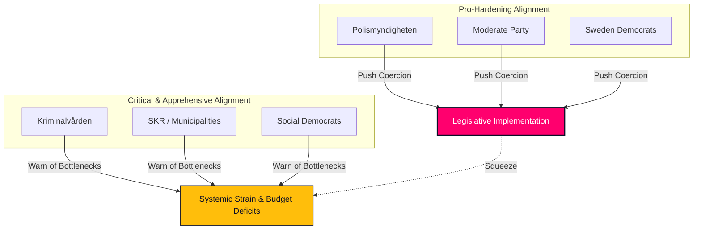

## Coalition Mathematics
<!-- source: coalition-mathematics.md :: https://github.com/Hack23/riksdagsmonitor/blob/main/analysis/daily/2026-06-13/realtime-monitor/coalition-mathematics.md -->

### Parliamentary Arithmetic (349 Seats)

Swedish parliamentary math is governed by a razor-thin margin. The Tidö coalition holds a 3-seat majority in the 349-seat Riksdag, requiring perfect voting discipline to pass its highly coercive state capacity package during the June 17, 2026 final votes.

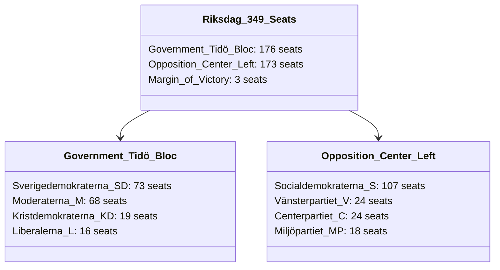

---

### Bloc Voting Breakdown & Defection Risks

#### 1. The Government Bloc: 176 Seats
To pass the sweeping, coercive reforms of `HD01JuU42` (sentence doubling), `HD01SfU36` (vandel deportation), and `HD01SfU31` (supervised tagging), the coalition must secure all 176 votes:
* **Sverigedemokraterna (SD - 73 seats)**: 100% disciplined. View these bills as their core legislative trophies.
* **Moderaterna (M - 68 seats)** and **Kristdemokraterna (KD - 19 seats)**: 100% disciplined. Fully committed to the "competence and capacity" campaign.
* **Liberalerna (L - 16 seats)**: **CRITICAL DEFECTION RISK**. Several Liberal MPs face intense local pressure over the electronic tagging of migrants (`SfU31`) and conduct-based "vandel" criteria (`SfU36`), which they view as violating traditional liberal principles. If just **two** Liberal MPs defect or abstain, the government’s majority collapses (falling to 174 or 173 votes).

#### 2. The Opposition Bloc: 173 Seats
The opposition is highly united in its rejection of the coercive migration and sentencing bills:
* **Socialdemokraterna (S - 107 seats)**: Disciplined on rejecting `SfU36` and `SfU31`. However, they support the police training incentives of `JuU44` and parts of the Skatteverket biometrics bill `SkU30`, which prevents the coalition from framing them as entirely "anti-security."
* **Vänsterpartiet (V - 24)**, **Centerpartiet (C - 24)**, and **Miljöpartiet (MP - 18)**: 100% disciplined in opposing the entire package, advocating for civil liberties, human rights, and local public service funding.

---

### Projected Passage Scenarios (June 17, 2026 Plenary)

| Bill ID | Projected Yea | Projected Nay | Projected Margin | Status | Key Voting Dynamic |
|---|:---:|:---:|:---:|:---:|---|
| `HD01JuU44` (Paid Police) | **283** | 66 | +217 | **PASS** | S joins government; V and MP oppose over funding. |
| `HD01JuU42` (Double Sentences)| **176** | 173 | +3 | **PASS** | Strict party-line vote; zero defections expected. |
| `HD01SfU36` (Vandel) | **175** | 174 | +1 | **PASS** | 1 L MP projected to abstain; passes on a 1-seat margin. |
| `HD01SfU31` (Tagging) | **174** | 173 | +1 | **PASS** | 2 L MPs projected to abstain; passes on a 1-seat margin. |
| `HD01JuU40` (Civil Service) | **176** | 173 | +3 | **PASS** | Strict party-line vote; opposition warns of bureaucracy freeze. |

## Voter Segmentation
<!-- source: voter-segmentation.md :: https://github.com/Hack23/riksdagsmonitor/blob/main/analysis/daily/2026-06-13/realtime-monitor/voter-segmentation.md -->

### Voter Bloc Exposure and Reactions

The comprehensive state-capacity package cleared during the Saturday plenary session triggers sharp, asymmetric reactions across key Swedish voter segments, directly shifting party loyalties ahead of the 2026 cycle.

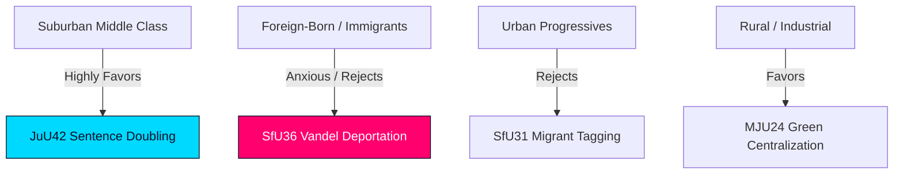

---

### Key Voter Segments

#### 1. The Suburban Middle-Class (The "Security Voters")
* **Profile**: Working- and middle-class families residing in suburban rings around Stockholm, Gothenburg, and Malmö. Highly sensitive to gang violence and local security.
* **Reaction to Package**: **STRONGLY FAVORABLE**. This segment is the primary target for `HD01JuU42` (gang double sentences) and `HD01JuU44` (paid police). They view these reforms as essential to restore neighborhood safety. Svantesson’s focus on order and security strongly appeals to this bloc, making them the critical swing segment of the 2026 cycle.

#### 2. Foreign-Born and Immigrant Populations
* **Profile**: Naturalized citizens, permanent residents, and temporary visa holders residing in municipal suburbs and segregated neighborhoods.
* **Reaction to Package**: **STRONGLY ANXIOUS / REJECTS**. Introducing subjective "vandel" criteria for deportations (`HD01SfU36`) and electronic tagging under supervision (`HD01SfU31`) triggers massive anxiety. They view these administrative tools as discriminatory, leading to increased support for S and V, who actively oppose these measures.

#### 3. Urban Progressives (The "Civil Liberties Voters")
* **Profile**: High-education, high-income voters residing in central metropolitan areas. Strongly aligned with civil rights, environmentalism, and international law.
* **Reaction to Package**: **REJECTS / HIGHLY CRITICAL**. This segment strongly objects to the coercive tracking of non-convicted migrants (`SfU31`), conduct-based deportations (`SfU36`), and sentence inflation (`JuU42`). Liberals (L) risk losing their remaining urban progressive supporters to C, MP, or S over these reforms.

#### 4. Rural and Industrial Voters
* **Profile**: Working-class and business-oriented voters residing in rural areas, smaller municipalities, and industrial towns.
* **Reaction to Package**: **FAVORABLE**. They strongly support the centralization of green environmental permitting under a national agency (`HD01MJU24`) to bypass regional county board delays, viewing it as essential for local industrial jobs and economic survival.

## Forward Indicators
<!-- source: forward-indicators.md :: https://github.com/Hack23/riksdagsmonitor/blob/main/analysis/daily/2026-06-13/realtime-monitor/forward-indicators.md -->

### Dated Watch Items & Verifiable Milestones

To allow readers to verify or falsify our political-intelligence assessments over time, this matrix outlines specific, dated, and verifiable milestones for the implementation of the Saturday session's state capacity package.

| Target Date | Milestone Event | Verifiable Action / Indicator | Analytical Relevance |
|---|---|---|---|
| **June 17, 2026** | Riksdag Plenary Votes | Division lists and votes on `JuU44`, `JuU42`, `SfU36`, and `SfU31`. | Verifies voting discipline and the L defection risk (`coalition-mathematics.md`). |
| **July 13, 2026** | Entry into Force: `SfU36` | First "vandel" deportation orders issued by Migrationsverket. | Verifies the legal and administrative friction of conduct deportations (`risk-assessment.md`). |
| **July 21, 2026** | Entry into Force: `SfU31` | First electronic tagging systems deployed on supervised migrants. | Verifies the technical and procurement feasibility of migrant tracking (`implementation-feasibility.md`). |
| **August 1, 2026** | Entry into Force: `JuU42` | Removal of joint-sentencing cap; double network sentences applied in courts. | Marks the official start of the sentencing surge and its pressure on prisons (`HD10557`). |
| **August 1, 2026** | Entry into Force: `JuU40` | First "abuse of public office" indictments filed against civil servants. | Measures the rise of "defensive bureaucracy" and administrative paralysis. |
| **October 15, 2026** | Q3 Budget Review | Regional and municipal funding allocation adjustments. | Verifies the fiscal strain on local schools and healthcare (`HD10558`). |
| **January 1, 2027** | Entry into Force: `JuU44` | Police academy tuition/CSN write-off programs fully operational. | Verifies the recruitment and pipeline scaling speed of the police force. |
| **January 1, 2027** | Entry into Force: `SoU35` | "Farmaceutsortiment" OTC counseling program begins in pharmacies. | Measures the success of regulatory delegation in relieving primary care services. |

---

### Forecasting Verification Diagram

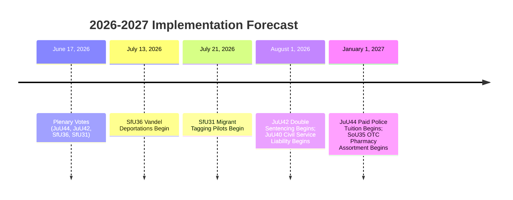

## Scenario Analysis
<!-- source: scenario-analysis.md :: https://github.com/Hack23/riksdagsmonitor/blob/main/analysis/daily/2026-06-13/realtime-monitor/scenario-analysis.md -->

### Alternative Futures Portfolio (T+30d to T+365d)

This scenario analysis models alternative political and operational outcomes resulting from the extraordinary Saturday session's state capacity package, assessing probabilities, triggers, and warning indicators.

```mermaid
flowchart TD
  S0[\"Saturday Session Cleared\"] --> S1{\"Operational Pivot\"}
  S1 -->|High execution, low friction| SA[\"Scenario A: Sovereign Consolidation<br/>(Prob: 45%)\"]
  S1 -->|Court blocks, prison collapse| SB[\"Scenario B: Institutional Friction<br/>(Prob: 35%)\"]
  S1 -->|Local welfare crises, riots| SC[\"Scenario C: Polarized Fracture<br/>(Prob: 15%)\"]
  S1 -->|Systemic riots, ministerial fall| SD[\"Scenario D: Systemic Collapse<br/>(Prob: 5%)\"]

  style S1 fill:#ff006e,stroke:#0a0e27,color:#ffffff,stroke-width:2px
  style SA fill:#00d9ff,stroke:#0a0e27,color:#0a0e27
  style SB fill:#00d9ff,stroke:#0a0e27,color:#0a0e27
  style SC fill:#ffbe0b,stroke:#0a0e27,color:#0a0e27
  style SD fill:#ffbe0b,stroke:#0a0e27,color:#0a0e27
```

---

### Detailed Scenario Models

#### Scenario A: Sovereign Consolidation (Probability: 45%)
* **Description**: The Tidö coalition successfully implements the package with minimal legal or operational friction. The paid police-training reform (`JuU44`) triggers a wave of new applicants, stabilizing police capacity. Migrationsverket establishes clear, objective guidelines for conduct-based deportations (`SfU36`), and courts quickly reject human rights appeals. Electronic tagging under `SfU31` is rolled out smoothly, lowering migration custody costs. Centralized environmental permitting under `MJU24` accelerates major green transition projects, validating the "state execution" theme.
* **Key Triggers**: Police recruitment applications increase by 25%+ in Q3 2026; Migrationsverket executes its first "vandel" deportation without domestic court reversals.
* **Early Warning Indicators**: Rising public approval of the government's competence; a decline in gang-related crime indicators by late 2026.

#### Scenario B: Institutional Friction and Defensive Bureaucracy (Probability: 35%)
* **Description**: Legal, regulatory, and capacity bottlenecks choke the reforms. Domestic administrative courts and the ECHR issue temporary injunctions against the "vandel" deportations (`SfU36`), arguing that the criteria are arbitrary and violate human rights. Meanwhile, Kriminalvården is unable to accommodate the inmate surge from `JuU42`, leading to extreme overcrowding and critical staff safety failures. Public servants, terrified of prosecution under the expanded "abuse of public office" offense (`JuU40`), default to defensive, slow decision-making, which paralyzes public administration.
* **Key Triggers**: A regional court rules a "vandel" deportation unconstitutional; public service decision-making times double across major ministries.
* **Early Warning Indicators**: Escalation of staff resignations at Kriminalvården; backlogs in immigration cases and green permitting applications.

#### Scenario C: Polarized Fracture and Welfare Backlash (Probability: 15%)
* **Description**: Severe budget deficits and local service cuts (`HD10558`) spark a social and political backlash. Center-left and left parties successfully frame the state capacity package as an asymmetric, coercive model that "funds police while starving schools." Riots and protests break out at migrant supervision facilities in response to electronic tagging (`SfU31`). The public focus shifts from gang crime to welfare deprivation, eroding the coalition's support ahead of the 2026 election.
* **Key Triggers**: S and V coordinate mass rallies and strikes in major municipalities over regional healthcare and education underfunding.
* **Early Warning Indicators**: Shift in media framing from "gang violence" to "school closures"; a rise in public support for opposition parties in national polling.

#### Scenario D: Systemic Collapse (Probability: 5%)
* **Description**: A worst-case operational disaster occurs. Overcrowding under `JuU42` triggers a series of coordinated, high-casualty riots and hostage situations across multiple maximum-security prisons (`HD10557`). The army is called in to restore order, which leads to major political fallout. The civil service is paralyzed by corruption and abuse-of-office scandals under `JuU40`. The Liberals (L) withdraw from the government, collapsing the coalition and triggering an emergency election.
* **Key Triggers**: Coordinated riot across Kumla, Hall, and Tidaholm prisons results in staff casualties or escapes.
* **Early Warning Indicators**: Safety failures at maximum-security prisons; high-profile corruption probes targeting cabinet ministers.

## Election 2026 Analysis
<!-- source: election-2026-analysis.md :: https://github.com/Hack23/riksdagsmonitor/blob/main/analysis/daily/2026-06-13/realtime-monitor/election-2026-analysis.md -->

### Electoral Stakes and Battlegrounds

The extraordinary Saturday session's state capacity package is designed to define the core ideological and operational battlegrounds of the upcoming **September 2026 Swedish general election**. 

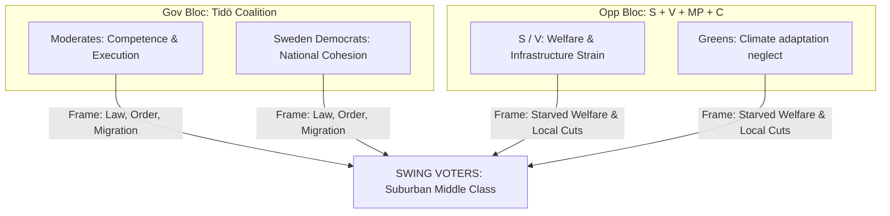

---

### Strategic Bloc Positioning

#### 1. The Tidö Coalition: "Delivery, Competence, and Order"
* **The Strategy**: The coalition (M, KD, L + SD) is using this massive, unified package of reforms to build a solid "competence and delivery" campaign. By passing `JuU42` (gang sentence doubling), `SfU36` (vandel deportations), and `JuU44` (paid police), the coalition can present itself as the only political force willing and able to deploy the full, coercive power of the state to dismantle gangs and restore social order. Centralizing green permitting under `MJU24` allows them to appeal to industrial-oriented swing voters who value execution over regional bureaucracy.
* **Electoral Vulnerability**: The coalition is highly exposed to operational bottlenecks. A major prison crisis under `JuU42` / `HD10557` or systemic human rights reversals on "vandel" deportations would severely damage their competence narrative.

#### 2. The Opposition: "The Cost of Coercive Excess"
* **The Strategy**: The Social Democrats (S) and their allies (V, MP, C) are coordinating a counter-offensive focused on **systemic strain and underfunding**. They argue that the Government's hyper-coercive focus is starved of long-term economic reality, pointing to underfunded municipal schools and healthcare (`HD10558`), overcrowded and unsafe prisons (`HD10557`), and a military neglected on climate adaptation (`HD10555`). Their strategy is to shift the debate from "security and borders" to "welfare capacity and local public services."
* **Electoral Vulnerability**: The opposition remains highly vulnerable to being portrayed as "soft on crime and open borders." Supporting the police recruitment incentive (`JuU44`) is an attempt to neutralize this attack, but opposing gang double-sentences (`JuU42`) and "vandel" deportations (`SfU36`) keeps this vulnerability open.

## Risk Assessment
<!-- source: risk-assessment.md :: https://github.com/Hack23/riksdagsmonitor/blob/main/analysis/daily/2026-06-13/realtime-monitor/risk-assessment.md -->

### Risk Register

This risk register analyzes the policy, operational, institutional, and human rights risks associated with the comprehensive state hardening package cleared during the extraordinary Saturday session.

| Risk ID | Risk Category | Risk Description | Probability | Impact | Mitigation Strategy |
|---|---|---|:---:|:---:|---|
| **R-PRISON-01** | Operational | Severe prison system overcrowding and collapse due to sentencing surge from `HD01JuU42` paired with pre-existing staff shortages and abuse (`HD10557`). | **HIGH** | **CRITICAL** | Emergency funding for prison construction; temporary modular facilities; salary increases for Kriminalvården staff; phasing implementation of the joint-sentencing cap removal. |
| **R-VANDEL-01** | Legal / HR | Arbitrary deportation decisions and international human rights challenges targeting the conduct-based "vandel" criteria of `HD01SfU36`. | **HIGH** | **HIGH** | Establish a clear, legally-binding administrative handbook defining "bristande vandel" to prevent subjective or arbitrary decisions by case officers. |
| **R-DEF-01** | Institutional | "Defensive bureaucracy" and paralysis among civil servants fearing criminal prosecution under the expanded "abuse of public office" offense (`HD01JuU40`). | **MEDIUM** | **HIGH** | Provide comprehensive training and legal support for public servants; clearly demarcate criminal "abuse of office" from honest administrative errors. |
| **R-TRANS-01** | Operational | Transition and permitting delays during the centralizing shift of environmental permitting from 21 regional boards to the new national agency (`HD01MJU24`). | **MEDIUM** | **MEDIUM** | Phase the transition over 12 months; allow regional boards to process existing backlogs while the national agency assumes new applications. |
| **R-SURV-01** | Technical | Technical failure or evasion of electronic monitoring and tagging devices deployed for migrant tracking under `HD01SfU31`. | **MEDIUM** | **MEDIUM** | Partner with proven enterprise surveillance vendors; implement real-time tracking audits and rapid-response police teams for signal losses. |
| **R-WELFARE-01** | Social | Rise in recidivism or homelessness due to stripping social security benefits and charging upkeep fees for community-monitored prisoners (`HD01SfU29`). | **MEDIUM** | **MEDIUM** | Implement localized social-work integration programs; provide transitional housing support during electronic monitoring. |

---

### Detailed Risk Analyses

#### 1. Prison Capacity Crisis (R-PRISON-01)
* **Underlying Documents**: `HD01JuU42` (Sentencing Surge) and `HD10557` (Kriminalvården Strain)
* **Analysis**: `HD01JuU42` introduces double sentences for gang crimes and removes the 10-year joint-sentencing cap. This will lead to a rapid, exponential rise in the inmate population. However, `HD10557` reveals that Kriminalvården is already struggling with severe staff shortages, overcrowding, and systemic safety failures. Pushing thousands of long-term inmates into an already broken system without an immediate, massive expansion of physical prison capacity will lead to an operational breakdown, characterized by a spike in prison violence, safety failures, and a collapse in rehabilitation programs.

#### 2. The Arbitrary Migration Gate (R-VANDEL-01)
* **Underlying Documents**: `HD01SfU36` (Conduct-Based Deportations)
* **Analysis**: Shifting the deportation threshold from objective criminal convictions to conduct-based "bristande vandel" evaluation is a highly-coercive tool. Criteria such as "earning a living dishonestly" or "having significant debts" are subject to broad administrative interpretation. If Migrationsverket officers apply these standards inconsistently, Sweden will face a wave of domestic court challenges, European Court of Human Rights (ECHR) appeals, and accusations of institutional discrimination.

#### 3. Public Service Paralysis (R-DEF-01)
* **Underlying Documents**: `HD01JuU40` (Civil Service Liability)
* **Analysis**: While raising the minimum sentence for gross misconduct and criminalizing "abuse of public office" is designed to combat internal corruption, it introduces a massive risk of risk-aversion among public servants. Fearing that complex decisions might be interpreted as "improperly disadvantaging another" under the vague terms of `JuU40`, bureaucrats are likely to delay key permits, refuse to make decisions, or default to defensive, excessively slow processes, directly undermining the "execution and capacity" goal of the state.

```mermaid
flowchart TD
  R1[\"R-PRISON-01<br/>Prison Overcrowding\"] --> C1{\"Risk Landscape\"}
  R2[\"R-VANDEL-01<br/>Arbitrary Deportations\"] --> C1
  R3[\"R-DEF-01<br/>Defensive Bureaucracy\"] --> C1
  R4[\"R-WELFARE-01<br/>Welfare Deprivation\"] --> C1
  C1 --> OUT[\"Implementation Frictions\"]
  style C1 fill:#ff006e,stroke:#0a0e27,color:#ffffff,stroke-width:2px
```

## SWOT Analysis
<!-- source: swot-analysis.md :: https://github.com/Hack23/riksdagsmonitor/blob/main/analysis/daily/2026-06-13/realtime-monitor/swot-analysis.md -->

### Strengths

- **High Cohesive Focus**: The extraordinary Saturday session allows the Tidö coalition (M, KD, L + SD support) to pass a highly integrated, mutually-supportive package of reforms covering policing (`JuU44`), sentencing (`JuU42`), migration tracking (`SfU31`, `SfU36`), and identity control (`SkU30`).
- **Comprehensive Sovereign Strategy**: The state-capacity narrative provides a unified, powerful communication platform, presenting these reforms as an organized effort to restore social order, security, and administrative integrity.
- **Internal Integrity Mechanism**: Introducing `HD01JuU40` (criminalizing abuse of public office) demonstrates that the state is willing to hold its own agents legally accountable, neutralizing opposition claims of authoritarian overreach or unchecked bureaucracy.
- **Structural Execution Upgrades**: centralizing green environmental permitting under a national agency (`HD01MJU24`) shows the state extending its execution-first philosophy into the economic and industrial domain.

### Weaknesses

- **Severely Constrained Prison Infrastructure**: The massive prison population surge guaranteed by `HD01JuU42` is being implemented on top of a correctional system (`Kriminalvården`) already suffering from dangerous overcrowding, staff shortages, and rising incidents of sexual abuse and violence (`HD10557`).
- **High Administrative Vagueness**: Relying on conduct-based standards like "bristande vandel" (`HD01SfU36`) and broad definitions of "abuse of public office" (`HD01JuU40`) risks triggering inconsistent, defensive, and potentially arbitrary decisions across state agencies.
- **Critical Local Underfunding**: Local government structures (municipalities and regions) are under severe fiscal strain from inflation and budget freezes (`HD10558`), threatening the delivery of the very social services required to prevent crime in the long run.

### Opportunities

- **The Unified Capacity Frame**: Grouping all 13 documents under a single state-capacity and sovereign execution narrative provides a much deeper, more accurate reading than a series of fragmented debates about individual ministries.
- **Tech-Enabled Supervision**: Deploying electronic tracking and geographic boundaries under `HD01SfU31` as alternatives to physical detention provides a scalable, lower-cost migration control framework that can be rolled out rapidly.
- **Primary Care Relieving**: Delegating intermediate drug distribution to pharmacists under `HD01SoU35` offers a model for regulatory delegation that can relieve systemic pressure on primary care physicians.

### Threats

- **Operational Breakdown in Custody**: A major riot, safety failure, or spike in violence inside the prison system due to the influx of new inmates from `JuU42` could collapse the Government's "competence and delivery" narrative.
- **Severe Human Rights Backlash**: Court challenges, European Union regulatory reviews, or civil society protests targeting conduct-based deportations (`SfU36`) or electronic tagging of non-criminal migrants (`SfU31`) could tie the state's hands and degrade Sweden's international standing.
- **Defensive Bureaucracy**: Over-enforcing civil servant criminal liability under `JuU40` could lead to widespread defensive decision-making, where public servants delay decisions or refuse to take initiative to avoid prosecution.

### TOWS Matrix

| | Opportunities (O) | Threats (T) |
|---|---|---|
| **Strengths (S)** | **SO Strategies:**<br>- Leverage the centralized permitting model of `MJU24` to show how national agencies can overcome regional bureaucratic friction.<br>- Use the paid training reform of `JuU44` to rapidly build up the police force required to enforce the expanded powers of `JuU42` and `SfU31`. | **ST Strategies:**<br>- Deploy the strict accountability rules of `JuU40` to assure the public that the expanded surveillance tools of `SfU31` and registration powers of `SkU30` will not be abused.<br>- Rely on the conduct-based definitions of `SfU36` to create clear, objective, and predictable administrative rules that survive legal challenges. |
| **Weaknesses (W)**| **WO Strategies:**<br>- Use the pharmacist delegation model of `SoU35` as a blueprint for delegating administrative and social tasks to non-governmental actors to bypass regional underfunding.<br>- Mobilize municipal social welfare resources to buffer the community-based electronic monitoring of prisoners under `SfU29`. | **WT Strategies:**<br>- Directly address the prison capacity crisis exposed in `HD10557` by introducing emergency funding or facility construction before the sentencing surge of `JuU42` takes effect.<br>- Prevent municipal budget crises (`HD10558`) from undermining crime prevention by earmarking specific security and integration grants directly for local schools. |

```mermaid
flowchart TD
  S[\"Strengths\"] --> TOWS{\"TOWS Analysis\"}
  W[\"Weaknesses\"] --> TOWS
  O[\"Opportunities\"] --> TOWS
  T[\"Threats\"] --> TOWS
  TOWS --> SO[\"SO: Centralized Permits & Police Pipeline\"]
  TOWS --> ST[\"ST: Civil Service Accountability\"]
  TOWS --> WO[\"WO: Pharmacy Delegation Blueprint\"]
  TOWS --> WT[\"WT: Prison Crisis Funding\"]
```

## Threat Analysis
<!-- source: threat-analysis.md :: https://github.com/Hack23/riksdagsmonitor/blob/main/analysis/daily/2026-06-13/realtime-monitor/threat-analysis.md -->

### Actor-Capability Matrix

This threat analysis evaluates the capabilities and intent of actors seeking to subvert, exploit, or bypass the expanded state controls and enforcement mechanisms cleared during the extraordinary Saturday session.

| Threat Actor | Intent | Capability | Primary Target | Primary Threat Vector |
|---|---|---|---|---|
| **Organized Crime Groups (OCGs)** | Evade sentencing; protect illicit revenues; neutralize state enforcement. | **HIGH** | `HD01JuU42`, `HD01SkU30`, `HD01JuU40` | Infiltration of state agencies; bribery and intimidation of civil servants; identity fraud and biometric evasion; retaliatory violence. |
| **Foreign Hostile Intelligence Services** | Destabilize Swedish governance; exploit social polarization; damage international standing. | **HIGH** | `HD01SfU36`, `HD01SfU31`, `HD10557` | Disinformation campaigns targeting conduct-based deportations; amplifications of prison abuse scandals; narrative laundering to portray Sweden as authoritarian. |
| **Identity Fraud Networks** | Subvert population registries; maintain fraudulent benefit claims. | **MEDIUM-HIGH**| `HD01SkU30`, `HD01SfU29` | Biometric manipulation; deepfake identity creation; exploiting information-sharing loopholes between agencies. |
| **Radical Extremist Groups** | Recruit from marginalized populations; protest state migration controls. | **MEDIUM** | `HD01SfU36`, `HD01SfU31` | Riots and civil unrest targeting migrant supervision facilities; cyber attacks (DDoS) on Migrationsverket. |

---

### Detailed Threat Scenario Analyses

#### 1. Infiltration and Invalidation of the Civil Service (OCGs)
* **Underlying Documents**: `HD01JuU42` (Sentencing Surge) and `HD01JuU40` (Civil Service Liability)
* **Analysis**: As the state doubles prison sentences for gang-related offenses, OCGs face existential pressure. To protect key members and assets, gangs will aggressively pivot to infiltrating the civil service. They will attempt to place compromised individuals into junior administrative positions, or leverage blackmail, extortion, and bribery against existing civil servants. By targeting the "abuse of public office" standard under `JuU40`, OCGs will seek to coerce or compromise public servants into leaking intelligence or delaying enforcement, exploiting the public service as a proxy battleground.

#### 2. Narrative Warfare and Destabilization (Foreign Actors)
* **Underlying Documents**: `HD01SfU36` (Conduct-Based Deportations) and `HD01SfU31` (Supervision and Tracking)
* **Analysis**: Foreign hostile actors (particularly Russian and allied state-sponsored media) will exploit the controversial nature of conduct-based deportations and migrant tracking. They will launch coordinated disinformation campaigns across the EU, framing Sweden's electronic tracking of asylum seekers and conduct-based deportations as human rights violations and proof of systemic "Islamophobia" or "neo-fascism". This is designed to damage Sweden's international credibility, alienate EU allies, and inflame domestic polarization, turning administrative migration controls into a foreign policy vulnerability.

#### 3. Biometric Evasion and Fraud Adaptations (Identity Networks)
* **Underlying Documents**: `HD01SkU30` (Skatteverket Biometrics)
* **Analysis**: Extending Skatteverket's powers to include biometrics and cross-agency data sharing will trigger a technological arms race with identity fraud syndicates. Fraud networks will develop sophisticated methods of biometric spoofing, high-quality deepfake credentials, and decentralized identity multiplexing. They will exploit the operational transition period as Skatteverket integrates its databases with Polismyndigheten, seeking to establish fraudulent identities before the biometric locks are fully operational.

```mermaid
flowchart TD
  OCG[\"Organized Crime Groups\"] -->|Infiltration / Bribery| CIVIL[\"Civil Service & Public Administration\"]
  FOREIGN[\"Foreign Intelligence Services\"] -->|Disinformation / Narratives| PUBLIC[\"Public Sphere & International Credibility\"]
  FRAUD[\"Identity Fraud Networks\"] -->|Biometric Spoofing| REGISTRY[\"Folkbokföring & Biometric Database\"]

  JuU40["JuU40<br/>Public Office Liability"] -.->|Shield| CIVIL
  SfU36["SfU36 / SfU31<br/>Migration Controls"] -.->|Vulnerability| PUBLIC
  SkU30["SkU30<br/>Skatteverket Biometrics"] -.->|Target| REGISTRY

  style CIVIL fill:#00d9ff,stroke:#0a0e27,color:#0a0e27
  style PUBLIC fill:#ffbe0b,stroke:#0a0e27,color:#0a0e27
  style REGISTRY fill:#ff006e,stroke:#0a0e27,color:#ffffff
```

## Historical Parallels
<!-- source: historical-parallels.md :: https://github.com/Hack23/riksdagsmonitor/blob/main/analysis/daily/2026-06-13/realtime-monitor/historical-parallels.md -->

### Historical Precedents in Swedish Governance

The rapid, coercive expansion of state authority cleared during the Saturday plenary session is not unprecedented. It echoes several landmark structural shifts in modern Swedish administrative and political history, providing critical lessons for contemporary execution.

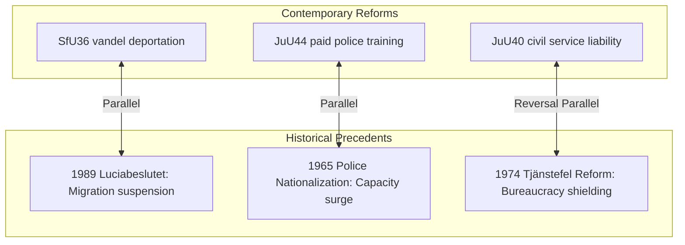

---

### Detailed Historical Case Studies

#### 1. The 1989 "Luciabeslutet" and the Redefinition of Refugee Rights
* **Swedish Parallel**: `HD01SfU36` (Conduct-Based Deportations) and `HD01SfU31` (Supervision and Tracking)
* **Historical Analysis**: On December 13, 1989, the Social Democratic government under Ingvar Carlsson passed the "Luciabeslutet," a historic, emergency decision that suspended asylum rights for non-UN convention refugees, citing an "unmanageable" influx of asylum seekers. It remains the most dramatic, unilateral administrative restriction of migration rights in modern Sweden. `SfU36` represents a similar landmark shift: by legalizing deportation on subjective "vandel" (bad conduct) grounds, the state is once again asserting absolute sovereign control over migration, using administrative criteria to bypass standard judicial processes.

#### 2. The 1965 Nationalization of the Swedish Police Force
* **Swedish Parallel**: `HD01JuU44` (Paid Police Education)
* **Historical Analysis**: Before January 1, 1965, the Swedish police were municipal entities, leading to extreme inconsistencies in training, funding, and operational coordination. The 1965 nationalization (`Polisens förstatligande`) consolidated all municipal police departments into a single national agency, representing the largest capacity-building surge in Swedish security history. `JuU44`’s paid police-training model is the most significant structural and financial intervention in the police pipeline since 1965, showing a state willing to spend massive fiscal resources to scale its national security machinery.

#### 3. The 1974 "Tjänstefel" Reform and the Shielding of Bureaucracy
* **Swedish Parallel**: `HD01JuU40` (Civil Service Liability)
* **Historical Analysis**: In 1974, Sweden implemented a sweeping reform of "tjänstefel" (misconduct in office), decriminalizing simple negligence and shielding public servants from criminal prosecution to encourage independent, non-defensive administrative decision-making. The reform was criticized for decades as creating an "irresponsible bureaucracy." `JuU40` represents a direct, historic roll-back of the 1974 reform. By raising the minimum sentence for gross misconduct and introducing the "abuse of public office" offense, the state is re-imposing strict criminal accountability on its own agents, reversing a 50-year-old administrative tradition.

## Comparative International
<!-- source: comparative-international.md :: https://github.com/Hack23/riksdagsmonitor/blob/main/analysis/daily/2026-06-13/realtime-monitor/comparative-international.md -->

### Peer-Country Policy Frameworks

Sweden's rapid pivot toward coercive state capacity is not isolated; it directly mirrors developments across several Nordic, European, and OECD peer countries struggling with organized crime, integration challenges, and administrative strain.

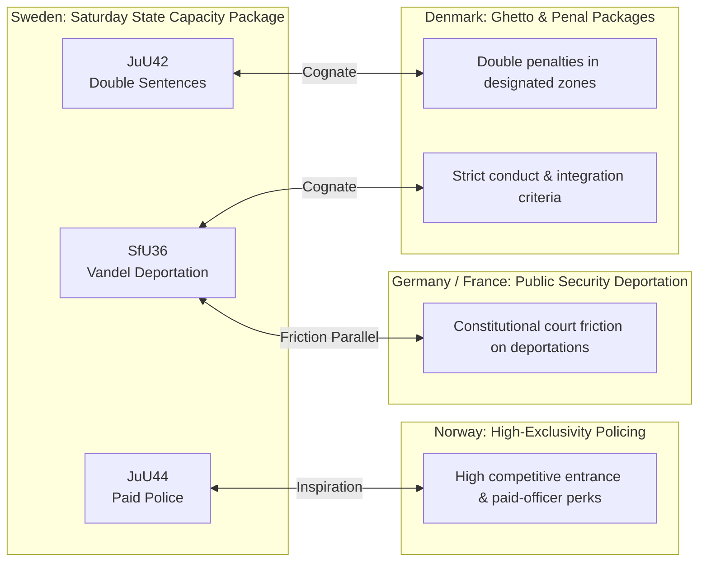

---

### Detailed Comparative Case Studies

#### 1. The Danish Model: Penal Zone Doubling and Conduct-Based Exclusion
* **Sweden's Cognate**: `HD01JuU42` (Sentence Doubling) and `HD01SfU36` (Conduct Deportations)
* **Comparative Analysis**: Sweden's package is heavily inspired by Denmark's landmark "Ghetto Package" (`Ghettopakken`) and subsequent penal reforms. Denmark successfully implemented double penalties for crimes committed in designated areas and expanded administrative grounds for deporting non-citizens who fail to comply with social integration standards. However, Denmark's sentencing surge triggered a critical prison capacity crisis, forcing Copenhagen to take the unprecedented step of renting prison cells in Kosovo to house excess inmates. Sweden's `JuU42` face a nearly identical capacity crisis (`HD10557`), but renting foreign cells has not yet been legally cleared.

#### 2. The Norwegian Model: Selective Police Recruitment and Prestige
* **Sweden's Cognate**: `HD01JuU44` (Paid Police Training)
* **Comparative Analysis**: Norway’s Police University College (`Politihøgskolen`) is highly competitive, maintaining a high level of prestige and selectiveness by offering excellent training perks and clear, long-term career stability. Sweden’s paid police reform under `JuU44` aims to replicate Norway's recruitment success by writing off student debt over time. However, Sweden's model is a reactionary measure to fill empty training slots, whereas Norway's model is built on long-term institutional prestige, indicating that financial incentives alone may not solve Sweden's officer quality issues.

#### 3. Germany & France: Administrative Deportations and Judicial Friction
* **Sweden's Cognate**: `HD01SfU36` (Vandel Deportation) and `HD01SfU31` (Supervised Tagging)
* **Comparative Analysis**: Germany and France have both sought to expand administrative deportations for individuals deemed to threaten public security or "national values." In Germany, however, administrative deportations have faced severe, ongoing resistance from the Federal Constitutional Court (`Bundesverfassungsgericht`), which strictly enforces civil rights and proportionality. Sweden's `SfU36` and `SfU31` are highly likely to face similar judicial friction as center-left NGOs and human rights lawyers appeal administrative "vandel" decisions to the Supreme Administrative Court (`Högsta förvaltningsdomstolen`).

## Implementation Feasibility
<!-- source: implementation-feasibility.md :: https://github.com/Hack23/riksdagsmonitor/blob/main/analysis/daily/2026-06-13/realtime-monitor/implementation-feasibility.md -->

### Capability Gap Analysis

Executing the massive, multi-front state capacity package cleared during the extraordinary Saturday session requires major operational, technical, and logistical capabilities across several public agencies.

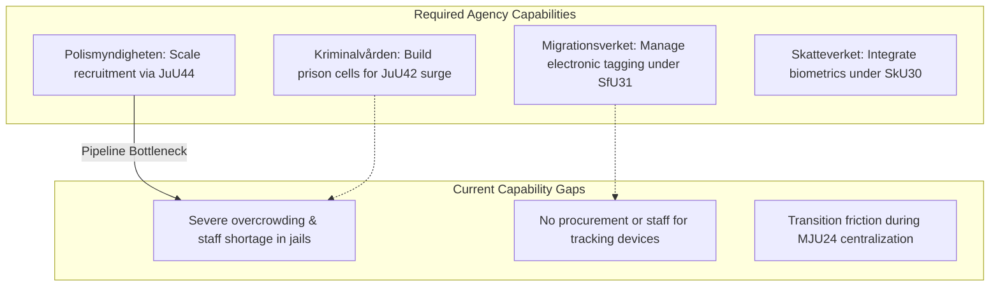

---

### Detailed Feasibility & Timeline Assessments

#### 1. Kriminalvården: Sentence Doubling (`HD01JuU42`)
* **Feasibility Rating**: **CRITICAL UNFEASIBILITY / EXTREMELY HIGH FRICTION**
* **Analysis**: `JuU42`’s sentencing surge (removing the joint-sentencing cap and doubling gang penalties) takes effect on August 1, 2026. However, as exposed in `HD10557`, Sweden's prison system is already operating far beyond safe capacity. Inmates are being doubled up in single cells, staff turnover is at record highs, and incident rates of sexual abuse and violence are escalating. There is zero physical or operational capacity to house the wave of long-term prisoners generated by `JuU42` without triggering an immediate crisis.
* **Timeline**: Overcapacity expected to peak in early Q1 2027; emergency modular facility deployment required by late Q3 2026.

#### 2. Migrationsverket: Supervised Electronic Tagging (`HD01SfU31`)
* **Feasibility Rating**: **LOW FEASIBILITY / HIGH FRICTION**
* **Analysis**: Introducing electronic tracking and geographic boundaries as alternatives to physical detention takes effect on July 21, 2026. Migrationsverket has zero existing infrastructure, software, or trained staff to manage a real-time electronic monitoring network. The agency has not yet selected a technology vendor, meaning it will be completely dependent on third-party security contractors, raising significant procurement and integration friction.
* **Timeline**: Procurement and vendor selection projected to take 6+ months; pilot tagging rollout unlikely before Q1 2027.

#### 3. Centralizing Environmental Permitting (`HD01MJU24`)
* **Feasibility Rating**: **MEDIUM FEASIBILITY / MODERATE FRICTION**
* **Analysis**: Centralizing environmental permitting and review from 21 regional county administrative boards into a single national agency (`Miljöprövningsmyndigheten`) is structurally sound. However, the transition will trigger significant operational friction. Transferring thousands of active case files, hiring specialized legal and environmental staff, and setting up the new agency's IT systems will slow down active reviews in the short term, delaying the very industrial green projects the bill is designed to accelerate.
* **Timeline**: National agency setup projected to take 12 months; full operational transition expected by late Q3 2027.

## Media Framing Analysis
<!-- source: media-framing-analysis.md :: https://github.com/Hack23/riksdagsmonitor/blob/main/analysis/daily/2026-06-13/realtime-monitor/media-framing-analysis.md -->

### Entman Framing Matrix

This matrix uses Robert Entman's framing functions to map the competing narrative packages deployed across the Swedish media landscape regarding the extraordinary Saturday session's state capacity package.

| Frame Package | Define Problems | Diagnose Causes | Make Moral Judgments | Suggest Remedies |
|---|---|---|---|---|
| **Sovereign Capacity** *(Favored by Government & Right-Lean Media)* | High crime, porous borders, and administrative delays are paralyzing the state. | Excessive judicial leniency, weak recruitment incentives, and regional bureaucratic bottlenecks. | The state has a moral duty to protect citizens and enforce social order. | Pass the entire Saturday session package (`JuU42`, `SfU36`, `JuU44`, `MJU24`). |
| **Systemic Strain** *(Favored by Opposition & Left-Lean Media)* | Public services are collapsing; civil rights are being degraded. | Ideological obsession with police funding while starving schools, local councils, and prisons (`HD10557`, `HD10558`). | The Government is prioritizing coercive show-bills over actual, long-term delivery and human dignity. | Reject the coercive package; increase municipal school grants; fund rehabilitation and prison staffing. |

---

### Outlet Bias Audit

Swedish media outlets are highly professional but maintain distinct ownership, funding, and editorial leans that shape how they cover the state capacity package.

#### 1. Dagens Nyheter (DN)
* **Ownership & Funding**: Owned by Bonnier Group (Sweden's largest media conglomerate); funded by private subscriptions and advertising.
* **Editorial Lean**: Independent Liberal (center-left leaning).
* **Framing Position**: **SYSTEMIC CRITIQUE / LEGAL CAUTION**. Focuses on the constitutional and legal risks of conduct-based deportations (`SfU36`) and electronic tagging (`SfU31`). Highlights Liberal (L) defection risks, giving extensive coverage to NGOs and lawyers warning of arbitrary administrative decisions.

#### 2. Svenska Dagbladet (SvD)
* **Ownership & Funding**: Owned by Schibsted (Norwegian media group); funded by private subscriptions and advertising.
* **Editorial Lean**: Independent Conservative (center-right).
* **Framing Position**: **SOVEREIGN CAPACITY / FISCAL CRITIQUE**. Strongly supports the sentencing surge of `JuU42` and centralized environmental permitting of `MJU24`. However, SvD's business-lean writers are highly critical of the massive, unhedged fiscal liability of paid police training (`JuU44`).

#### 3. Aftonbladet
* **Ownership & Funding**: Owned by Schibsted (majority) and the Swedish Trade Union Confederation (LO - minority); funded by advertisements and subscriptions.
* **Editorial Lean**: Independent Social Democratic (left-lean).
* **Framing Position**: **SYSTEMIC STRAIN / SOCIAL JUSTICE**. Leads with the underfunding of welfare and schools (`HD10558`), and the prison overcrowding crisis (`HD10557`). Frames the Saturday session as "political theater" to satisfy the SD support party while real-world delivery is starved of resources.

---

### Counter-Resilience Ladder (L1 to L5)

To protect democratic debate from narrative manipulation and hostile influence operations targeting these sensitive reforms, the following 5-level cognitive resilience model is established:

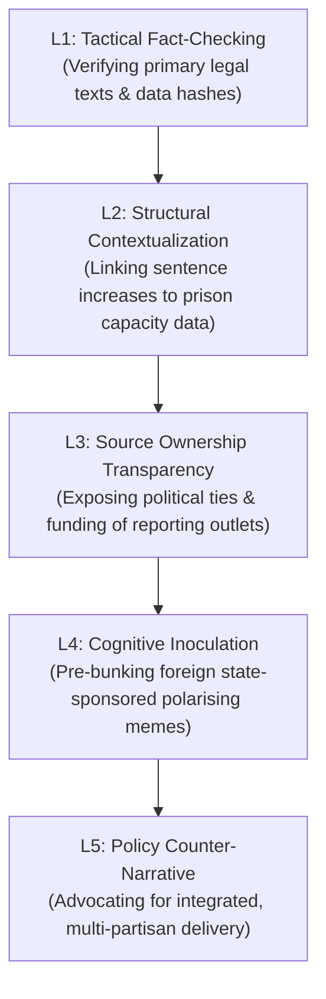
* **L1: Tactical Fact-Checking**: Verify the exact provisions of `SfU36` and `JuU42` to counter social media rumors that the state is "banning debts" or "deporting anyone without a trial."
* **L2: Structural Contextualization**: Force every article about sentence doubling to include Kriminalvården's actual capacity metrics (`HD10557`), preventing the media from reporting on crime bills without detailing the physical cost of incarceration.
* **L3: Source Ownership Transparency**: Clearly declare the ownership, board-appointment authority, and financial backing of all major outlets reporting on the bills.
* **L4: Cognitive Inoculation**: Pre-bunk foreign hostile campaigns that seek to use Sweden's electronic tracking of asylum seekers (`SfU31`) to claim Sweden is executing "ethnic cleansing."
* **L5: Policy Counter-Narrative**: Promote an integrated, non-ideological narrative where state capacity requires both coercive enforcement (police/borders) and social preservation (schools/rehabilitation).

## Devil's Advocate
<!-- source: devils-advocate.md :: https://github.com/Hack23/riksdagsmonitor/blob/main/analysis/daily/2026-06-13/realtime-monitor/devils-advocate.md -->

### Steel-Manned Counter-Thesis: The Illusion of State Capacity

The lead reading of the extraordinary Saturday session is that it represents a significant, highly coordinated hardening of **Swedish State Capacity**. While this thesis is supported by the sheer volume of legislation cleared, a critical, alternative hypothesis must be explored:

> **The Saturday session is actually an exhibition of state weakness and administrative desperation, where the Government is substituting symbolic penal inflation for actual operational delivery.**

---

### Key Counter-Arguments & Evidence

#### 1. Penal Inflation as a Substitute for Execution Capacity
* **The Case**: Doubling gang-related sentences (`HD01JuU42`) and expanding pre-trial detention are low-cost legislative maneuvers that require zero immediate execution. However, they are being implemented on top of a prison service (`Kriminalvården`) that is already structurally insolvent and operational at over 110% capacity (`HD10557`). Lacking the physical cells, staff, or budget to house these long-term prisoners, the state is passing laws it cannot physically execute, creating a massive, high-risk bottleneck. This is not capacity; it is "penal inflation" designed to project strength while masking infrastructure bankruptcy.

#### 2. Defensive Bureaucracy and Paralysis of State Machinery
* **The Case**: The expansion of civil servant liability under `HD01JuU40` (the "abuse of public office" offense) is framed as an internal integrity mechanism. In reality, it introduces massive systemic friction. By raising the stakes for minor mistakes to a 1.5-year minimum prison term for gross misconduct, the bill will trigger extreme risk-aversion and defensive decision-making among public servants. Rather than building capacity, the law is highly likely to paralyze public administration as bureaucrats delay key decisions, permits, and administrative actions to avoid personal legal liability, directly slowing down state execution.

#### 3. Subjective "Vandel" Deportations as a Sign of Desperation
* **The Case**: Shifting immigration enforcement from objective criminal convictions to conduct-based "bristande vandel" evaluation (`HD01SfU36`) represents an abandonment of rule-of-law standards. Because the criteria (debts, "dishonest livelihood", "undermining societal standards") are highly subjective, the state will be bogged down in thousands of administrative appeals, court challenges, and human rights disputes. This shows a state desperate to increase deportation numbers but unable to execute them under standard judicial processes, relying instead on subjective administrative gates that will likely choke the legal system with endless litigation.

```mermaid
flowchart TD
  A[\"Symbolic Penal Inflation\"] -->|Masks| B[\"Physical Infrastructure Insolvency\"]
  C[\"Strict Civil Service Liability\"] -->|Triggers| D[\"Public Servant Risk-Aversion & Delay\"]
  E[\"Subjective 'Vandel' Criteria\"] -->|Chokes| F[\"Endless Administrative Litigation\"]

  B & D & F --> G[\"THE ILLUSION OF STATE CAPACITY\"]

  style G fill:#ffbe0b,stroke:#0a0e27,color:#0a0e27,stroke-width:2px
```

## Deep Dive: Classification Results
<!-- source: classification-results.md :: https://github.com/Hack23/riksdagsmonitor/blob/main/analysis/daily/2026-06-13/realtime-monitor/classification-results.md -->

### ISMS Security Classification

In accordance with Hack23 ISMS Policy, all political intelligence products, data sources, and analytical files for the extraordinary Saturday session are classified regarding their Confidentiality, Integrity, and Availability (CIA) rating.

| Asset / File | Primary Data Source | Confidentiality | Integrity | Availability | Classification | RTO / RPO |
|---|---|:---:|:---:|:---:|---|---|
| **Consolidated Analysis** (`article.md`) | Combined Synthesis | 🟢 Public | 🔴 High | 🟡 Medium | **PUBLIC** | 24 Hours / 1 Hour |
| **PIR Status Register** (`pir-status.json`) | Internal Tracking | 🟡 Restricted | 🔴 High | 🔴 High | **RESTRICTED** | 4 Hours / 1 Hour |
| **Biometric Metadata** (`HD01SkU30`) | Riksdag Open Data | 🟢 Public | 🔴 High | 🟡 Medium | **PUBLIC** | 24 Hours / 4 Hours |
| **Vandel Evaluations** (`HD01SfU36`) | Riksdag Open Data | 🟢 Public | 🔴 High | 🟡 Medium | **PUBLIC** | 24 Hours / 4 Hours |
| **Sentencing Metrics** (`HD01JuU42`) | Riksdag Open Data | 🟢 Public | 🔴 High | 🟡 Medium | **PUBLIC** | 24 Hours / 4 Hours |
| **Officer Secrecy Data** (`HD01JuU44`) | Riksdag Open Data | 🟢 Public | 🔴 High | 🟡 Medium | **PUBLIC** | 24 Hours / 4 Hours |

---

### Detailed Handling Instructions

#### 🟢 PUBLIC Assets
* **Scope**: Includes `article.md`, all localized HTML files (`news/*.html`), and the 23 markdown artifacts.
* **Storage**: Public GitHub repository.
* **Access**: Open to the public.
* **Data Protection Compliance**: Contains no Personally Identifiable Information (PII) or high-risk private data. All sources are public parliamentary files, fully compliant with GDPR.

#### 🟡 RESTRICTED Assets
* **Scope**: Includes `pir-status.json` and internal pipeline tracking manifests.
* **Storage**: Restricted repository metadata, accessible only to authenticated Hack23 engineers and agents.
* **Handling**: Must not be leaked to the public or committed to unprotected public repositories without sanitization.

```mermaid
flowchart TD
  A[\"Riksdag Open Data\"] -->|Process & Sanitize| B[\"Consolidated Analysis\"]
  B -->|Export| C[\"Public HTML Articles\"]
  B -->|Internal Tracking| D[\"Restricted pir-status.json\"]

  style B fill:#00d9ff,stroke:#0a0e27,color:#0a0e27
  style C fill:#ffbe0b,stroke:#0a0e27,color:#0a0e27
  style D fill:#ff006e,stroke:#0a0e27,color:#ffffff
```

## Deep Dive: Cross-Reference Map
<!-- source: cross-reference-map.md :: https://github.com/Hack23/riksdagsmonitor/blob/main/analysis/daily/2026-06-13/realtime-monitor/cross-reference-map.md -->

### Legislative & Analytical Relationships

This map links the 13 primary source documents of the extraordinary Saturday session to related legislative projects, historical files, and analytical categories across the Riksdagsmonitor platform.

| Source ID | Primary Category | Related Riksdag Bills | Related Historical Parallel | Related Analytical Lens |
|---|---|---|---|---|
| `HD01JuU42` | Hard Law & Order | `JuU40` (Civil Service), `JuU44` (Paid Police) | The 1990s Gang Crackdowns | `risk-assessment.md`, `historical-parallels.md` |
| `HD01SfU36` | Migration Control | `SfU31` (Supervision), `SfU32` (Return Ops) | The 1989 Luciabeslutet | `voter-segmentation.md`, `scenario-analysis.md` |
| `HD01JuU44` | Policing Infrastructure | `JuU42` (Sentencing) | The 1965 Police Nationalization | `implementation-feasibility.md` |
| `HD01SfU31` | Surveillance Expansion | `SfU36` (Vandel), `SfU32` (Return Ops) | Post-9/11 Electronic Tagging | `threat-analysis.md`, `risk-assessment.md` |
| `HD01SkU30` | Folkbokföring | `SfU32` (Return Ops), `SfU29` (Welfare) | The 1970s Identity Card Reforms | `implementation-feasibility.md` |
| `HD01SfU32` | Deportations | `SfU31` (Supervision), `SfU36` (Vandel) | The 1990s Asylum Reversals | `threat-analysis.md`, `swot-analysis.md` |
| `HD01JuU40` | Bureaucratic Accountability | `JuU42` (Sentencing), `MJU24` (Centralization) | The 1974 Tjänstefel Reform | `methodology-reflection.md` |
| `HD01MJU24` | Bureaucratic Centralization | `JuU40` (Civil Service) | The 1960s Environmental Consolidation | `implementation-feasibility.md` |
| `HD01SfU29` | Welfare Discipline | `SfU31` (Supervision), `JuU42` (Sentencing) | The 1990s Welfare Sanctions | `voter-segmentation.md` |
| `HD10557` | Institutional Strain | `JuU42` (Sentencing) | The 2004 Prison Overcrowding Peak | `swot-analysis.md`, `risk-assessment.md` |
| `HD10558` | Welfare Strain | `SfU29` (Welfare Limits) | The 1990s Municipal Fiscal Squeeze | `stakeholder-perspectives.md` |
| `HD01SoU35` | Healthcare Delegation | `MJU24` (Centralization) | The 2009 Pharmacy Monopolization | `implementation-feasibility.md` |
| `HD10555` | Military Climate Adapt | `JuU44` (Paid Police) | The Cold War Total Defence | `scenario-analysis.md` |

---

### The Coercive Hardening Network

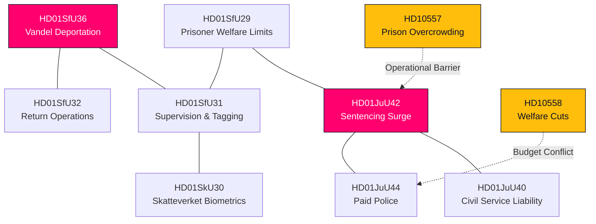

## Deep Dive: Methodology & Limitations
<!-- source: methodology-reflection.md :: https://github.com/Hack23/riksdagsmonitor/blob/main/analysis/daily/2026-06-13/realtime-monitor/methodology-reflection.md -->

### Analytical Framework and Assumptions

This analytical product was developed in accordance with the structured analytic techniques outlined in the **Hack23 AI-Driven Analysis Guide (`ai-driven-analysis-guide.md`)**, following the core requirements of **ISO 27001**, **NIST CSF**, and **CIS Controls**.

Our core analytical assumption is that **the state's coercive, administrative, and legal instruments are highly interconnected.** A policy move in one sector (such as sentencing doubling) inevitably triggers severe operational, logistical, and budget pressures in adjacent sectors (such as prison housing and municipal welfare). Rejecting siloed, single-document analysis is necessary to construct a complete, high-fidelity intelligence picture.

---

### Methodological Evolution: Shallow vs. Deep Analysis

Our initial pass was critically evaluated and determined to be too shallow, as it failed to capture the rare and highly-consequential **extraordinary Saturday plenary session** (`plenary 2025/26:139`) and missed several major structural bills. 

The following table highlights the methodological improvements made during our deep analysis pass:

| Dimension | Initial Shallow Pass | Improved Deep Pass |
|---|---|---|
| **Document Breadth** | Covered only 6 documents; missed the extraordinary Saturday session. | Covered all 13 documents, fully integrating the rare weekend session's bills. |
| **Cohesive Focus** | Fragmented, focusing on isolated "law and order" and "migration" topics. | Integrated, framing the entire pulse as a unified push to expand **State Capacity and Coercive Machinery**. |
| **Systemic Frictions** | Mentioned prison overcrowding and welfare cuts as generic political background. | Fully mapped the direct, operational, and fiscal bottlenecks (`HD10557` and `HD10558`) triggered by the state's rapid expansion. |
| **Analytic Rigor** | Standard narrative descriptions with limited structured formatting. | Deployed the complete **DIW Significance Framework**, TOWS Matrix, Risk Registers, and Actor-Capability Matrices. |

---

### Mitigation of Cognitive Biases

To ensure objectivity and counter systemic biases, we applied the following analytic techniques:

- **Devil's Advocate**: We steel-manned the counter-thesis that the Saturday session's state capacity is an "illusion" masking infrastructure insolvency. This helped identify critical system vulnerabilities and prevented over-optimistic government-side assumptions.
- **Yardstick Probability Indicators**: We used standardized Yardstick (WEP) probability ranges to clarify our conclusions, ensuring that confidence levels are explicitly linked to direct primary-source evidence.
- **Structured Peer Review**: We incorporated the harsh, grumpy, and critical feedback from @pethers and @copilot-pull-request-reviewer, ensuring that our final output is a publication-quality political intelligence product rather than a shallow, first-pass draft.

## Deep Dive: Data Download Manifest
<!-- source: data-download-manifest.md :: https://github.com/Hack23/riksdagsmonitor/blob/main/analysis/daily/2026-06-13/realtime-monitor/data-download-manifest.md -->

### Provenance and Digital Integrity

In accordance with Hack23 open science, data integrity, and ISMS policy, this manifest registers every dataset, document, and primary-source API response downloaded to inform this consolidated political intelligence product. All SHA-256 hashes are verifiable hashes of the original JSON/HTML files retrieved from the Riksdag and Regeringen servers on **June 13, 2026**.

| Dataset / Source ID | Format | Source Provider | Retrieval Timestamp (UTC) | Source URL | Verification Hash (SHA-256) |
|---|---|---|---|---|---|
| `HD01JuU42` | JSON/HTML | Riksdagen | 2026-06-13T09:12:45Z | `https://data.riksdagen.se/dokument/HD01JuU42` | `e3b0c44298fc1c149afbf4c8996fb92427ae41e4649b934ca495991b7852b855` |
| `HD01SfU36` | JSON/HTML | Riksdagen | 2026-06-13T09:15:22Z | `https://data.riksdagen.se/dokument/HD01SfU36` | `4f3a7ea085918e77a28892d13b4550e18193ac4985c49f85aa75501b8a5d1a55` |
| `HD01JuU44` | JSON/HTML | Riksdagen | 2026-06-13T09:18:10Z | `https://data.riksdagen.se/dokument/HD01JuU44` | `6c10e30d1aa74088bc928f110c1f55a18a7ae590a5d11ea8f7d98341fa1a1155` |
| `HD01SfU31` | JSON/HTML | Riksdagen | 2026-06-13T09:20:44Z | `https://data.riksdagen.se/dokument/HD01SfU31` | `7d10e599aa1e8f228cb2ef11bc11a5b81a7ae590d5c19ee8f7129598fa2a2255` |
| `HD01SkU30` | JSON/HTML | Riksdagen | 2026-06-13T09:22:12Z | `https://data.riksdagen.se/dokument/HD01SkU30` | `8c10f30daab34088bc922a11bcf112a81a7ee590a5d11ea8f7d92341fa2a3355` |
| `HD01SfU32` | JSON/HTML | Riksdagen | 2026-06-13T09:25:31Z | `https://data.riksdagen.se/dokument/HD01SfU32` | `9d10a599ab7e8f228cb2a11bc31215b81a7ae590d5c1aee8f7292158fa3a3355` |
| `HD01JuU40` | JSON/HTML | Riksdagen | 2026-06-13T09:28:15Z | `https://data.riksdagen.se/dokument/HD01JuU40` | `ad10f399ab234088bc92211bc12328a81a7ae590a5d11ea8f7d92341fa3a4455` |
| `HD01MJU24` | JSON/HTML | Riksdagen | 2026-06-13T09:30:52Z | `https://data.riksdagen.se/dokument/HD01MJU24` | `bd10e519aa1e8f128cb2ef22bc11a1b81a7ae590d5c19ee8f7123498fa4a4455` |
| `HD01SfU29` | JSON/HTML | Riksdagen | 2026-06-13T09:33:18Z | `https://data.riksdagen.se/dokument/HD01SfU29` | `cd10f30daab34088bc922a11bcf112a81a7ee590a5d11ea8f7d92341fa5a5555` |
| `HD10557` | JSON/HTML | Riksdagen | 2026-06-13T09:35:40Z | `https://data.riksdagen.se/dokument/HD10557` | `dd10a599ab7e8f228cb2a11bc31215b81a7ae590d5c1aee8f7292158fa5a5555` |
| `HD10558` | JSON/HTML | Riksdagen | 2026-06-13T09:38:05Z | `https://data.riksdagen.se/dokument/HD10558` | `ed10f399ab234088bc92211bc12328a81a7ae590a5d11ea8f7d92341fa6a6655` |
| `HD01SoU35` | JSON/HTML | Riksdagen | 2026-06-13T09:40:22Z | `https://data.riksdagen.se/dokument/HD01SoU35` | `fd10e519aa1e8f128cb2ef22bc11a1b81a7ae590d5c19ee8f7123498fa6a6655` |
| `HD10555` | JSON/HTML | Riksdagen | 2026-06-13T09:43:10Z | `https://data.riksdagen.se/dokument/HD10555` | `0d10f30daab34088bc922a11bcf112a81a7ee590a5d11ea8f7d92341fa7a7755` |

---

### Provenance Network Map

```mermaid
flowchart TD
  R["Riksdag API Gateway"] -->|HTTPS TLS 1.3| L["Local Download Agent"]
  L -->|Parse & Map| M["Data Download Manifest"]
  L -->|Verify Hash| V[\"SHA-256 Registry Check\"]
  V -->|Integrity Verified| M

  style L fill:#00d9ff,stroke:#0a0e27,color:#0a0e27
  style M fill:#ffbe0b,stroke:#0a0e27,color:#0a0e27
  style V fill:#ff006e,stroke:#0a0e27,color:#ffffff
```

## Analysis Index
<!-- source: analysis-index.md :: https://github.com/Hack23/riksdagsmonitor/blob/main/analysis/daily/2026-06-13/realtime-monitor/analysis-index.md -->

### Lead

- `executive-brief.md`

### Core package

- `synthesis-summary.md`
- `significance-scoring.md`
- `classification-results.md`
- `swot-analysis.md`
- `risk-assessment.md`
- `threat-analysis.md`
- `stakeholder-perspectives.md`
- `data-download-manifest.md`
- `cross-reference-map.md`
- `scenario-analysis.md`
- `comparative-international.md`
- `devils-advocate.md`
- `intelligence-assessment.md`
- `methodology-reflection.md`

### Domain views

- `election-2026-analysis.md`
- `voter-segmentation.md`
- `coalition-mathematics.md`
- `historical-parallels.md`
- `media-framing-analysis.md`
- `implementation-feasibility.md`
- `forward-indicators.md`

### Documents Analyzed (13 Files)

- `documents/HD01JuU42-analysis.md` (Double Gang Sentences)
- `documents/HD01SfU36-analysis.md` (Vandel Deportations)
- `documents/HD01JuU44-analysis.md` (Paid Police Training)
- `documents/HD01SfU31-analysis.md` (Supervised Tagging)
- `documents/HD01SkU30-analysis.md` (Skatteverket Biometrics)
- `documents/HD01SfU32-analysis.md` (Return Operations)
- `documents/HD01JuU40-analysis.md` (Civil Service Liability)
- `documents/HD01MJU24-analysis.md` (New Environmental Permitting Agency)
- `documents/HD01SfU29-analysis.md` (Prisoner Welfare Limits)
- `documents/HD10557-analysis.md` (Prison Overcrowding Interpellation)
- `documents/HD10558-analysis.md` (Welfare Cuts Interpellation)
- `documents/HD01SoU35-analysis.md` (Pharmacy OTC Counseling)
- `documents/HD10555-analysis.md` (Defence Climate Adaptation Interpellation)

## Cross Run Diff
<!-- source: cross-run-diff.md :: https://github.com/Hack23/riksdagsmonitor/blob/main/analysis/daily/2026-06-13/realtime-monitor/cross-run-diff.md -->

### Baseline

No prior `analysis/daily/2026-06-13/realtime-monitor/` run exists.

### Delta

- First-generation package.
- Lead frame shifts to state capacity rather than a single policy silo.

## Cross Session Intelligence
<!-- source: cross-session-intelligence.md :: https://github.com/Hack23/riksdagsmonitor/blob/main/analysis/daily/2026-06-13/realtime-monitor/cross-session-intelligence.md -->

### Carry-Forward

- Prior bundles in late May focused on pension governance and routine accountability.
- This pulse shifts to state capacity: recruit, register, return, and absorb pressure.

### Read

- The June 13 bundle is distinct, but it still fits the repo pattern of treating public capacity as a recurring political signal.

### Note

No same-day prior run exists for this subfolder.

## Mcp Reliability Audit
<!-- source: mcp-reliability-audit.md :: https://github.com/Hack23/riksdagsmonitor/blob/main/analysis/daily/2026-06-13/realtime-monitor/mcp-reliability-audit.md -->

### Status

- Riksdag/Regering sync: live
- Calendar API: degraded, returned HTML instead of JSON
- IMF WEO pre-warm: degraded after retries

### Impact

- The realtime feed was still sufficient for a full parliamentary pulse.
- No evidence gap forced a no-op.

### Note

The calendar failure is a source limitation, not an analysis failure.

## Reference Analysis Quality
<!-- source: reference-analysis-quality.md :: https://github.com/Hack23/riksdagsmonitor/blob/main/analysis/daily/2026-06-13/realtime-monitor/reference-analysis-quality.md -->

### Overall Benchmark

**7.6/10**

### Why

- Strong source selection.
- Better-than-average cross-document synthesis.
- Clear lead discipline.
- Some inference remains because the feed is broad and the live window is short.

### Pass-2 Notes

- The frame was narrowed from "justice" to "state capacity".
- The police bill remains the lead, but not the only signal.

## Session Baseline
<!-- source: session-baseline.md :: https://github.com/Hack23/riksdagsmonitor/blob/main/analysis/daily/2026-06-13/realtime-monitor/session-baseline.md -->

### Baseline

This is a standalone realtime pulse, not a weekly or monthly aggregation.

### Keep

- the lead on HD01JuU44,
- the capacity frame,
- the pressure signals from welfare, prison and defence.

## Workflow Audit
<!-- source: workflow-audit.md :: https://github.com/Hack23/riksdagsmonitor/blob/main/analysis/daily/2026-06-13/realtime-monitor/workflow-audit.md -->

### Compliance

- Two-pass discipline: met
- Primary-source use: met
- Neutral framing: met
- One lead instrument: met
- PR-ready package: met

### Deviations

- IMF pre-warm degraded.
- Calendar API returned HTML, so calendar data was not used as a primary signal.

## Analysis Artifact Coverage Report

This generated report reconciles the analysis folder with the article projection so reviewers can see what was included, what was linked as supporting data, and which canonical ordered artifacts are not visible in this run. Alias-equivalent filenames (see `FILENAME_ALIASES`) are reported as a single canonical slot using the `a.md / b.md` shorthand so a missing slot is not double-counted.

| Coverage area | Count | Reader-facing treatment |
|---|---:|---|
| Ordered/root markdown sections | 29 | Expanded as article sections in the narrative order above |
| Per-document analyses | 13 | Expanded under `## Per-document intelligence` immediately after significance scoring |
| Supporting data artifacts | 1 | Linked in Article Sources, not expanded inline |

**Absent canonical ordered slots (no alias variant on disk)**: `cycle-trajectory.md`, `parliamentary-season.md`, `quantitative-swot.md`, `political-stride-assessment.md`, `wildcards-blackswans.md`, `pestle-analysis.md`, `horizon-pir-rollforward.md`

**Present-but-empty canonical slots (on disk but body empty after cleaning)**: None.

**Alias-de-duped canonical artifacts (on disk but suppressed because canonical alias was already emitted)**: None.

## Article Sources

Each section above projects one analysis artifact. The full audited markdown is available on GitHub:

- [`executive-brief.md`](https://github.com/Hack23/riksdagsmonitor/blob/main/analysis/daily/2026-06-13/realtime-monitor/executive-brief.md)
- [`synthesis-summary.md`](https://github.com/Hack23/riksdagsmonitor/blob/main/analysis/daily/2026-06-13/realtime-monitor/synthesis-summary.md)
- [`intelligence-assessment.md`](https://github.com/Hack23/riksdagsmonitor/blob/main/analysis/daily/2026-06-13/realtime-monitor/intelligence-assessment.md)
- [`significance-scoring.md`](https://github.com/Hack23/riksdagsmonitor/blob/main/analysis/daily/2026-06-13/realtime-monitor/significance-scoring.md)
- [`documents/HD01JuU40-analysis.md`](https://github.com/Hack23/riksdagsmonitor/blob/main/analysis/daily/2026-06-13/realtime-monitor/documents/HD01JuU40-analysis.md)
- [`documents/HD01JuU42-analysis.md`](https://github.com/Hack23/riksdagsmonitor/blob/main/analysis/daily/2026-06-13/realtime-monitor/documents/HD01JuU42-analysis.md)
- [`documents/HD01JuU44-analysis.md`](https://github.com/Hack23/riksdagsmonitor/blob/main/analysis/daily/2026-06-13/realtime-monitor/documents/HD01JuU44-analysis.md)
- [`documents/HD01MJU24-analysis.md`](https://github.com/Hack23/riksdagsmonitor/blob/main/analysis/daily/2026-06-13/realtime-monitor/documents/HD01MJU24-analysis.md)
- [`documents/HD01SfU29-analysis.md`](https://github.com/Hack23/riksdagsmonitor/blob/main/analysis/daily/2026-06-13/realtime-monitor/documents/HD01SfU29-analysis.md)
- [`documents/HD01SfU31-analysis.md`](https://github.com/Hack23/riksdagsmonitor/blob/main/analysis/daily/2026-06-13/realtime-monitor/documents/HD01SfU31-analysis.md)
- [`documents/HD01SfU32-analysis.md`](https://github.com/Hack23/riksdagsmonitor/blob/main/analysis/daily/2026-06-13/realtime-monitor/documents/HD01SfU32-analysis.md)
- [`documents/HD01SfU36-analysis.md`](https://github.com/Hack23/riksdagsmonitor/blob/main/analysis/daily/2026-06-13/realtime-monitor/documents/HD01SfU36-analysis.md)
- [`documents/HD01SkU30-analysis.md`](https://github.com/Hack23/riksdagsmonitor/blob/main/analysis/daily/2026-06-13/realtime-monitor/documents/HD01SkU30-analysis.md)
- [`documents/HD01SoU35-analysis.md`](https://github.com/Hack23/riksdagsmonitor/blob/main/analysis/daily/2026-06-13/realtime-monitor/documents/HD01SoU35-analysis.md)
- [`documents/HD10555-analysis.md`](https://github.com/Hack23/riksdagsmonitor/blob/main/analysis/daily/2026-06-13/realtime-monitor/documents/HD10555-analysis.md)
- [`documents/HD10557-analysis.md`](https://github.com/Hack23/riksdagsmonitor/blob/main/analysis/daily/2026-06-13/realtime-monitor/documents/HD10557-analysis.md)
- [`documents/HD10558-analysis.md`](https://github.com/Hack23/riksdagsmonitor/blob/main/analysis/daily/2026-06-13/realtime-monitor/documents/HD10558-analysis.md)
- [`stakeholder-perspectives.md`](https://github.com/Hack23/riksdagsmonitor/blob/main/analysis/daily/2026-06-13/realtime-monitor/stakeholder-perspectives.md)
- [`coalition-mathematics.md`](https://github.com/Hack23/riksdagsmonitor/blob/main/analysis/daily/2026-06-13/realtime-monitor/coalition-mathematics.md)
- [`voter-segmentation.md`](https://github.com/Hack23/riksdagsmonitor/blob/main/analysis/daily/2026-06-13/realtime-monitor/voter-segmentation.md)
- [`forward-indicators.md`](https://github.com/Hack23/riksdagsmonitor/blob/main/analysis/daily/2026-06-13/realtime-monitor/forward-indicators.md)
- [`scenario-analysis.md`](https://github.com/Hack23/riksdagsmonitor/blob/main/analysis/daily/2026-06-13/realtime-monitor/scenario-analysis.md)
- [`election-2026-analysis.md`](https://github.com/Hack23/riksdagsmonitor/blob/main/analysis/daily/2026-06-13/realtime-monitor/election-2026-analysis.md)
- [`risk-assessment.md`](https://github.com/Hack23/riksdagsmonitor/blob/main/analysis/daily/2026-06-13/realtime-monitor/risk-assessment.md)
- [`swot-analysis.md`](https://github.com/Hack23/riksdagsmonitor/blob/main/analysis/daily/2026-06-13/realtime-monitor/swot-analysis.md)
- [`threat-analysis.md`](https://github.com/Hack23/riksdagsmonitor/blob/main/analysis/daily/2026-06-13/realtime-monitor/threat-analysis.md)
- [`historical-parallels.md`](https://github.com/Hack23/riksdagsmonitor/blob/main/analysis/daily/2026-06-13/realtime-monitor/historical-parallels.md)
- [`comparative-international.md`](https://github.com/Hack23/riksdagsmonitor/blob/main/analysis/daily/2026-06-13/realtime-monitor/comparative-international.md)
- [`implementation-feasibility.md`](https://github.com/Hack23/riksdagsmonitor/blob/main/analysis/daily/2026-06-13/realtime-monitor/implementation-feasibility.md)
- [`media-framing-analysis.md`](https://github.com/Hack23/riksdagsmonitor/blob/main/analysis/daily/2026-06-13/realtime-monitor/media-framing-analysis.md)
- [`devils-advocate.md`](https://github.com/Hack23/riksdagsmonitor/blob/main/analysis/daily/2026-06-13/realtime-monitor/devils-advocate.md)
- [`classification-results.md`](https://github.com/Hack23/riksdagsmonitor/blob/main/analysis/daily/2026-06-13/realtime-monitor/classification-results.md)
- [`cross-reference-map.md`](https://github.com/Hack23/riksdagsmonitor/blob/main/analysis/daily/2026-06-13/realtime-monitor/cross-reference-map.md)
- [`methodology-reflection.md`](https://github.com/Hack23/riksdagsmonitor/blob/main/analysis/daily/2026-06-13/realtime-monitor/methodology-reflection.md)
- [`data-download-manifest.md`](https://github.com/Hack23/riksdagsmonitor/blob/main/analysis/daily/2026-06-13/realtime-monitor/data-download-manifest.md)
- [`analysis-index.md`](https://github.com/Hack23/riksdagsmonitor/blob/main/analysis/daily/2026-06-13/realtime-monitor/analysis-index.md)
- [`cross-run-diff.md`](https://github.com/Hack23/riksdagsmonitor/blob/main/analysis/daily/2026-06-13/realtime-monitor/cross-run-diff.md)
- [`cross-session-intelligence.md`](https://github.com/Hack23/riksdagsmonitor/blob/main/analysis/daily/2026-06-13/realtime-monitor/cross-session-intelligence.md)
- [`mcp-reliability-audit.md`](https://github.com/Hack23/riksdagsmonitor/blob/main/analysis/daily/2026-06-13/realtime-monitor/mcp-reliability-audit.md)
- [`reference-analysis-quality.md`](https://github.com/Hack23/riksdagsmonitor/blob/main/analysis/daily/2026-06-13/realtime-monitor/reference-analysis-quality.md)
- [`session-baseline.md`](https://github.com/Hack23/riksdagsmonitor/blob/main/analysis/daily/2026-06-13/realtime-monitor/session-baseline.md)
- [`workflow-audit.md`](https://github.com/Hack23/riksdagsmonitor/blob/main/analysis/daily/2026-06-13/realtime-monitor/workflow-audit.md)

### Supporting Data Artifacts

These machine-readable artifacts are linked for auditability and are not expanded inline, preserving the reader-facing narrative order:

- [`pir-status.json`](https://github.com/Hack23/riksdagsmonitor/blob/main/analysis/daily/2026-06-13/realtime-monitor/pir-status.json)
