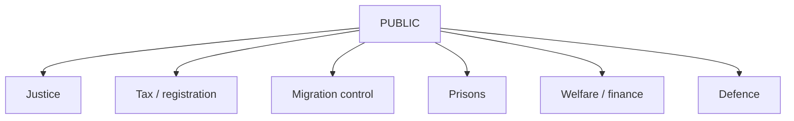

# Classification Results — Realtime Monitor 2026-06-13

| doc | confidentiality | sensitivity | retention | access | domain | note |
|---|---|---|---|---|---|---|
| HD01JuU44 | PUBLIC | MEDIUM | routine | open | justice | recruitment + secrecy |
| HD01SkU30 | PUBLIC | HIGH | routine | open | tax / registration | biometrics and identity controls |
| HD01SfU32 | PUBLIC | HIGH | routine | open | migration control | return operations and coercive tools |
| HD10557 | PUBLIC | HIGH | routine | open | prisons | abuse and crowding pressure |
| HD10558 | PUBLIC | MEDIUM | routine | open | welfare / finance | pressure signal |
| HD10555 | PUBLIC | MEDIUM | routine | open | defence | climate and threat readiness |

## Notes

- Nothing in this pulse is classified.
- The sensitivity is about operational and privacy implications, not secrecy.

