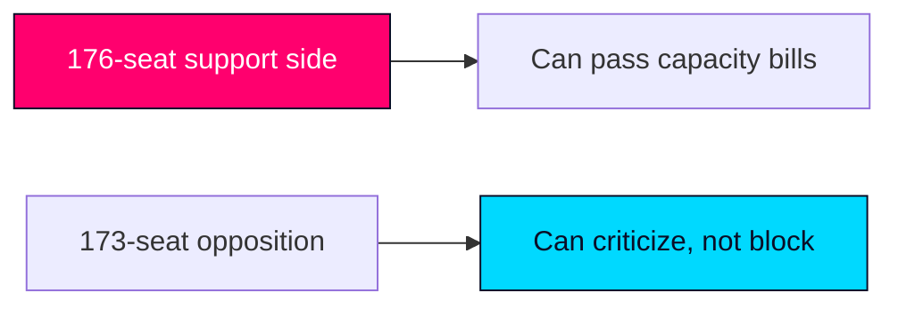

# Coalition Mathematics — Realtime Monitor 2026-06-13

| block | seats | read |
|---|---:|---|
| M | 68 | government bloc |
| KD | 19 | government bloc |
| L | 16 | government bloc |
| SD | 73 | support bloc |
| S | 107 | opposition |
| V | 24 | opposition |
| C | 24 | opposition |
| MP | 18 | opposition |
| majority threshold | 175 | Riksdag majority |

## Read

- The governing side plus SD support reaches 176, which is enough to move capacity packages.
- That makes JuU44, SkU30 and SfU32 politically feasible even when the opposition criticises them.

