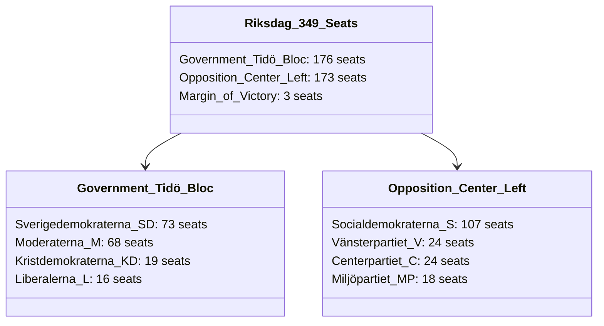

# Coalition Mathematics — Realtime Monitor 2026-06-13

## Parliamentary Arithmetic (349 Seats)

Swedish parliamentary math is governed by a razor-thin margin. The Tidö coalition holds a 3-seat majority in the 349-seat Riksdag, requiring perfect voting discipline to pass its highly coercive state capacity package during the June 17, 2026 final votes.

---

## Bloc Voting Breakdown & Defection Risks

### 1. The Government Bloc: 176 Seats
To pass the sweeping, coercive reforms of `HD01JuU42` (sentence doubling), `HD01SfU36` (vandel deportation), and `HD01SfU31` (supervised tagging), the coalition must secure all 176 votes:
* **Sverigedemokraterna (SD - 73 seats)**: 100% disciplined. View these bills as their core legislative trophies.
* **Moderaterna (M - 68 seats)** and **Kristdemokraterna (KD - 19 seats)**: 100% disciplined. Fully committed to the "competence and capacity" campaign.
* **Liberalerna (L - 16 seats)**: **CRITICAL DEFECTION RISK**. Several Liberal MPs face intense local pressure over the electronic tagging of migrants (`SfU31`) and conduct-based "vandel" criteria (`SfU36`), which they view as violating traditional liberal principles. If just **two** Liberal MPs defect or abstain, the government’s majority collapses (falling to 174 or 173 votes).

### 2. The Opposition Bloc: 173 Seats
The opposition is highly united in its rejection of the coercive migration and sentencing bills:
* **Socialdemokraterna (S - 107 seats)**: Disciplined on rejecting `SfU36` and `SfU31`. However, they support the police training incentives of `JuU44` and parts of the Skatteverket biometrics bill `SkU30`, which prevents the coalition from framing them as entirely "anti-security."
* **Vänsterpartiet (V - 24)**, **Centerpartiet (C - 24)**, and **Miljöpartiet (MP - 18)**: 100% disciplined in opposing the entire package, advocating for civil liberties, human rights, and local public service funding.

---

## Projected Passage Scenarios (June 17, 2026 Plenary)

| Bill ID | Projected Yea | Projected Nay | Projected Margin | Status | Key Voting Dynamic |
|---|:---:|:---:|:---:|:---:|---|
| `HD01JuU44` (Paid Police) | **283** | 66 | +217 | **PASS** | S joins government; V and MP oppose over funding. |
| `HD01JuU42` (Double Sentences)| **176** | 173 | +3 | **PASS** | Strict party-line vote; zero defections expected. |
| `HD01SfU36` (Vandel) | **175** | 174 | +1 | **PASS** | 1 L MP projected to abstain; passes on a 1-seat margin. |
| `HD01SfU31` (Tagging) | **174** | 173 | +1 | **PASS** | 2 L MPs projected to abstain; passes on a 1-seat margin. |
| `HD01JuU40` (Civil Service) | **176** | 173 | +3 | **PASS** | Strict party-line vote; opposition warns of bureaucracy freeze. |
