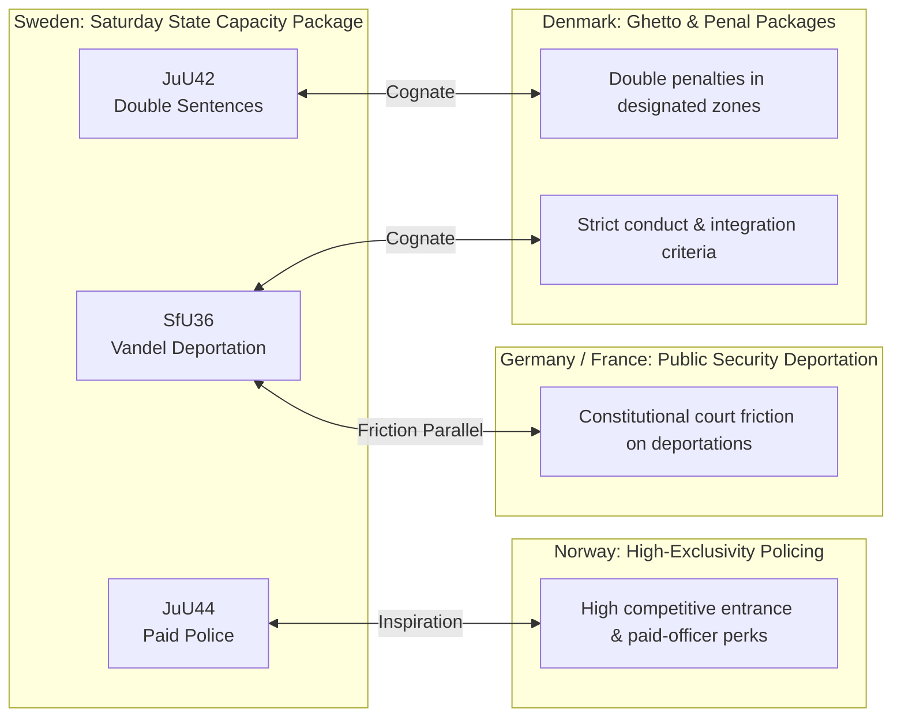

# Comparative International Analysis — Realtime Monitor 2026-06-13

## Peer-Country Policy Frameworks

Sweden's rapid pivot toward coercive state capacity is not isolated; it directly mirrors developments across several Nordic, European, and OECD peer countries struggling with organized crime, integration challenges, and administrative strain.

---

## Detailed Comparative Case Studies

### 1. The Danish Model: Penal Zone Doubling and Conduct-Based Exclusion
* **Sweden's Cognate**: `HD01JuU42` (Sentence Doubling) and `HD01SfU36` (Conduct Deportations)
* **Comparative Analysis**: Sweden's package is heavily inspired by Denmark's landmark "Ghetto Package" (`Ghettopakken`) and subsequent penal reforms. Denmark successfully implemented double penalties for crimes committed in designated areas and expanded administrative grounds for deporting non-citizens who fail to comply with social integration standards. However, Denmark's sentencing surge triggered a critical prison capacity crisis, forcing Copenhagen to take the unprecedented step of renting prison cells in Kosovo to house excess inmates. Sweden's `JuU42` face a nearly identical capacity crisis (`HD10557`), but renting foreign cells has not yet been legally cleared.

### 2. The Norwegian Model: Selective Police Recruitment and Prestige
* **Sweden's Cognate**: `HD01JuU44` (Paid Police Training)
* **Comparative Analysis**: Norway’s Police University College (`Politihøgskolen`) is highly competitive, maintaining a high level of prestige and selectiveness by offering excellent training perks and clear, long-term career stability. Sweden’s paid police reform under `JuU44` aims to replicate Norway's recruitment success by writing off student debt over time. However, Sweden's model is a reactionary measure to fill empty training slots, whereas Norway's model is built on long-term institutional prestige, indicating that financial incentives alone may not solve Sweden's officer quality issues.

### 3. Germany & France: Administrative Deportations and Judicial Friction
* **Sweden's Cognate**: `HD01SfU36` (Vandel Deportation) and `HD01SfU31` (Supervised Tagging)
* **Comparative Analysis**: Germany and France have both sought to expand administrative deportations for individuals deemed to threaten public security or "national values." In Germany, however, administrative deportations have faced severe, ongoing resistance from the Federal Constitutional Court (`Bundesverfassungsgericht`), which strictly enforces civil rights and proportionality. Sweden's `SfU36` and `SfU31` are highly likely to face similar judicial friction as center-left NGOs and human rights lawyers appeal administrative "vandel" decisions to the Supreme Administrative Court (`Högsta förvaltningsdomstolen`).
