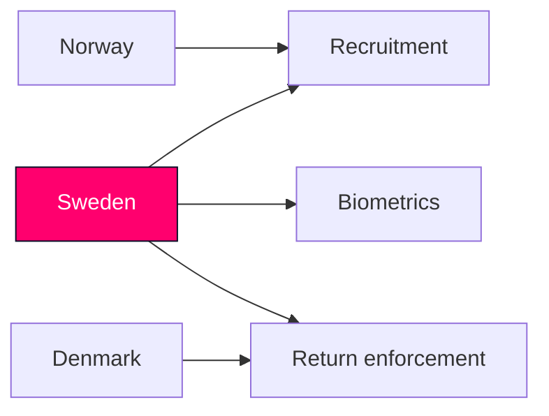

# Comparative International — Realtime Monitor 2026-06-13

## Comparator Set

| jurisdiction | qualitative comparison | why it matters |
|---|---|---|
| Norway | police recruitment support and strong identity-management institutions | shows the Nordic "capacity first" frame |
| Denmark | tighter return and enforcement tools | useful for comparing coercive administrative design |

## Outside-In Read

- Sweden's package is not unusual in Nordic terms, but the mix is notable: recruitment incentives, biometrics and return enforcement are all moving together.
- The live question is less whether the tools exist elsewhere and more whether they can be made operational at the same time.

