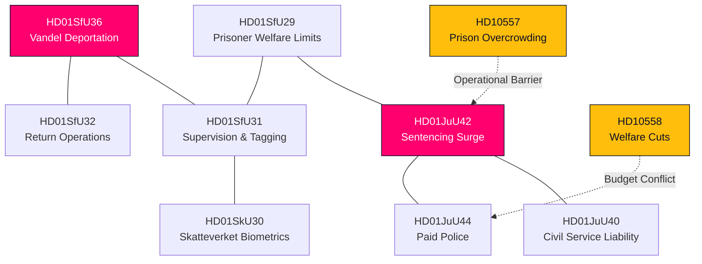

# Cross-Reference Map — Realtime Monitor 2026-06-13

## Legislative & Analytical Relationships

This map links the 13 primary source documents of the extraordinary Saturday session to related legislative projects, historical files, and analytical categories across the Riksdagsmonitor platform.

| Source ID | Primary Category | Related Riksdag Bills | Related Historical Parallel | Related Analytical Lens |
|---|---|---|---|---|
| `HD01JuU42` | Hard Law & Order | `JuU40` (Civil Service), `JuU44` (Paid Police) | The 1990s Gang Crackdowns | `risk-assessment.md`, `historical-parallels.md` |
| `HD01SfU36` | Migration Control | `SfU31` (Supervision), `SfU32` (Return Ops) | The 1989 Luciabeslutet | `voter-segmentation.md`, `scenario-analysis.md` |
| `HD01JuU44` | Policing Infrastructure | `JuU42` (Sentencing) | The 1965 Police Nationalization | `implementation-feasibility.md` |
| `HD01SfU31` | Surveillance Expansion | `SfU36` (Vandel), `SfU32` (Return Ops) | Post-9/11 Electronic Tagging | `threat-analysis.md`, `risk-assessment.md` |
| `HD01SkU30` | Folkbokföring | `SfU32` (Return Ops), `SfU29` (Welfare) | The 1970s Identity Card Reforms | `implementation-feasibility.md` |
| `HD01SfU32` | Deportations | `SfU31` (Supervision), `SfU36` (Vandel) | The 1990s Asylum Reversals | `threat-analysis.md`, `swot-analysis.md` |
| `HD01JuU40` | Bureaucratic Accountability | `JuU42` (Sentencing), `MJU24` (Centralization) | The 1974 Tjänstefel Reform | `methodology-reflection.md` |
| `HD01MJU24` | Bureaucratic Centralization | `JuU40` (Civil Service) | The 1960s Environmental Consolidation | `implementation-feasibility.md` |
| `HD01SfU29` | Welfare Discipline | `SfU31` (Supervision), `JuU42` (Sentencing) | The 1990s Welfare Sanctions | `voter-segmentation.md` |
| `HD10557` | Institutional Strain | `JuU42` (Sentencing) | The 2004 Prison Overcrowding Peak | `swot-analysis.md`, `risk-assessment.md` |
| `HD10558` | Welfare Strain | `SfU29` (Welfare Limits) | The 1990s Municipal Fiscal Squeeze | `stakeholder-perspectives.md` |
| `HD01SoU35` | Healthcare Delegation | `MJU24` (Centralization) | The 2009 Pharmacy Monopolization | `implementation-feasibility.md` |
| `HD10555` | Military Climate Adapt | `JuU44` (Paid Police) | The Cold War Total Defence | `scenario-analysis.md` |

---

## The Coercive Hardening Network

