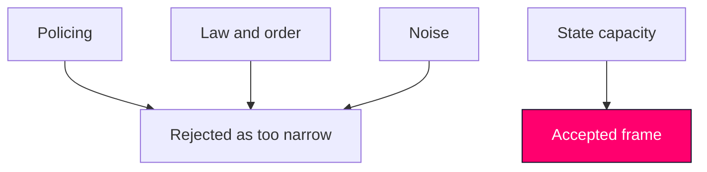

# Devil's Advocate — Realtime Monitor 2026-06-13

## Hypothesis 1: This is just a police-recruitment story

- Counterpoint: Skatteverket, return operations, prisons, welfare and defence all appear in the same pulse.

## Hypothesis 2: This is just a law-and-order story

- Counterpoint: the real throughline is state capacity, not only punishment.

## Hypothesis 3: The interpellations are unrelated noise

- Counterpoint: they are the pressure evidence that explains why the capacity frame is politically live.

## Rejected Alternative

- A narrow "committee report only" article would be too small for the actual feed.

