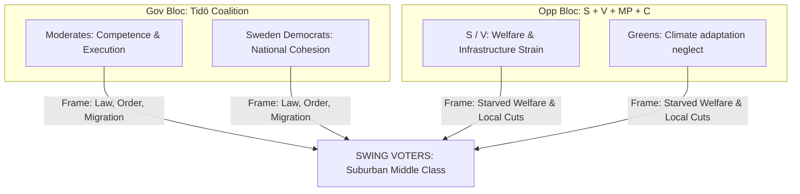

# Election 2026 Analysis — Realtime Monitor 2026-06-13

## Electoral Stakes and Battlegrounds

The extraordinary Saturday session's state capacity package is designed to define the core ideological and operational battlegrounds of the upcoming **September 2026 Swedish general election**. 

---

## Strategic Bloc Positioning

### 1. The Tidö Coalition: "Delivery, Competence, and Order"
* **The Strategy**: The coalition (M, KD, L + SD) is using this massive, unified package of reforms to build a solid "competence and delivery" campaign. By passing `JuU42` (gang sentence doubling), `SfU36` (vandel deportations), and `JuU44` (paid police), the coalition can present itself as the only political force willing and able to deploy the full, coercive power of the state to dismantle gangs and restore social order. Centralizing green permitting under `MJU24` allows them to appeal to industrial-oriented swing voters who value execution over regional bureaucracy.
* **Electoral Vulnerability**: The coalition is highly exposed to operational bottlenecks. A major prison crisis under `JuU42` / `HD10557` or systemic human rights reversals on "vandel" deportations would severely damage their competence narrative.

### 2. The Opposition: "The Cost of Coercive Excess"
* **The Strategy**: The Social Democrats (S) and their allies (V, MP, C) are coordinating a counter-offensive focused on **systemic strain and underfunding**. They argue that the Government's hyper-coercive focus is starved of long-term economic reality, pointing to underfunded municipal schools and healthcare (`HD10558`), overcrowded and unsafe prisons (`HD10557`), and a military neglected on climate adaptation (`HD10555`). Their strategy is to shift the debate from "security and borders" to "welfare capacity and local public services."
* **Electoral Vulnerability**: The opposition remains highly vulnerable to being portrayed as "soft on crime and open borders." Supporting the police recruitment incentive (`JuU44`) is an attempt to neutralize this attack, but opposing gang double-sentences (`JuU42`) and "vandel" deportations (`SfU36`) keeps this vulnerability open.
