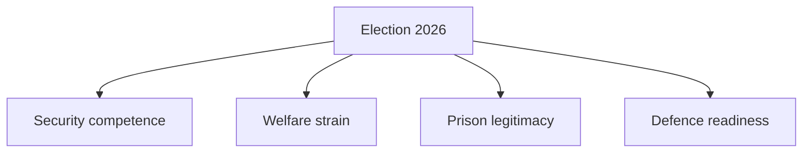

# Election 2026 Analysis — Realtime Monitor 2026-06-13

## Electoral Meaning

The feed matters because it sits in the run-up to the 2026 election year:

- police recruitment is a high-salience law-and-order issue,
- welfare cuts are a core opposition attack line,
- prison conditions and defence readiness test governing credibility.

## Implication

The Government is trying to show competence on security and enforcement before the campaign hardens. The opposition is trying to show that capacity is already failing.

