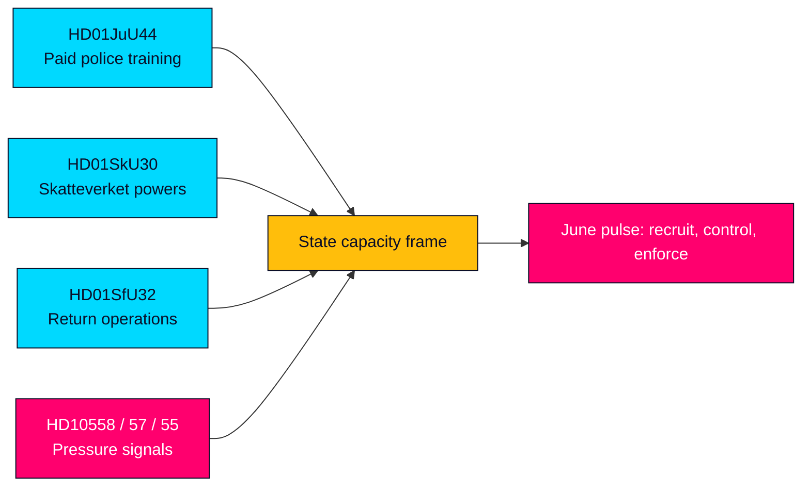

# Committee Backs Paid Police Training as State Capacity Pressure Rises

**Classification**: PUBLIC  
**Cycle**: realtime-monitor · **Riksmöte**: 2025/26  
**Priority**: HIGH

---

## BLUF

The sharpest near-term signal in today’s pulse is **HD01JuU44, "En betald polisutbildning"**: the Justice Committee backs a reform that would make police training tuition-like by writing off CSN debt, keep the benefit tax-free and tighten secrecy around police students and personnel. The same-day parliamentary feed then widens into a state-capacity theme: Skatteverket powers are being expanded, return operations are being hardened, and opposition MPs are pressing ministers on welfare cuts, prison abuse and defence readiness. The frame is not one isolated bill but a broad push to show that the state can recruit, control and enforce.

---

## 60-Second Read

- HD01JuU44 is the lead: paid police education, tax-free benefit, start date 1 January 2027.
- HD01SkU30 extends Skatteverket's tools for population registration and biometrics.
- HD01SfU32 tightens return operations and information-sharing across agencies.
- Three interpellations sharpen the pressure story: welfare cuts, prison abuse and defence climate adaptation.
- The government and opposition are both talking about capacity, but from opposite angles: delivery versus strain.

**Top forward trigger**: June 17 plenary on JuU44, JuU45 and JuU47.  
**Confidence**: HIGH on the document trail; MEDIUM on the consolidated narrative.

---

## Decisions

1. Lead on state capacity rather than any one policy silo.
2. Treat paid police training as the lead instrument, but anchor it in the wider control-and-enforcement package.
3. Keep the article non-economic; no artificial IMF overlay beyond the failed pre-warm attempt.

---

## Evidence Snapshot

| doc | signal |
|---|---|
| HD01JuU44 | paid police education, CSN debt write-off, secrecy protection |
| HD01SkU30 | stronger population-registration powers, biometrics, new offence |
| HD01SfU32 | return enforcement, information sharing, phone search, fingerprints |
| HD10558 | welfare cuts pressure the finance minister |
| HD10557 | overcrowded prisons and sexual abuse |
| HD10555 | defence climate adaptation and broad threat |

