# Special Saturday Session Hardens State Capacity: Gang Double-Sentences and Conduct-Based Deportations Cleared

**Classification**: PUBLIC  
**Cycle**: realtime-monitor · **Riksmöte**: 2025/26  
**Priority**: HIGH

---

## BLUF

The extraordinary Saturday, June 13, 2026 plenary session represents a watershed moment in Swedish administrative and penal history, demonstrating an unprecedented centralization and hardening of state authority ("state capacity"). While the headline-grabbing recruitment reform of **HD01JuU44 ("En betald polisutbildning")** (offering debt write-offs and enhanced officer protection) remains a critical pillar, it is now clearly understood as merely one piece of a synchronized, multi-front campaign to rebuild state authority.

By integrating the sweeping penal expansions of **HD01JuU42 (Doubled sentences for gang-related crimes)** and the civil service accountability of **HD01JuU40 (Abuse of public office offense)** with a highly aggressive migration enforcement suite—comprising conduct-based deportations (**HD01SfU36**), electronic monitoring for supervised individuals (**HD01SfU31**), biometric tracking (**HD01SkU30**), and restricted welfare access (**HD01SfU29**)—the Government has pivoted from rhetorical "tough-on-crime" signaling to a comprehensive restructuring of state capacity.

---

## 60-Second Read

- **The Saturday Session**: Plenary session 2025/26:139 marks a rare weekend assembly called specifically to clear a backlog of high-salience, structural reforms on law-and-order, migration, and administrative centralization.
- **Hard Law & Order**: `HD01JuU42` removes the 10-year joint-sentencing cap, doubles gang-linked sentences, and introduces life terms for repeat violent crimes. Simultaneously, `HD01JuU40` introduces a new criminal offense for public officials, "abuse of public office," imposing strict legal accountability internally.
- **Migration & Borders**: `HD01SfU36` lowers the deportation threshold by allowing revocation of residence permits for "bristande vandel" (bad conduct), while `HD01SfU31` legalizes electronic tagging for supervised asylum seekers and undocumented migrants.
- **Welfare & Administrative Restrictions**: `HD01SfU29` strips social security benefits from prisoners under electronic monitoring or preventive detention and forces them to pay for upkeep. `HD01SoU35` delegates OTC drug sales to pharmacies via mandatory pharmacist counseling.
- **Structural Centralization**: `HD01MJU24` bypasses regional county administrative boards to establish a centralized national Environmental Permitting Agency (`Miljöprövningsmyndigheten`), aiming to accelerate industrial transitions.
- **Opposition Stance**: Centers on systemic strain, pointing to overcrowded, abusive prisons (`HD10557`), underfunded municipal welfare networks (`HD10558`), and a military struggling with climate adaptation (`HD10555`).

**Top forward trigger**: June 17, 2026 final votes on JuU44, JuU42, SfU36, and SfU31 in the chamber.  
**Confidence**: HIGH on the legislative and document trail; HIGH on the consolidated state-capacity narrative.

---

## Decisions

1. **Lead on State Capacity**: Reject siloed analysis. Force all 13 documents into a unified "state capacity" and "coercive machinery" framework.
2. **Weekend Session Focus**: Center the entire pulse on the extraordinary Saturday, June 13, 2026 session, treating it as a consolidated legislative push rather than isolated events.
3. **Opposition Strain Counter-Balance**: Treat the interpellations on welfare cuts, prison abuse, and military climate adaptation not as noise, but as the direct externalities of this aggressive state expansion.

---

## Evidence Snapshot

| doc | signal | key provisions |
|---|---|---|
| `HD01JuU44` | Paid Police Education | CSN debt write-off over time, tax-free benefit, tighter secrecy around students |
| `HD01JuU42` | Doubled Gang Sentences | No 10-yr joint sentence cap, double joint max, life for repeat violent crime, expanded pre-trial detention |
| `HD01JuU40` | Public Office Accountability | New "abuse of public office" offense, grovt tjänstefel minimum raised to 1.5 years |
| `HD01SfU36` | Conduct-Based Deportations | Permits denied/revoked for "bristande vandel" (debts, dishonesty, non-compliance) |
| `HD01SfU31` | Supervised Tagging | Electronic tracking and geographic limits as alternatives to physical detention |
| `HD01SfU29` | Welfare Limits for Custody | No social security for community-monitored prisoners, pay for own upkeep |
| `HD01SkU30` | Folkbokföring Biometrics | Folkbokföring fraud criminalized, biometrics shared across Tax and Police |
| `HD01SfU32` | Return Operations | Coercive search powers, phone inspection, expanded fingerprinting |
| `HD01MJU24` | Miljöprövningsmyndigheten | Centralized national environmental permitting agency, bypassing regional boards |
| `HD01SoU35` | Pharmacist Assortment | Creates "farmaceutsortiment" OTC drugs requiring mandatory pharmacist counseling |
| `HD10558` | Welfare Cuts Pressure | S interpellation on municipal and regional underfunding and class size |
| `HD10557` | Prison Sexual Abuse | V interpellation on Kriminalvården overcrowding, staff shortages, and abuse |
| `HD10555` | Military Climate Adapt | MP interpellation on military adaptation to climate stress and broader threat landscape |

```mermaid
flowchart TD
  subgraph Saturday Plenary Session 2025/26:139
    A1["HD01SfU36<br/>Vandel Deportation"]
    A2["HD01SfU31<br/>Migrant Tracking"]
    A3["HD01SfU29<br/>Prisoner Welfare Limits"]
    A4["HD01JuU42<br/>Double Gang Sentences"]
    A5["HD01JuU40<br/>Civil Service Liability"]
  end

  subgraph Adjacent Hardening Package
    B1["HD01JuU44<br/>Paid Police Training"]
    B2["HD01SkU30<br/>Skatteverket Biometrics"]
    B3["HD01SfU32<br/>Return Operations"]
    B4["HD01MJU24<br/>Environmental Permitting"]
    B5["HD01SoU35<br/>OTC Pharmacy Delegation"]
  end

  subgraph Systemic Strain / Opposition Backlash
    C1["HD10558<br/>Welfare & Local Cuts"]
    C2["HD10557<br/>Kriminalvården Overcrowding"]
    C3["HD10555<br/>Defence Climate Adapt"]
  end

  A1 & A2 & A3 & A4 & A5 --> STATE["HARDENED STATE CAPACITY"]
  B1 & B2 & B3 & B4 & B5 --> STATE
  STATE --> STRAIN["Systemic Strain & Bottlenecks"]
  C1 & C2 & C3 -.-> STRAIN

  style STATE fill:#ff006e,stroke:#0a0e27,color:#ffffff,stroke-width:2px
  style STRAIN fill:#ffbe0b,stroke:#0a0e27,color:#0a0e27
  style A1 fill:#00d9ff,stroke:#0a0e27,color:#0a0e27
  style A2 fill:#00d9ff,stroke:#0a0e27,color:#0a0e27
  style A4 fill:#00d9ff,stroke:#0a0e27,color:#0a0e27
  style B1 fill:#00d9ff,stroke:#0a0e27,color:#0a0e27
  style C1 fill:#ffbe0b,stroke:#0a0e27,color:#0a0e27
  style C2 fill:#ffbe0b,stroke:#0a0e27,color:#0a0e27
```

