<!-- dir: rtl -->
# جلسة السبت الاستثنائية تعزز قدرة الدولة: الموافقة على مضاعفة عقوبات العصابات وعمليات الترحيل على أساس السلوك

**Classification**: PUBLIC  
**Cykel**: realtime-monitor · **Riksmöte**: 2025/26  
**الأولويات**: عالية

---

## 🎯 الخلاصة

تمثل الجلسة العامة الاستثنائية يوم السبت ١٣ يونيو ٢٠٢٦ نقطة تحول في التاريخ الإداري والجنائي السويدي، وتوضح مركزية وتشديدًا غير مسبوقين لسلطة الدولة ("قدرة الدولة"). وبينما يظل إصلاح التوظيف المثير للاهتمام في **HD01JuU44 ("En betald polisutbildning")** (الذي يقدم شطبًا للديون وحماية معززة لرجال الشرطة) ركيزة أساسية، فإنه يُفهم الآن بوضوح على أنه مجرد جزء واحد من حملة متزامنة متعددة الجبهات لإعادة بناء سلطة الدولة.

من خلال دمج التوسعات الجنائية الشاملة لـ **HD01JuU42 (مضاعفة عقوبات الجرائم المرتبطة بالعصابات)** والمسؤولية المدنية لـ **HD01JuU40 (Tjenestemannsansvar)** مع حزمة إنفاذ قوانين الهجرة العدوانية للغاية — التي تضم عمليات الترحيل على أساس السلوك (**HD01SfU36**)، والمراقبة الإلكترونية للأفراد الخاضعين للإشراف (**HD01SfU31**)، والتتبع البيومتري (**HD01SkU30**)، والوصول المقيد إلى مزايا الرعاية الاجتماعية (**HD01SfU29**) — انتقلت الحكومة من مجرد إطلاق إشارات خطابية حول "التشدد ضد الجريمة" إلى إعادة هيكلة شاملة لقدرة الدولة.

---

## قراءة في 60 ثانية

- **جلسة السبت**: تمثل الجلسة العامة ٢٠٢٥/٢٦:١٣٩ تجمعًا نادرًا في عطلة نهاية الأسبوع دُعي إليه خصيصًا لتصفية متأخرات الإصلاحات الهيكلية البارزة بشأن القانون والنظام، والهجرة، والمركزية الإدارية.
- **القانون والنظام الصارم**: تلغي `HD01JuU42` سقف الأحكام المشتركة البالغ ١٠ سنوات، وتضاعف العقوبات المرتبطة بالعصابات، وتدخل أحكام السجن مدى الحياة لجرائم العنف المتكررة. وفي الوقت نفسه، تقدم `HD01JuU40` جريمة جنائية جديدة للمسؤولين العموميين، "إساءة استخدام الوظيفة العامة"، مما يفرض مسؤولية قانونية صارمة داخليًا.
- **الهجرة والحدود**: تخفض `HD01SfU36` حد الترحيل من خلال السماح بإلغاء تصاريح الإقامة بسبب "bristande vandel" (السلوك السيئ)، بينما تقنن `HD01SfU31` التتبع الإلكتروني لطالبي اللجوء الخاضعين للإشراف والمهاجرين غير الشرعيين.
- **الرعاية الاجتماعية والقيود الإدارية**: تحرم `HD01SfU29` السجناء الخاضعين للمراقبة الإلكترونية أو الاحتجاز الوقائي من مزايا الضمان الاجتماعي وتجبرهم على دفع تكاليف إعالتهم. وتفوض `HD01SoU35` مبيعات الأدوية التي لا تستلزم وصفة طبية للصيدليات مع تقديم مشورة إلزامية من الصيادلة.
- **المركزية الهيكلية**: تتجاوز `HD01MJU24` مجالس إدارة المقاطعات الإقليمية لإنشاء وكالة وطنية مركزية لترخيص البيئة (`Miljöprövningsmyndigheten`)، بهدف تسريع الانتقال الصناعي.
- **موقف المعارضة**: يركز على الضغط النظامي، مشيرًا إلى السجون المكتظة والمسيئة (`HD10557`)، وشبكات الرعاية البلدية التي تعاني من نقص التمويل (`HD10558`)، وجيش يكافح من أجل التكيف مع المناخ (`HD10555`).

**أهم مؤشر مستقبلي**: التصويت النهائي في ١٧ يونيو ٢٠٢٦ على JuU44 و JuU42 و SfU36 و SfU31.  
**مستوى الثقة**: مرتفع في مسار التشريعات والوثائق؛ مرتفع في السرد الموحد لقدرة الدولة.

---

## القرارات

1. **الريادة في قدرة الدولة**: رفض التحليل المجزأ. دمج جميع الوثائق الـ ١٣ في إطار موحد لـ "قدرة الدولة" و "أجهزة الإكراه".
2. **التركيز على جلسة نهاية الأسبوع**: تركيز التحليل بأكمله على الجلسة الاستثنائية ليوم السبت ١٣ يونيو ٢٠٢٦، والتعامل معها كحملة تشريعية موحدة وليس كأحداث معزولة.
3. **موازنة ضغوط المعارضة**: عدم معاملة الاستجوابات بشأن تخفيضات الرعاية الاجتماعية، وإساءة المعاملة في السجون، والتكيف مع المناخ العسكري كضوضاء، بل كعواقب مباشرة للتوسع العدواني للدولة.

---

## لقطة أدلة

| doc | signal | key provisions |
|---|---|---|
| `HD01JuU44` | التعليم الشرطي المدفوع | شطب ديون CSN بمرور الوقت، ميزة معفاة من الضرائب، سرية أكثر صرامة حول الطلاب |
| `HD01JuU42` | مضاعفة عقوبات العصابات | لا يوجد سقف للأحكام المشتركة البالغ ١٠ سنوات، مضاعفة الحد الأقصى المشترك، السجن مدى الحياة لجرائم العنف المتكررة، توسيع الاحتجاز السابق للمحاكمة |
| `HD01JuU40` | Tjenestemannsansvar | جريمة جديدة لـ "إساءة استخدام الوظيفة العامة"، رفع الحد الأدنى للمخالفة الجسيمة إلى ١.٥ سنة |
| `HD01SfU36` | عمليات الترحيل على أساس السلوك | رفض/إلغاء التصاريح بسبب "bristande vandel" (الديون، عدم الأمانة، عدم الامتثال) |
| `HD01SfU31` | المراقبة الإلكترونية | التتبع الإلكتروني والحدود الجغرافية كبدائل للاحتجاز الفعلي |
| `HD01SfU29` | حدود الرعاية الاجتماعية أثناء الاحتجاز | لا توجد ضمان اجتماعي للسجناء الخاضعين للمراقبة الإلكترونية، الدفع مقابل إعالتهم الخاصة |
| `HD01SkU30` | البيومترية في التسجيل المدني | تجريم تزوير قيد النفوس، ومشاركة البيانات الحيوية بين مصلحة الضرائب والشرطة |
| `HD01SfU32` | عمليات العودة | سلطات التفتيش القسرية، وتفتيش الهواتف، وتوسيع نطاق أخذ البصمات |
| `HD01MJU24` | Miljöprövningsmyndigheten | وكالة مركزية وطنية لترخيص البيئة، تتجاوز المجالس الإقليمية |
| `HD01SoU35` | التشكيلة الصيدلانية | تنشئ تشكيلة "farmaceutsortiment" للأدوية التي لا تستلزم وصفة طبية وتتطلب مشورة إلزامية من الصيدلي |
| `HD10558` | الضغط الناجم عن تخفيضات الرعاية | استجواب S حول نقص تمويل البلديات والمناطق وحجم الفصول الدراسية |
| `HD10557` | الاعتداء الجنسي في السجون | استجواب V حول الاكتظاظ ونقص الموظفين والانتهاكات في مصلحة السجون |
| `HD10555` | التكيف العسكري مع المناخ | استجواب MP حول التكيف العسكري مع الإجهاد المناخي والمشهد الأوسع للتهديدات |

```mermaid
flowchart TD
  subgraph Saturday Plenary Session 2025/26:139
    A1["HD01SfU36<br/>Vandel Deportation"]
    A2["HD01SfU31<br/>Migrant Tracking"]
    A3["HD01SfU29<br/>Prisoner Welfare Limits"]
    A4["HD01JuU42<br/>Double Gang Sentences"]
    A5["HD01JuU40<br/>Civil Service Liability"]
  end

  subgraph Adjacent Hardening Package
    B1["HD01JuU44<br/>Paid Police Training"]
    B2["HD01SkU30<br/>Skatteverket Biometrics"]
    B3["HD01SfU32<br/>Return Operations"]
    B4["HD01MJU24<br/>Environmental Permitting"]
    B5["HD01SoU35<br/>OTC Pharmacy Delegation"]
  end

  subgraph Systemic Strain / Opposition Backlash
    C1["HD10558<br/>Welfare & Local Cuts"]
    C2["HD10557<br/>Kriminalvården Overcrowding"]
    C3["HD10555<br/>Defence Climate Adapt"]
  end

  A1 & A2 & A3 & A4 & A5 --> STATE["HARDENED STATE CAPACITY"]
  B1 & B2 & B3 & B4 & B5 --> STATE
  STATE --> STRAIN["Systemic Strain & Bottlenecks"]
  C1 & C2 & C3 -.-> STRAIN

  style STATE fill:#ff006e,stroke:#0a0e27,color:#ffffff,stroke-width:2px
  style STRAIN fill:#ffbe0b,stroke:#0a0e27,color:#0a0e27
  style A1 fill:#00d9ff,stroke:#0a0e27,color:#0a0e27
  style A2 fill:#00d9ff,stroke:#0a0e27,color:#0a0e27
  style A4 fill:#00d9ff,stroke:#0a0e27,color:#0a0e27
  style B1 fill:#00d9ff,stroke:#0a0e27,color:#0a0e27
  style C1 fill:#ffbe0b,stroke:#0a0e27,color:#0a0e27
  style C2 fill:#ffbe0b,stroke:#0a0e27,color:#0a0e27
```

<!-- source-sha: 3cbc48e33ff1ee4ebcade24170fd1d1a9b887ae7 -->
