# Ekstraordinær lørdagssession styrker statskapaciteten: Dobbeltstraf for bandekriminalitet og udvisninger på grund af dårlig vandel godkendt

**Klassificering**: OFFENTLIG  
**Cykel**: realtime-monitor · **Riksmöte**: 2025/26  
**Prioritet**: HØJ

---

## 🎯 Resumé

Den ekstraordinære plenarsession lørdag den 13. juni 2026 repræsenterer et vendepunkt i svensk administrativ og strafferetlig historie, hvilket demonstrerer en hidtil uset centralisering og styrkelse af statslig autoritet ("statskapacitet"). Selvom den iøjnefaldende rekrutteringsreform i **HD01JuU44 ("En betald polisutbildning")** (der tilbyder afskrivning av gæld og forbedret beskyttelse af betjente) fortsat er en afgørende søjle, forstås den nu tydeligt som blot én brik i en synkroniseret kampagne på flere fronter for at genopbygge statslig autoritet.

Ved at integrera de omfattende strafferetlige udvidelser i **HD01JuU42 (Dobbeltstraf for bandekriminalitet)** og det skærpede tjenestemandsansvar i **HD01JuU40 (Tjenestemandsansvar)** med en yderst aggressiv migrationshåndhævelsespakke — bestående af udvisninger på grund af dårlig vandel (**HD01SfU36**), elektronisk overvågning af personer under opsyn (**HD01SfU31**), biometrisk sporing (**HD01SkU30**) og begrænset velfærdsadgang (**HD01SfU29**) — har regeringen bevæget sig fra retoriske signaler om at være "hård mod kriminalitet" til en gennemgribende omstrukturering af statskapaciteten.

---

## 60 sekunders læsning

- **Lørdagssessionen**: Plenarsession 2025/26:139 markerer en sjælden weekendsamling indkaldt specifikt til at afvikle en række højtprofilerede, strukturelle reformer om lov og orden, migration og administrativ centralisering.
- **Hård lov og orden**: `HD01JuU42` fjerner det 10-årige loft for fælles strafudmåling, fordobler banderelaterede straffe og indfører livstid for gentagen voldskriminalitet. Samtidig indfører `HD01JuU40` en ny straffelovsovertrædelse for offentligt ansatte, "misbrug af offentligt embede", hvilket pålægger et strengt juridisk ansvar internt.
- **Migration og grænser**: `HD01SfU36` sænker udvisningstærsklen ved at tillade tilbagekaldelse af opholdstilladelser for "bristande vandel" (dårlig vandel), mens `HD01SfU31` legaliserer elektronisk sporing for asylansøgere under opsyn og udokumenterede migranter.
- **Velfærd og administrative begrænsninger**: `HD01SfU29` fratager sociale ydelser fra fanger under elektronisk overvågning eller forebyggende varetægt og tvinger dem til at betale for deres eget underhold. `HD01SoU35` uddelegerer salg af håndkøbsmedicin til apoteker med krav om obligatorisk rådgivning fra en farmaceut.
- **Strukturel centralisering**: `HD01MJU24` går uden om de regionale länsstyrelser for at etablere en centraliseret national miljøgodkendelsesmyndighed (`Miljöprövningsmyndigheten`) med det formål at fremskynde den industrielle omstilling.
- **Oppositionens holdning**: Fokuserer på systemisk overbelastning og peger på overfyldte fængsler med misbrug (`HD10557`), underfinansierede kommunale velfærdsnetværk (`HD10558`) og et militær, der kæmper med klimatilpasning (`HD10555`).

**Vigtigste fremadrettede signal**: Endelige afstemninger den 17. juni 2026 om JuU44, JuU42, SfU36 og SfU31 i salen.  
**Konfidensgrad**: HØJ på lovgivnings- og dokumentstien; HØJ på den konsoliderede fortælling om statskapacitet.

---

## Beslutninger

1. **Fokus på statskapacitet**: Afvis fragmenteret analyse. Saml alle 13 dokumenter under en fælles ramme for "statskapacitet" og "statens tvangsapparat".
2. **Fokus på weekendsessionen**: Centrer hele overvågningen om den ekstraordinære session lørdag den 13. juni 2026, og behandl den som en samled lovgivningsmæssig offensiv snarere end isolerede begivenheder.
3. **Afbalancering af systemisk pres**: Behandl interpellationerne om velfærdsbesparelser, misbrug i fængsler og militær klimatilpasning ikke som baggrundsstøj, men som de direkte eksternaliteter af denne aggressive statslige ekspansion.

---

## Evidensoversigt

| doc | signal | key provisions |
|---|---|---|
| `HD01JuU44` | Betalt politiuddannelse | Afskrivning af CSN-gæld over tid, skattefri fordel, strengere fortrolighed omkring studerende |
| `HD01JuU42` | Dobbeltstraf for bandekriminalitet | Intet 10-årigt loft for fælles strafudmåling, dobbelt fælles maksimum, livstid for gentagen voldskriminalitet, udvidet varetægtsfængsling |
| `HD01JuU40` | Tjenestemandsansvar | Ny "misbrug af offentligt embede"-forseelse, groft tjenestefejl-minimum hævet til 1,5 år |
| `HD01SfU36` | Udvisning på grund af dårlig vandel | Tilladelser nægtet/tilbagekaldt for "bristande vandel" (gæld, uærlighed, manglende overholdelse) |
| `HD01SfU31` | Elektronisk fodlænke | Elektronisk sporing og geografiske begrænsninger som alternativer til fysisk tilbageholdelse |
| `HD01SfU29` | Velfærdsbegrænsninger under varetægt | Ingen social sikring til fanger under elektronisk overvågning, betaling for eget underhold |
| `HD01SkU30` | Biometri i folkeregistret | Folkebogføringssvindel kriminaliseret, biometri deles på tværs af skat og politi |
| `HD01SfU32` | Udsendelsesoperationer | Tvangsindgreb ved ransagning, telefoninspektion, udvidet optagelse af fingeraftryk |
| `HD01MJU24` | Miljöprövningsmyndigheten | Centraliseret national miljøgodkendelsesmyndighed, går uden om regionale råd |
| `HD01SoU35` | Farmaceutsortiment | Skaber "farmaceutsortiment" for håndkøbsmedicin med krav om obligatorisk rådgivning |
| `HD10558` | Pres fra velfærdsbesparelser | S-interpellation om underfinansiering af kommuner og regioner samt klassestørrelse |
| `HD10557` | Sexuelt misbrug i fængsler | V-interpellation om overfyldning af Kriminalvården, personalemangel og misbrug |
| `HD10555` | Militær klimatilpasning | MP-interpellation om militær tilpasning til klimastress og et bredere trusselsbillede |

```mermaid
flowchart TD
  subgraph Saturday Plenary Session 2025/26:139
    A1["HD01SfU36<br/>Vandel Deportation"]
    A2["HD01SfU31<br/>Migrant Tracking"]
    A3["HD01SfU29<br/>Prisoner Welfare Limits"]
    A4["HD01JuU42<br/>Double Gang Sentences"]
    A5["HD01JuU40<br/>Civil Service Liability"]
  end

  subgraph Adjacent Hardening Package
    B1["HD01JuU44<br/>Paid Police Training"]
    B2["HD01SkU30<br/>Skatteverket Biometrics"]
    B3["HD01SfU32<br/>Return Operations"]
    B4["HD01MJU24<br/>Environmental Permitting"]
    B5["HD01SoU35<br/>OTC Pharmacy Delegation"]
  end

  subgraph Systemic Strain / Opposition Backlash
    C1["HD10558<br/>Welfare & Local Cuts"]
    C2["HD10557<br/>Kriminalvården Overcrowding"]
    C3["HD10555<br/>Defence Climate Adapt"]
  end

  A1 & A2 & A3 & A4 & A5 --> STATE["HARDENED STATE CAPACITY"]
  B1 & B2 & B3 & B4 & B5 --> STATE
  STATE --> STRAIN["Systemic Strain & Bottlenecks"]
  C1 & C2 & C3 -.-> STRAIN

  style STATE fill:#ff006e,stroke:#0a0e27,color:#ffffff,stroke-width:2px
  style STRAIN fill:#ffbe0b,stroke:#0a0e27,color:#0a0e27
  style A1 fill:#00d9ff,stroke:#0a0e27,color:#0a0e27
  style A2 fill:#00d9ff,stroke:#0a0e27,color:#0a0e27
  style A4 fill:#00d9ff,stroke:#0a0e27,color:#0a0e27
  style B1 fill:#00d9ff,stroke:#0a0e27,color:#0a0e27
  style C1 fill:#ffbe0b,stroke:#0a0e27,color:#0a0e27
  style C2 fill:#ffbe0b,stroke:#0a0e27,color:#0a0e27
```

<!-- source-sha: 3cbc48e33ff1ee4ebcade24170fd1d1a9b887ae7 -->
