# Sondersitzung am Samstag stärkt Staatskapazität: Doppelte Strafen für Bandenmitglieder und Ausweisung wegen mangelnden Wohlverhaltens beschlossen

**Einstufung**: ÖFFENTLICH  
**Cykel**: realtime-monitor · **Riksmöte**: 2025/26  
**Priorität**: HOCH

---

## 🎯 Zusammenfassung

Die außerordentliche Plenarsitzung am Samstag, dem 13. Juni 2026, stellt einen Wendepunkt in der schwedischen Verwaltungs- und Strafrechtsgeschichte dar und zeigt eine beispiellose Zentralisierung und Stärkung der staatlichen Autorität („Staatskapazität“). Während die reißerische Rekrutierungsreform von **HD01JuU44 ("En betald polisutbildning")** (die den Erlass von Studienschulden und einen verbesserten Schutz für Beamte vorsieht) ein entscheidender Pfeiler bleibt, wird sie nun eindeutig als nur ein Teil einer synchronisierten Mehrfrontenkampagne zum Wiederaufbau staatlicher Autorität verstanden.

Durch die Integration der weitreichenden strafrechtlichen Verschärfungen von **HD01JuU42 (Doppelte Strafen für Bandenkriminalität)** und des verschärften Dienstvergehens von **HD01JuU40 (Tjenestemannsansvar)** mit einem hocheffektiven Migrationsdurchsetzungspaket — bestehend aus Ausweisungen wegen mangelnden Wohlverhaltens (**HD01SfU36**), elektronischer Überwachung von Personen unter Aufsicht (**HD01SfU31**), biometrischer Erfassung (**HD01SkU30**) und eingeschränktem Zugang zu Sozialleistungen (**HD01SfU29**) — hat sich die Regierung von rhetorischen „Härte-gegen-Kriminalität“-Signalen zu einer umfassenden Umstrukturierung der Staatskapazität bewegt.

---

## 60-Sekunden-Schnellleser

- **Die Samstags-Sitzung**: Die Plenarsitzung 2025/26:139 markiert eine seltene Wochenendversammlung, die speziell einberufen wurde, um einen Rückstand an hochrelevanten, strukturellen Reformen in den Bereichen Recht und Ordnung, Migration und administrative Zentralisierung abzuarbeiten.
- **Hartes Recht & Ordnung**: `HD01JuU42` hebt die 10-jährige Höchstgrenze für Gesamtstrafen auf, verdoppelt bandenbezogene Strafen und führt lebenslange Haftstrafen für wiederholte Gewaltverbrechen ein. Gleichzeitig führt `HD01JuU40` einen neuen Straftatbestand für Beamte ein, „Dienstvergehen“, der intern eine strenge rechtliche Verantwortlichkeit auferlegt.
- **Migration & Grenzen**: `HD01SfU36` senkt die Abschiebungsschwelle durch die Möglichkeit des Entzugs von Aufenthaltstiteln wegen „bristande vandel“ (mangelndes Wohlverhalten), während `HD01SfU31` die elektronische Überwachung von Personen unter Aufsicht und undokumentierten Migranten legalisiert.
- **Sozialleistungen & administrative Einschränkungen**: `HD01SfU29` entzieht Gefangenen unter elektronischer Überwachung oder Sicherungsverwahrung die Sozialversicherungsleistungen und zwingt sie, für ihren Unterhalt selbst aufzukommen. `HD01SoU35` delegiert den Verkauf von rezeptfreien Medikamenten an Apotheken mit einer obligatorischen Beratung durch Apotheker.
- **Strukturelle Zentralisierung**: `HD01MJU24` umgeht die regionalen Länsstyrelser (Bezirksregierungen), um eine zentralisierte nationale Umweltprüfungsbehörde (`Miljöprövningsmyndigheten`) einzurichten, mit dem Ziel, die industrielle Wende zu beschleunigen.
- **Haltung der Opposition**: Konzentriert sich auf systemische Belastungen und verweist auf überfüllte Gefängnisse mit Missständen (`HD10557`), unterfinanzierte kommunale Sozialnetzwerke (`HD10558`) und ein Militär, das mit der Klimaanpassung kämpft (`HD10555`).

**Wichtigstes Vorwärtssignal**: Endgültige Abstimmungen am 17. Juni 2026 über JuU44, JuU42, SfU36 und SfU31 in der Kammer.  
**Vertrauensniveau**: HOCH auf der Gesetzgebungs- und Dokumentenspur; HOCH beim konsolidierten Narrativ zur Staatskapazität.

---

## Entscheidungen

1. **Fokus auf Staatskapazität**: Isolierte Analysen ablehnen. Alle 13 Dokumente in einen einheitlichen Rahmen aus „Staatskapazität“ und „staatlichem Zwangsapparat“ einordnen.
2. **Fokus auf Wochenendsitzung**: Den gesamten Fokus auf die außerordentliche Sitzung am Samstag, dem 13. Juni 2026, richten und diese als eine konsolidierte Gesetzgebungsoffensive und nicht als isolierte Ereignisse betrachten.
3. **Ausgleich systemischer Belastung**: Die Interpellationen zu Kürzungen im Sozialbereich, Missbrauch im Gefängnis und militärischer Klimaanpassung nicht als bloßes Rauschen, sondern als direkte Auswirkungen dieser aggressiven staatlichen Expansion betrachten.

---

## Evidenz-Übersicht

| doc | signal | key provisions |
|---|---|---|
| `HD01JuU44` | Bezahlte Polizeiausbildung | Erlass von CSN-Schulden über die Zeit, steuerfreier Vorteil, strengere Geheimhaltung für Studierende |
| `HD01JuU42` | Doppelte Strafen für Bandenkriminalität | Keine 10-jährige Höchstgrenze für Gesamtstrafen, doppeltes gemeinsames Maximum, lebenslange Haft für wiederholte Gewaltdelikte, ausgeweitete Untersuchungshaft |
| `HD01JuU40` | Tjenestemannsansvar | Neues Dienstvergehen, Mindeststrafe für schweres Dienstvergehen auf 1,5 Jahre angehoben |
| `HD01SfU36` | Ausweisung wegen mangelnden Wohlverhaltens | Aufenthaltstitel verweigert/entzogen wegen „bristande vandel“ (Schulden, Unehrlichkeit, Nichteinhaltung) |
| `HD01SfU31` | Elektronische Fußfessel | Elektronische Überwachung und geografische Einschränkungen als Alternative zu physischer Haft |
| `HD01SfU29` | Einschränkung von Sozialleistungen bei Haft | Keine Sozialversicherung für elektronisch überwachte Gefangene, Zahlung für eigenen Unterhalt |
| `HD01SkU30` | Biometrie im Melderegister | Betrug bei der Wohnsitzanmeldung kriminalisiert, Biometrie zwischen Steueramt und Polizei geteilt |
| `HD01SfU32` | Rückführungsmaßnahmen | Zwangsbefugnisse bei Durchsuchungen, Telefoninspektion, erweiterte Fingerabdrucknahme |
| `HD01MJU24` | Miljöprövningsmyndigheten | Zentralisierte nationale Umweltprüfungsbehörde, umgeht regionale Gremien |
| `HD01SoU35` | Apothekersortiment | Schafft ein „Farmaceutsortiment“ für rezeptfreie Medikamente mit verpflichtender Apothekerberatung |
| `HD10558` | Druck durch Sozialkürzungen | S-Interpellation zu Unterfinanzierung von Kommunen und Regionen sowie Klassengrößen |
| `HD10557` | Sexueller Missbrauch im Gefängnis | V-Interpellation zur Überbelegung, Personalmangel und Missbrauch bei Kriminalvården |
| `HD10555` | Militärische Klimaanpassung | MP-Interpellation zur militärischen Anpassung an Klimastress und ein breiteres Bedrohungsszenario |

```mermaid
flowchart TD
  subgraph Saturday Plenary Session 2025/26:139
    A1["HD01SfU36<br/>Vandel Deportation"]
    A2["HD01SfU31<br/>Migrant Tracking"]
    A3["HD01SfU29<br/>Prisoner Welfare Limits"]
    A4["HD01JuU42<br/>Double Gang Sentences"]
    A5["HD01JuU40<br/>Civil Service Liability"]
  end

  subgraph Adjacent Hardening Package
    B1["HD01JuU44<br/>Paid Police Training"]
    B2["HD01SkU30<br/>Skatteverket Biometrics"]
    B3["HD01SfU32<br/>Return Operations"]
    B4["HD01MJU24<br/>Environmental Permitting"]
    B5["HD01SoU35<br/>OTC Pharmacy Delegation"]
  end

  subgraph Systemic Strain / Opposition Backlash
    C1["HD10558<br/>Welfare & Local Cuts"]
    C2["HD10557<br/>Kriminalvården Overcrowding"]
    C3["HD10555<br/>Defence Climate Adapt"]
  end

  A1 & A2 & A3 & A4 & A5 --> STATE["HARDENED STATE CAPACITY"]
  B1 & B2 & B3 & B4 & B5 --> STATE
  STATE --> STRAIN["Systemic Strain & Bottlenecks"]
  C1 & C2 & C3 -.-> STRAIN

  style STATE fill:#ff006e,stroke:#0a0e27,color:#ffffff,stroke-width:2px
  style STRAIN fill:#ffbe0b,stroke:#0a0e27,color:#0a0e27
  style A1 fill:#00d9ff,stroke:#0a0e27,color:#0a0e27
  style A2 fill:#00d9ff,stroke:#0a0e27,color:#0a0e27
  style A4 fill:#00d9ff,stroke:#0a0e27,color:#0a0e27
  style B1 fill:#00d9ff,stroke:#0a0e27,color:#0a0e27
  style C1 fill:#ffbe0b,stroke:#0a0e27,color:#0a0e27
  style C2 fill:#ffbe0b,stroke:#0a0e27,color:#0a0e27
```

<!-- source-sha: 3cbc48e33ff1ee4ebcade24170fd1d1a9b887ae7 -->
