# Sesión extraordinaria de sábado refuerza la capacidad del Estado: penas dobles para pandillas y deportaciones aprobadas

**Clasificación**: PUBLIC  
**Cykel**: realtime-monitor · **Riksmöte**: 2025/26  
**Prioridad**: ALTA

---

## 🎯 Resumen

La sesión plenaria extraordinaria del sábado 13 de junio de 2026 marca un hito en la historia administrativa y penal sueca, demostrando una centralización y endurecimiento sin precedentes de la autoridad estatal ("capacidad del Estado"). Aunque la reforma de contratación de **HD01JuU44 ("En betald polisutbildning")** (condonación de deudas y mayor protección a oficiales) sigue siendo un pilar, se entiende ahora como parte de una campaña sincronizada en múltiples frentes para reconstruir la autoridad del Estado.

Al integrar las penas dobles para delitos de pandillas (**HD01JuU42**) y la responsabilidad pública de **HD01JuU40 (Tjenestemannsansvar)** con un paquete de aplicación migratoria agresivo —deportaciones por "mala conducta" (**HD01SfU36**), monitoreo electrónico (**HD01SfU31**), biometría (**HD01SkU30**) y acceso restringido a asistencia social (**HD01SfU29**)— el Gobierno ha pasado de señales retóricas de mano dura a una reestructuración integral de la capacidad del Estado.

---

## Lectura de 60 segundos

- **La sesión del sábado**: La sesión 2025/26:139 es una inusual asamblea de fin de semana convocada para despejar un cúmulo de reformas estructurales de alta relevancia sobre ley y orden, migración y centralización.
- **Ley y orden**: `HD01JuU42` elimina el límite de condenas conjuntas, duplica las penas de pandillas y crea cadena perpetua para reincidentes violentos. En paralelo, `HD01JuU40` crea el delito de "abuso de funciones públicas", reforzando la responsabilidad legal interna.
- **Migración y fronteras**: `HD01SfU36` reduce el umbral de deportación para "mala conducta" (permisos denegados o revocados), mientras que `HD01SfU31` legaliza el monitoreo electrónico para solicitantes de asilo y sin papeles.
- **Límites de bienestar y administración**: `HD01SfU29` retira beneficios sociales a presos bajo monitoreo o preventivos, cobrando su manutención. `HD01SoU35` delega la venta de medicamentos sin receta a farmacias con asesoramiento obligatorio.
- **Centralización**: `HD01MJU24` elude las juntas provinciales para crear una agencia nacional de permisos ambientales (`Miljöprövningsmyndigheten`) a fin de acelerar transiciones industriales.
- **Oposición**: Alerta de tensión sistémica, prisiones sobrepobladas (`HD10557`), subfinanciación de bienestar municipal (`HD10558`) y dificultades de adaptación climática militar (`HD10555`).

**Principal signal prospectiva**: Votaciones finales el 17 de junio de 2026 sobre JuU44, JuU42, SfU36 y SfU31.  
**Nivel de confianza**: ALTO en los textos legislativos; ALTO en la tesis de capacidad del Estado.

---

## Decisiones

1. **Capacidad del Estado**: Integrar los 13 textos en un marco unificado de "capacidad del Estado" y aparato coercitivo.
2. **Focus de sesión**: Centrar el análisis en la sesión extraordinaria del sábado 13 de junio de 2026, vista como una ofensiva legislativa unificada.
3. **Contrapeso de tensión**: Tratar las interpelaciones (social, prisiones, militar) como consecuencias directas de esta expansión estatal.

---

## Resumen de evidencia

| doc | signal | key provisions |
|---|---|---|
| `HD01JuU44` | Educación policial pagada | Condonación de deuda de CSN con el tiempo, beneficio libre de impuestos, mayor confidencialidad sobre los estudiantes |
| `HD01JuU42` | Penas dobles para pandillas | Sin límite de 10 años para condenas conjuntas, doble máximo conjunto, cadena perpetua por delitos violentos reincidentes, prisión preventiva ampliada |
| `HD01JuU40` | Tjenestemannsansvar | Nuevo delito de "abuso de funciones públicas", el mínimo para incumplimiento grave de deberes profesionales se eleva a 1,5 años |
| `HD01SfU36` | Deportaciones basadas en conducta | Permisos denegados/revocados por "bristande vandel" (deudas, deshonestidad, incumplimiento) |
| `HD01SfU31` | Monitoreo electrónico | Seguimiento electrónico y límites geográficos como alternativas a la detención física |
| `HD01SfU29` | Límites de asistencia social en prisión | Sin seguridad social para presos bajo monitoreo electrónico, pago por su propio mantenimiento |
| `HD01SkU30` | Biometría en registro civil | Fraude de empadronamiento criminalizado, biometría compartida entre Hacienda y Policía |
| `HD01SfU32` | Operaciones de retorno | Facultades coercitivas de registro, inspección de teléfonos, toma de huellas dactilares ampliada |
| `HD01MJU24` | Miljöprövningsmyndigheten | Agencia nacional centralizada de permisos ambientales, eludiendo juntas regionales |
| `HD01SoU35` | Gama farmacéutica | Crea la "farmaceutsortiment" para medicamentos de venta libre con asesoramiento farmacéutico obligatorio |
| `HD10558` | Presión por recortes de asistencia social | Interpelación S sobre subfinanciación municipal y regional y tamaño de clases |
| `HD10557` | Abusos en prisiones | Interpelación V sobre sobrepoblación en Kriminalvården, escasez de personal y abusos |
| `HD10555` | Adaptación climática militar | Interpelación MP sobre adaptación militar al estrés climático y un panorama de amenazas más amplio |

```mermaid
flowchart TD
  subgraph Saturday Plenary Session 2025/26:139
    A1["HD01SfU36<br/>Vandel Deportation"]
    A2["HD01SfU31<br/>Migrant Tracking"]
    A3["HD01SfU29<br/>Prisoner Welfare Limits"]
    A4["HD01JuU42<br/>Double Gang Sentences"]
    A5["HD01JuU40<br/>Civil Service Liability"]
  end

  subgraph Adjacent Hardening Package
    B1["HD01JuU44<br/>Paid Police Training"]
    B2["HD01SkU30<br/>Skatteverket Biometrics"]
    B3["HD01SfU32<br/>Return Operations"]
    B4["HD01MJU24<br/>Environmental Permitting"]
    B5["HD01SoU35<br/>OTC Pharmacy Delegation"]
  end

  subgraph Systemic Strain / Opposition Backlash
    C1["HD10558<br/>Welfare & Local Cuts"]
    C2["HD10557<br/>Kriminalvården Overcrowding"]
    C3["HD10555<br/>Defence Climate Adapt"]
  end

  A1 & A2 & A3 & A4 & A5 --> STATE["HARDENED STATE CAPACITY"]
  B1 & B2 & B3 & B4 & B5 --> STATE
  STATE --> STRAIN["Systemic Strain & Bottlenecks"]
  C1 & C2 & C3 -.-> STRAIN

  style STATE fill:#ff006e,stroke:#0a0e27,color:#ffffff,stroke-width:2px
  style STRAIN fill:#ffbe0b,stroke:#0a0e27,color:#0a0e27
  style A1 fill:#00d9ff,stroke:#0a0e27,color:#0a0e27
  style A2 fill:#00d9ff,stroke:#0a0e27,color:#0a0e27
  style A4 fill:#00d9ff,stroke:#0a0e27,color:#0a0e27
  style B1 fill:#00d9ff,stroke:#0a0e27,color:#0a0e27
  style C1 fill:#ffbe0b,stroke:#0a0e27,color:#0a0e27
  style C2 fill:#ffbe0b,stroke:#0a0e27,color:#0a0e27
```

<!-- source-sha: 3cbc48e33ff1ee4ebcade24170fd1d1a9b887ae7 -->
