# Ylimääräinen lauantai-istunto vahvistaa valtion valmiuksia: jengituomioiden tuplaaminen ja vandel-perusteiset karkotukset hyväksytty

**Klassifiointi**: JULKINEN  
**Sykli**: realtime-monitor · **Riksmöte**: 2025/26  
**Prioriteetti**: KORKEA

---

## 🎯 Tiivistelmä

Ylimääräinen täysistunto lauantaina 13. kesäkuuta 2026 edustaa käännekohtaa Ruotsin hallinto- ja rangaistushistoriassa osoittaen ennennäkemätöntä valtion auktoriteetin keskittämistä ja tiukentamista ("valtion valmiudet"). Vaikka suurta huomiota herättänyt rekrytointiuudistus **HD01JuU44 ("En betald polisutbildning")** (joka tarjoaa opintolainojen anteeksiantamista ja parannettua poliisien suojelua) on edelleen kriittinen pilari, se ymmärretään nyt selvästi vain yhdeksi osaksi synkronoitua, monirintamaista kampanjaa valtion auktoriteetin palauttamiseksi.

Integroimalla laajat rangaistusoikeudelliset laajennukset **HD01JuU42 (jengirikosten tuplarangaistukset)** ja virkamiesten vastuullisuuden **HD01JuU40 (Virkamiesten vastuullisuus)** erittäin aggressiiviseen maahanmuuton valvontapakettiin — joka koostuu vandel-perusteisista karkotuksista (**HD01SfU36**), valvottavien henkilöiden sähköisestä seurannasta (**HD01SfU31**), biometrisestä seurannasta (**HD01SkU30**) ja rajoitetusta pääsystä sosiaalitukiin (**HD01SfU29**) — hallitus on siirtynyt retorisen "kovat otteet rikollisuutta vastaan" -viestinnän sijaan valtion valmiuksien kokonaisvaltaiseen uudistamiseen.

---

## 60 sekunnin pikaluku

- **Lauantai-istunto**: Täysistunto 2025/26:139 merkitsee harvinaista viikonloppukokousta, joka on kutsuttu koolle erityisesti purkamaan erittäin merkittävien rakenneuudistusten ruuhkaa koskien lakia ja järjestystä, maahanmuuttoa ja hallinnollista keskittämistä.
- **Kova laki ja järjestys**: `HD01JuU42` poistaa 10 vuoden yhteisrangaistuksen ylärajan, tuplaa jengeihin liittyvät tuomiot ja ottaa käyttöön elinkautisen vankeusrangaistuksen toistuvista väkivaltarikoksista. Samaan aikaan `HD01JuU40` esittelee uuden rikosnimikkeen julkisille virkamiehille, "virka-aseman väärinkäyttö", asettaen tiukan oikeudellisen vastuun sisäisesti.
- **Maahanmuutto ja rajat**: `HD01SfU36` alentaa karkotuskynnystä sallimalla oleskelulupien peruuttamisen "bristande vandel" (huono käytös) vuoksi, kun taas `HD01SfU31` laillistaa sähköisen seurannan valvotuille turvapaikanhakijoille ja paperittomille maahanmuuttajille.
- **Sosiaalituki- ja hallinnolliset rajoitukset**: `HD01SfU29` poistaa sosiaaliturvaetuudet vangeilta, jotka ovat sähköisessä valvonnassa tai turvaosastolla, ja pakottaa heidät maksamaan omasta ylläpidostaan. `HD01SoU35` siirtää käsikauppalääkkeiden myynnin apteekkeihin pakollisella farmaseutin neuvonnalla.
- **Rakenteellinen keskittäminen**: `HD01MJU24` ohittaa alueelliset lääninhallitukset perustaakseen keskitetyn kansallisen ympäristölupaviraston (`Miljöprövningsmyndigheten`), jonka tavoitteena on nopeuttaa teollisuuden siirtymiä.
- **Opposition kanta**: Keskittyy järjestelmän ylikuormitukseen ja viittaa ylikansoitettuihin, väärinkäytöksiä sisältäviin vankiloihin (`HD10557`), alirahoitettuihin kunnallisiin hyvinvointiverkostoihin (`HD10558`) ja armeijaan, joka kamppailee ilmastonmuutokseen sopeutumisen kanssa (`HD10555`).

**Tärkein tuleva signaali**: JuU44, JuU42, SfU36 ja SfU31 lopulliset äänestykset täysistuntosalissa 17. kesäkuuta 2026.  
**Luottamustaso**: KORKEA lainsäädäntö- ja asiakirjahistoriassa; KORKEA yhtenäisessä kertomuksessa valtion valmiuksista.

---

## Päätökset

1. **Keskity valtion valmiuksiin**: Hylkää pirstaloitunut analyysi. Yhdistä kaikki 13 asiakirjaa yhtenäiseen "valtion valmiudet" ja "valtion pakkokeinot" -kehykseen.
2. **Lauantai-istunnon painotus**: Keskitä koko analyysi poikkeukselliseen lauantain 13. kesäkuuta 2026 istuntoon ja käsittele sitä yhtenäisenä lainsäädäntöoffensiivina erillisten tapahtumien sijaan.
3. **Tasapainota järjestelmän kuormituksella**: Käsittele sosiaalitukien leikkauksia, vankiloiden väärinkäytöksiä ja armeijan ilmastosopeutumista koskevia välikysymyksiä suorina seurauksina tästä aggressiivisesta valtion laajentumisesta.

---

## Todisteiden yhteenveto

| doc | signal | key provisions |
|---|---|---|
| `HD01JuU44` | Maksuton poliisikoulutus | CSN-opintolainojen anteeksiantaminen ajan myötä, verovapaa etuus, tiukempi salassapito opiskelijoiden ympärillä |
| `HD01JuU42` | Jengirikosten tuplarangaistukset | Ei 10 vuoden yhteisrangaistuksen ylärajaa, tuplattu yhteinen maksimi, elinkautinen toistuvista väkivaltarikoksista, laajennettu esitutkintavankeus |
| `HD01JuU40` | Virkamiesten vastuullisuus | Uusi "virka-aseman väärinkäyttö" -rikos, törkeän virkavirheen minimituomio nostettu 1,5 vuoteen |
| `HD01SfU36` | Vandel-perusteiset karkotukset | Luvat evätään/peruutetaan "bristande vandel" (velat, epärehellisyys, noudattamatta jättäminen) vuoksi |
| `HD01SfU31` | Sähköinen valvonta | Sähköinen seuranta ja maantieteelliset rajoitukset vaihtoehtona fyysiselle säilöönotolle |
| `HD01SfU29` | Sosiaalituen rajoitukset vankeusaikana | Ei sosiaaliturvaa sähköisesti valvotuille vangeille, maksu omasta ylläpidosta |
| `HD01SkU30` | Biometria väestökirjanpidossa | Väestökirjanpitorikos kriminalisoidaan, biometria jaetaan veroviraston ja poliisin välillä |
| `HD01SfU32` | Palautusoperaatiot | Pakkokeinot kotietsinnässä, puhelimen tarkastus, laajennettu sormenjälkien ottaminen |
| `HD01MJU24` | Miljöprövningsmyndigheten | Keskitetty kansallinen ympäristölupavirasto, ohittaa alueelliset lautakunnat |
| `HD01SoU35` | Farmaseuttivalikoima | Luo "farmaseuttivalikoiman" käsikauppalääkkeille, jotka vaativat pakollisen farmaseutin neuvonnan |
| `HD10558` | Sosiaalitukien leikkausten paine | S:n välikysymys kuntien ja alueiden alirahoituksesta sekä luokkakooista |
| `HD10557` | Seksuaalinen väkivalta vankiloissa | V:n välikysymys Kriminalvårdenin ylikansoituksesta, henkilöstöpulasta ja väärinkäytöksistä |
| `HD10555` | Armeijan ilmastosopeutuminen | MP:n välikysymys armeijan sopeutumisesta ilmastostressiin ja laajempaan uhkakuvaan |

```mermaid
flowchart TD
  subgraph Saturday Plenary Session 2025/26:139
    A1["HD01SfU36<br/>Vandel Deportation"]
    A2["HD01SfU31<br/>Migrant Tracking"]
    A3["HD01SfU29<br/>Prisoner Welfare Limits"]
    A4["HD01JuU42<br/>Double Gang Sentences"]
    A5["HD01JuU40<br/>Civil Service Liability"]
  end

  subgraph Adjacent Hardening Package
    B1["HD01JuU44<br/>Paid Police Training"]
    B2["HD01SkU30<br/>Skatteverket Biometrics"]
    B3["HD01SfU32<br/>Return Operations"]
    B4["HD01MJU24<br/>Environmental Permitting"]
    B5["HD01SoU35<br/>OTC Pharmacy Delegation"]
  end

  subgraph Systemic Strain / Opposition Backlash
    C1["HD10558<br/>Welfare & Local Cuts"]
    C2["HD10557<br/>Kriminalvården Overcrowding"]
    C3["HD10555<br/>Defence Climate Adapt"]
  end

  A1 & A2 & A3 & A4 & A5 --> STATE["HARDENED STATE CAPACITY"]
  B1 & B2 & B3 & B4 & B5 --> STATE
  STATE --> STRAIN["Systemic Strain & Bottlenecks"]
  C1 & C2 & C3 -.-> STRAIN

  style STATE fill:#ff006e,stroke:#0a0e27,color:#ffffff,stroke-width:2px
  style STRAIN fill:#ffbe0b,stroke:#0a0e27,color:#0a0e27
  style A1 fill:#00d9ff,stroke:#0a0e27,color:#0a0e27
  style A2 fill:#00d9ff,stroke:#0a0e27,color:#0a0e27
  style A4 fill:#00d9ff,stroke:#0a0e27,color:#0a0e27
  style B1 fill:#00d9ff,stroke:#0a0e27,color:#0a0e27
  style C1 fill:#ffbe0b,stroke:#0a0e27,color:#0a0e27
  style C2 fill:#ffbe0b,stroke:#0a0e27,color:#0a0e27
```

<!-- source-sha: 3cbc48e33ff1ee4ebcade24170fd1d1a9b887ae7 -->
